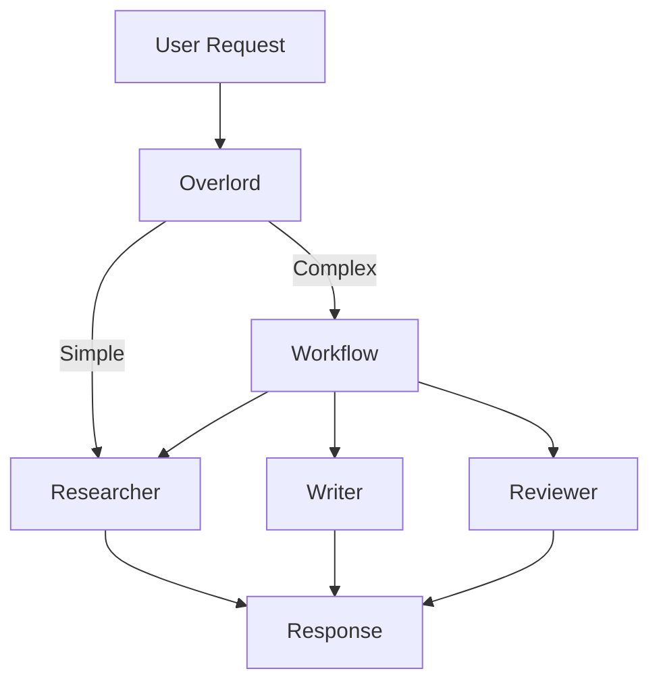

# Agents & Orchestration

## How MUXI agents work together to accomplish complex tasks


MUXI agents are specialized workers that collaborate, delegate, and adapt. The Overlord orchestrates them automatically, routing tasks to the right agent and breaking complex requests into manageable steps.


## How Agents Work

Each agent is a specialized AI persona with:
- A **role** defining its expertise and behavior
- **Tools** it can use (web search, databases, APIs)
- **Knowledge** it can reference (documents, FAQs)

```yaml
agents:
  - id: researcher
    role: Research topics thoroughly with web search
    mcps:
      - web-search

  - id: writer
    role: Write clear, engaging content
```

When a request arrives, MUXI's **Overlord** decides which agent handles it - or coordinates multiple agents for complex tasks.

---

## The Overlord Pattern



The Overlord:
1. **Analyzes** incoming requests for complexity
2. **Routes** to the best agent (or creates a workflow)
3. **Coordinates** multi-agent execution
4. **Synthesizes** the final response

> [!TIP]
> You don't need to specify which agent to use - MUXI figures it out. But you can override with `agent: researcher` in your request.

---

## Intelligent Task Decomposition

Complex requests are automatically broken into steps:

```
User: "Research AI trends and write a blog post about them"

Overlord analyzes:
  - Complexity score: 8/10
  - Requires: research + writing
  - Creates workflow:
    1. Researcher gathers information
    2. Writer creates draft
    3. (Optional) Reviewer checks quality
```

This happens automatically based on your formation's `complexity_threshold`:

```yaml
overlord:
  auto_decomposition: true
  complexity_threshold: 7.0
```

---

## Agent Collaboration (A2A)

Agents don't work in isolation - they collaborate. MUXI supports two levels of collaboration:

### Within Formation (Tactical)

Agents in your formation consult each other directly:

```
Developer Agent: "I need security advice on this API endpoint"
         ↓
Security Agent: "Here are the security recommendations..."
         ↓
Developer Agent: [Implements recommendations]
```

**Tactical collaboration** (peer-to-peer):
- **Ask for help** - Agent stuck on a problem consults a specialist
- **Share findings** - Agent shares relevant data with teammates
- **Seek expertise** - Agent requests domain-specific advice
- **Coordinate work** - Agents working on related tasks sync up

This happens without Overlord involvement - agents make their own tactical decisions.

### Across Formations (Strategic - A2A Protocol)

For cross-formation or cross-organization collaboration, MUXI implements the **A2A protocol**:

```
┌──────────────────┐           ┌───────────────────┐
│  Your Formation  │ ←- A2A -→ │ Partner Formation │
│  (Research Bot)  │           │   (Legal Review)  │
└──────────────────┘           └───────────────────┘
```

**Strategic collaboration** (formation-to-formation):
- **Delegate** complex tasks to specialists in other formations
- **Collaborate** with external agents from partner organizations
- **Discover** capabilities through protocol negotiation
- **Compose** workflows that span multiple formations

Example:

```
User: "Research and draft a partnership agreement"
         ↓
Your Research Agent: Gathers information
         ↓
A2A Call → Legal Review Formation
         ↓
Legal Agent: Reviews and drafts legal terms
         ↓
Returns draft to Your Formation
         ↓
Your Agent: Combines research with legal draft
```

### Division of Responsibilities

**Overlord (Strategic Level):**
- Decomposes complex tasks into subtasks
- Assigns subtasks to appropriate agents
- Monitors overall progress
- Manages dependencies and sequencing

**Agents (Tactical Level):**
- Execute assigned subtasks
- Consult peers when stuck
- Share relevant findings
- Request domain-specific advice
- Coordinate with related work

**The difference:**

| Overlord Decisions | Agent Decisions |
|-------------------|-----------------|
| "Break this into 3 subtasks" | "I need help with this step" |
| "Assign Task 1 to Researcher" | "Let me ask Security Agent" |
| "Task 2 depends on Task 1" | "I'll share these findings with Developer" |
| Strategic planning | Tactical execution |

### Example: Multi-Agent Workflow

```
User: "Build a customer analytics dashboard"

Overlord decomposes:
  1. Design database schema → Data Engineer
  2. Build API endpoints → Backend Developer
  3. Create frontend dashboard → Frontend Developer
  4. Set up monitoring → DevOps Engineer

During execution (peer-to-peer):
  Backend Developer: "Hey Frontend, what data format do you need?"
  Frontend Developer: "JSON with these fields..."
  
  DevOps Engineer: "Data Engineer, which metrics should I monitor?"
  Data Engineer: "Monitor query latency on these tables..."
  
  Backend Developer: "I'm stuck on this SQL query"
  Data Engineer: "Try this approach..."
```

The Overlord sets the strategy, agents execute tactically and collaborate as needed.

### Why This Matters

**Without peer collaboration:**
```
Agent stuck → Escalates to Overlord → Overlord figures it out → Responds
Slow, bottleneck at Overlord
```

**With peer collaboration:**
```
Agent stuck → Asks peer directly → Gets answer immediately → Continues
Fast, no bottleneck
```

**The result:** Agents work like human teams - strategic direction from above, tactical collaboration among peers.

---

## Routing Priority

When a request arrives, routing follows this order:

1. **SOP Match** - If request matches a Standard Operating Procedure, execute it
2. **Explicit Agent** - If request specifies an agent, use it
3. **Complexity Analysis** - Score the request complexity
4. **Best Agent Selection** - Route to most capable agent

```
Request: "onboard new customer"
         ↓
    SOP "customer-onboarding" matches!
         ↓
    Execute SOP (bypass other routing)
```

---

## Why This Matters

| Traditional Approach | MUXI Approach |
|---------------------|---------------|
| One monolithic prompt | Specialized agents |
| Manual workflow code | Automatic orchestration |
| Static task routing | Dynamic complexity analysis |
| Siloed agents | Collaborative A2A |

The result: **agents that work together**, not chat interfaces with different prompts.

---

## Learn More

- [Configure agents](../reference/agents.md) - YAML syntax for agent definitions
- [Multi-Agent Guide](../guides/multi-agent.md) - Build your first multi-agent system
- [Orchestration Deep Dive](../deep-dives/orchestration.md) - Technical internals
