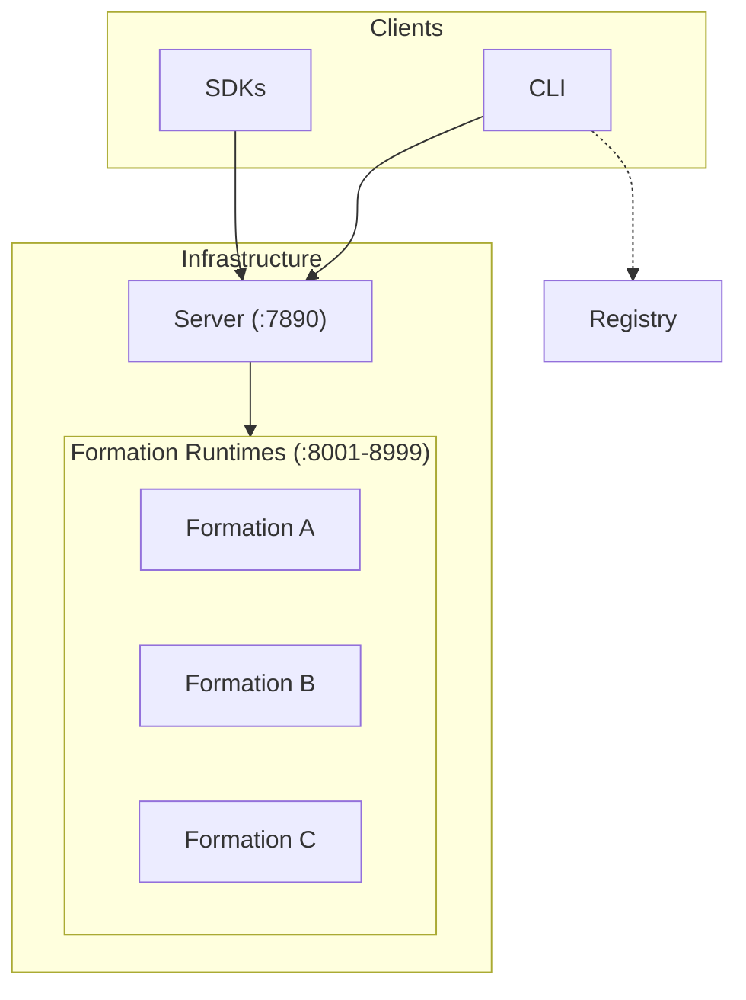
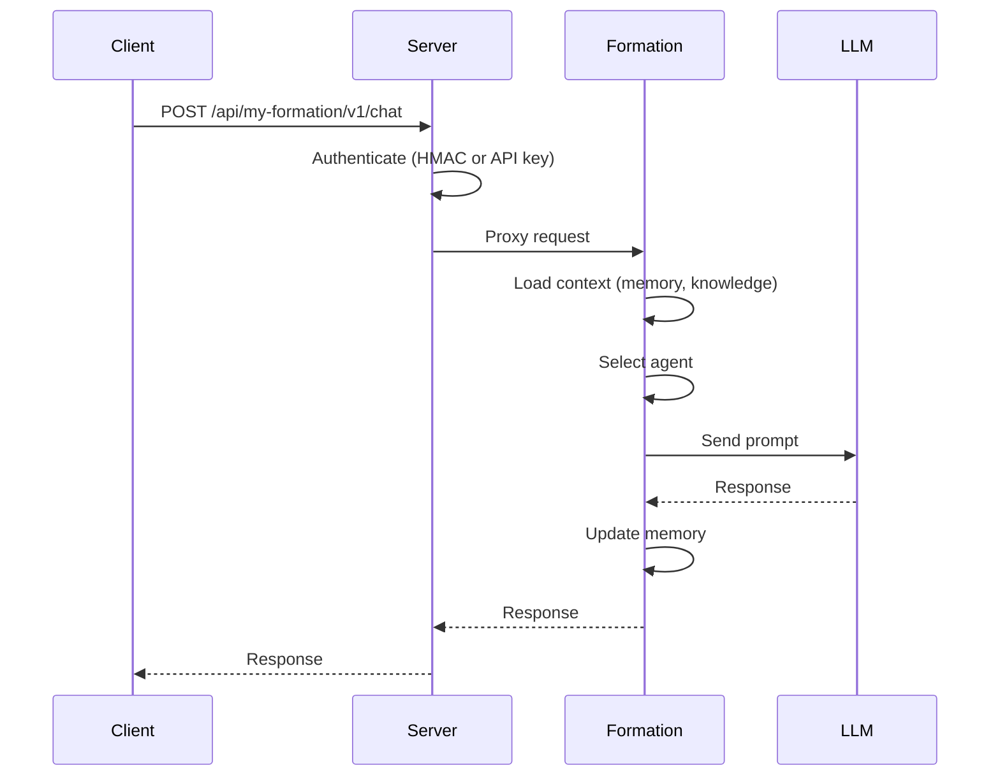
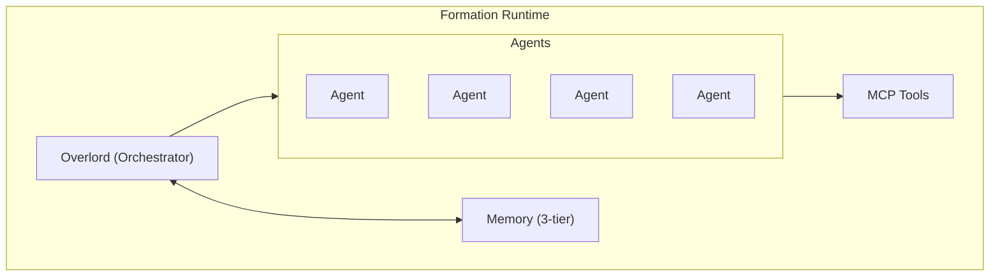

# Architecture

## How MUXI components work together


MUXI is a layered system: CLI and SDKs talk to Servers, which manage Formations running on Runtimes. The Registry distributes formations.


## System Overview



---

## Components

:::: cols=2

[[card]]
#### Server
**Orchestration platform**

Manages formation lifecycle, routes requests, handles auth, monitors health. Written in Go.

Port: 7890
[[/card]]

[[card]]
#### Runtime
**Execution environment**

Runs agent logic, manages memory, calls LLMs, executes tools. Written in Python (FastAPI).

Packaging: ships as a native SIF image for Linux. On macOS/Windows, run via Docker; on Linux, run SIF directly (or Docker if preferred).

Ports: 8001-8999
[[/card]]

[[card]]
#### CLI
**Command-line tool**

Creates formations, deploys to servers, manages secrets. Written in Go.
[[/card]]

[[card]]
#### SDKs
**Client libraries**

Python, TypeScript, Go. Chat with formations, manage sessions, fire triggers.
[[/card]]

[[card]]
#### Registry
**Distribution hub**

Share and discover formations. Version management. Like npm for agents.
[[/card]]

::::

---

## Request Flow



---

## Formation Structure

Everything your AI needs in one directory:

```
my-formation/
├── formation.afs      # Main configuration
├── agents/            # Agent definitions (auto-discovered)
│   ├── researcher.afs
│   └── writer.afs
├── mcp/               # MCP tool servers (auto-discovered)
│   └── web-search.afs
├── a2a/               # Agent-to-agent services (auto-discovered)
│   └── external-api.afs
├── skills/            # Agent skills with SKILL.md files
│   └── data-analysis/
│       └── SKILL.md
├── knowledge/         # RAG sources (any location in formation)
│   └── docs/
├── secrets.enc        # Encrypted credentials
└── secrets.example    # Template for required secrets
```

### Formation placement (concepts → files/dirs)

| Concept | Where it lives |
|---------|----------------|
| LLM Config | `formation.afs` (`llm:` section) with per-agent overrides in `agents/*.afs` |
| Agents | `agents/*.afs` - auto-discovered, define persona, role, specialties |
| Overlord | `formation.afs` (`overlord:` persona, workflow, clarification settings) |
| Workflows | `formation.afs` (`overlord.workflow:` auto-decomposition, timeouts) |
| Memory | `formation.afs` (`memory:` buffer, working, persistent config) |
| Tools & MCP | `mcp/*.afs` - auto-discovered; `formation.afs` (`mcp:` global settings) |
| Agent-to-Agent | `a2a/*.afs` - auto-discovered; `formation.afs` (`a2a:` config) |
| Skills | `skills/*/SKILL.md` files with scripts, references, assets |
| Knowledge | `knowledge/` files, referenced in `agents/*.afs` (`knowledge:` section) |
| Scheduled Tasks | `formation.afs` (`scheduler:` config) - users schedule via natural language |
| Async Processing | `formation.afs` (`async:` threshold, webhooks) |
| Secrets | `secrets.enc` - referenced as `${{ secrets.NAME }}` anywhere |
| User Credentials | `${{ user.secrets.NAME }}` - per-user secrets bound at runtime |
| Clarification | `formation.afs` (`overlord.clarification:` settings) |
| Server/API | `formation.afs` (`server:` host, port, API keys) |
| Logging | `formation.afs` (`logging:` destinations, formats) |
| Versioning | `formation.afs` (`schema:`, `version:`, `runtime:` fields) |

---

## Inside a Formation



---

## Deployment Models

### Local Development

```
muxi dev → Runtime (localhost:8001)
```

### Single Server

```
Server (:7890)
  ├── Formation A (:8001)
  ├── Formation B (:8002)
  └── Formation C (:8003)
```

### Multi-Server

```
Load Balancer
     ├── Server-East (:7890) → Formations
     └── Server-West (:7890) → Formations
```

---

## Technology Stack

| Component | Technology | Why |
|-----------|------------|-----|
| Server | Go | Single binary, fast, concurrent |
| Runtime | Python + FastAPI (as native SIF image) | AI ecosystem, async, OneLLM |
| CLI | Go | Cross-platform, single binary |
| SDKs | Python, TS, Go | Native experience per language |

---

## Design Principles

> [!IMPORTANT]
> MUXI is **infrastructure**, not a framework. It deploys anywhere and integrates with anything.

1. **YAML configuration** - Simple, versionable, shareable
2. **Encrypted secrets** - Not environment variables
3. **MCP for tools** - Standard protocol, any server works
4. **Multi-agent** - Specialized agents, coordinated work
5. **Portable** - Works on any cloud, any platform

---

## Versioning & compatibility

- Formation schema follows semver; new minor versions stay backward compatible, breaking changes land in majors.
- Pin server/runtime versions together for production; upgrade runtime before server when possible.
- Regenerate/validate formations after upgrades to catch schema or tooling changes early.

---

## Next Steps

[+] [Request Lifecycle](../deep-dives/request-lifecycle.md) - Detailed request flow
[+] [Security Model](../deep-dives/security-model.md) - Authentication layers
[+] [Reference](../reference/README.md) - Building formations
