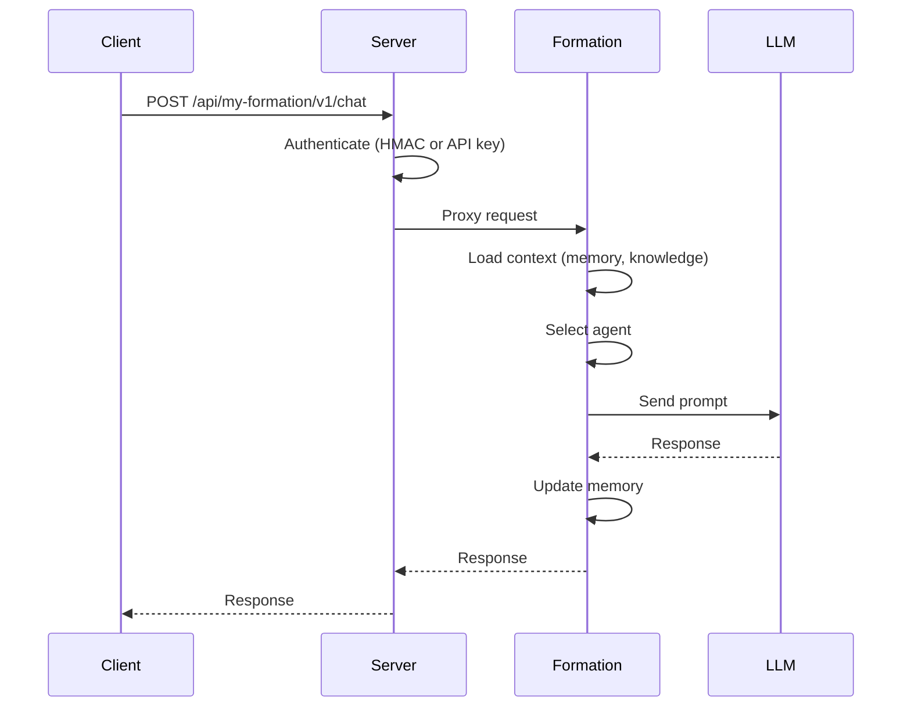

# Architecture

## How MUXI components work together


MUXI is a layered system: CLI and SDKs talk to Servers, which manage Formations running on Runtimes. The Registry distributes formations.


## System Overview

```
┌────────────────────────────────────────────────┐
│                MUXI Ecosystem                  │
├────────────────────────────────────────────────┤
│                                                │
│      ┌──────────┐        ┌──────────────┐      │
│      │   CLI    │───────▶│    Server    │      │
│      └──────────┘   ┌───▶│   (:7890)    │      │
│           │         │    └──────┬───────┘      │
│           │         │           │              │
│      ┌──────────┐   │    ┌──────┴───────┐      │
│      │   SDKs   │───┘    │  Formations  │      │
│      └──────────┘        │ (:8001-8999) │      │
│           │              └──────┬───────┘      │
│           │                     │              │
│      ┌──────────┐        ┌──────┴───────┐      │
│      │ Registry │        │   Runtime    │      │
│      └──────────┘        └──────────────┘      │
│                                                │
└────────────────────────────────────────────────┘
```

---

## Components

:::: cols=2

[[card]]
#### Server
**Orchestration platform**

Manages formation lifecycle, routes requests, handles auth, monitors health. Written in Go.

Port: 7890
[[/card]]

[[card]]
#### Runtime
**Execution environment**

Runs agent logic, manages memory, calls LLMs, executes tools. Written in Python (FastAPI).

Packaging: ships as a native SIF image for Linux. On macOS/Windows, run via Docker; on Linux, run SIF directly (or Docker if preferred).

Ports: 8001-8999
[[/card]]

[[card]]
#### CLI
**Command-line tool**

Creates formations, deploys to servers, manages secrets. Written in Go.
[[/card]]

[[card]]
#### SDKs
**Client libraries**

Python, TypeScript, Go. Chat with formations, manage sessions, fire triggers.
[[/card]]

[[card]]
#### Registry
**Distribution hub**

Share and discover formations. Version management. Like npm for agents.
[[/card]]

::::

---

## Request Flow



---

## Formation Structure

Everything your AI needs in one directory:

```
my-formation/
├── formation.afs      # Main configuration
├── agents/            # Agent definitions
│   ├── researcher.afs
│   └── writer.afs
├── mcp/              # Tool configurations
│   └── web-search.afs
├── sops/              # Standard procedures
│   └── onboarding.md
├── triggers/          # Webhook templates
│   └── github-issue.md
├── knowledge/         # RAG sources
│   └── docs/
├── secrets.enc        # Encrypted credentials
└── secrets    # Template
```

### Formation placement (concepts → files/dirs)

| Concept | Where it lives in a formation |
|---------|--------------------------------|
| LLMs | `formation.afs` (defaults) and `agents/*.afs` (`llm:` per agent) |
| Agents & Orchestration | `agents/*.afs` (roles, routing, task decomposition) |
| Workflows | `agents/*.afs` (plans/steps), optionally `formation.afs` defaults |
| Approvals (HITL) | `agents/*.afs` (`approvals:` per action/workflow) |
| Persona | `agents/*.afs` (`persona:`) |
| Memory (3-tier) | `formation.afs` (`memory:` backend/limits) |
| Multi-Tenancy | `formation.afs` (`security/users`, namespaces), secrets scoped per user |
| Tools & MCP | `mcp/*.afs` (server defs, auto-discovered); agents use `mcp_servers:` for agent-specific tools |
| Secrets & Security | `secrets.enc` (referenced as `${{ secrets.* }}` / `${{ user.secrets.* }}` in formation/agents/mcps) |
| User Credentials | `secrets.enc` / `user.secrets.*`, bound at runtime per caller |
| Knowledge & RAG | `knowledge/` files, referenced in `agents/*.afs` (`knowledge:`) |
| Triggers & Webhooks | `triggers/` definitions (including schedules); referenced in `formation.afs`/agents |
| Async Processing | `formation.afs` (`async`/timeouts), trigger workflows in `triggers/` |
| SOPs | `sops/` documents linked from `agents/*.afs` |
| Registry/Versioning | Metadata in `formation.afs` (name/version); published via CLI/registry |
| Scheduled Tasks | `triggers/` entries with `schedule:`; optional `formation.afs` defaults |
| Artifacts | Produced by agents; configuration in `agents/*.afs` (outputs/format) |
| Clarification | `agents/*.afs` (clarification prompts/steps) |
| Structured Output | `agents/*.afs` (response format/persona), validated by runtime |

---

## Inside a Formation

```
┌───────────────────────────────────────────────────┐
│                 Formation Runtime                 │
├───────────────────────────────────────────────────┤
│                                                   │
│      ┌────────────────┐      ┌────────────────┐   │
│      │   Overlord     │──────│     Memory     │   │
│      │ (Orchestrator) │      │    (3-tier)    │   │
│      └────────┬───────┘      └────────────────┘   │
│               │                                   │
│    ┌──────────┴───┬──────┐                        │
│    ↓      ↓       ↓      ↓                        │
│  Agent  Agent   Agent  Agent                      │
│    │      │       │      │                        │
│    └──────┴───┬───┴──────┘                        │
│               │                                   │
│        ┌──────┴──────┐                            │
│        │  MCP Tools  │                            │
│        └─────────────┘                            │
│                                                   │
└───────────────────────────────────────────────────┘
```

---

## Deployment Models

### Local Development

```
muxi dev → Runtime (localhost:8001)
```

### Single Server

```
Server (:7890)
  ├── Formation A (:8001)
  ├── Formation B (:8002)
  └── Formation C (:8003)
```

### Multi-Server

```
Load Balancer
     ├── Server-East (:7890) → Formations
     └── Server-West (:7890) → Formations
```

---

## Technology Stack

| Component | Technology | Why |
|-----------|------------|-----|
| Server | Go | Single binary, fast, concurrent |
| Runtime | Python + FastAPI (as native SIF image) | AI ecosystem, async, OneLLM |
| CLI | Go | Cross-platform, single binary |
| SDKs | Python, TS, Go | Native experience per language |

---

## Design Principles

> [!IMPORTANT]
> MUXI is **infrastructure**, not a framework. It deploys anywhere and integrates with anything.

1. **YAML configuration** - Simple, versionable, shareable
2. **Encrypted secrets** - Not environment variables
3. **MCP for tools** - Standard protocol, any server works
4. **Multi-agent** - Specialized agents, coordinated work
5. **Portable** - Works on any cloud, any platform

---

## Versioning & compatibility

- Formation schema follows semver; new minor versions stay backward compatible, breaking changes land in majors.
- Pin server/runtime versions together for production; upgrade runtime before server when possible.
- Regenerate/validate formations after upgrades to catch schema or tooling changes early.

---

## Next Steps

[+] [Request Lifecycle](../deep-dives/request-lifecycle.md) - Detailed request flow
[+] [Security Model](../deep-dives/security.md) - Authentication layers
[+] [Reference](../reference/README.md) - Building formations
