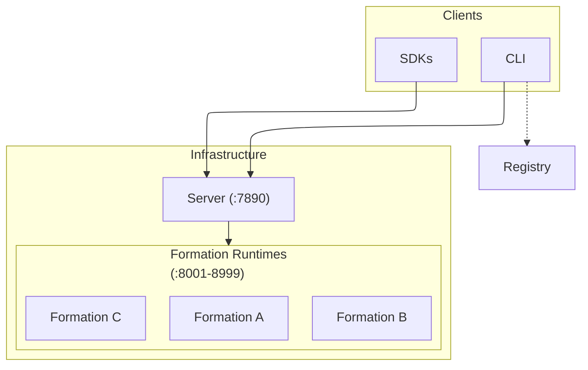
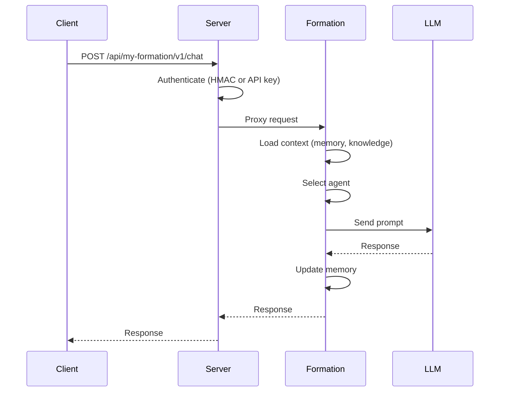
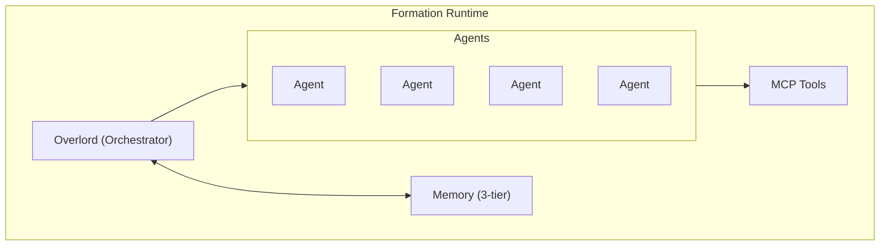

# Architecture

## How MUXI components work together


MUXI is a layered system: CLI and SDKs talk to Servers, which manage Formations running on Runtimes. The Registry distributes formations.


## System Overview



---

## Components

:::: cols=2

[[card]]

<svg xmlns="http://www.w3.org/2000/svg" width="24" height="24" viewBox="0 0 24 24" fill="none">
    <g opacity="0.2">
        <path d="M3 6C3 5.07003 3 4.60504 3.10222 4.22354C3.37962 3.18827 4.18827 2.37962 5.22354 2.10222C5.60504 2 6.07003 2 7 2H17C17.93 2 18.395 2 18.7765 2.10222C19.8117 2.37962 20.6204 3.18827 20.8978 4.22354C21 4.60504 21 5.07003 21 6V6C21 6.92997 21 7.39496 20.8978 7.77646C20.6204 8.81173 19.8117 9.62038 18.7765 9.89778C18.395 10 17.93 10 17 10H7C6.07003 10 5.60504 10 5.22354 9.89778C4.18827 9.62038 3.37962 8.81173 3.10222 7.77646C3 7.39496 3 6.92997 3 6V6Z" fill="currentColor"></path>
        <path d="M3 17C3 16.07 3 15.605 3.10222 15.2235C3.37962 14.1883 4.18827 13.3796 5.22354 13.1022C5.60504 13 6.07003 13 7 13H17C17.93 13 18.395 13 18.7765 13.1022C19.8117 13.3796 20.6204 14.1883 20.8978 15.2235C21 15.605 21 16.07 21 17V17C21 17.93 21 18.395 20.8978 18.7765C20.6204 19.8117 19.8117 20.6204 18.7765 20.8978C18.395 21 17.93 21 17 21H7C6.07003 21 5.60504 21 5.22354 20.8978C4.18827 20.6204 3.37962 19.8117 3.10222 18.7765C3 18.395 3 17.93 3 17V17Z" fill="currentColor"></path>
    </g>
    <path d="M17.5 6C17.5 6.27614 17.2761 6.5 17 6.5C16.7239 6.5 16.5 6.27614 16.5 6M17.5 6C17.5 5.72386 17.2761 5.5 17 5.5C16.7239 5.5 16.5 5.72386 16.5 6M17.5 6H16.5M17.5 17C17.5 17.2761 17.2761 17.5 17 17.5C16.7239 17.5 16.5 17.2761 16.5 17M17.5 17C17.5 16.7239 17.2761 16.5 17 16.5C16.7239 16.5 16.5 16.7239 16.5 17M17.5 17H16.5M7 21H17C17.93 21 18.395 21 18.7765 20.8978C19.8117 20.6204 20.6204 19.8117 20.8978 18.7765C21 18.395 21 17.93 21 17V17C21 16.07 21 15.605 20.8978 15.2235C20.6204 14.1883 19.8117 13.3796 18.7765 13.1022C18.395 13 17.93 13 17 13H7C6.07003 13 5.60504 13 5.22354 13.1022C4.18827 13.3796 3.37962 14.1883 3.10222 15.2235C3 15.605 3 16.07 3 17V17C3 17.93 3 18.395 3.10222 18.7765C3.37962 19.8117 4.18827 20.6204 5.22354 20.8978C5.60504 21 6.07003 21 7 21ZM7 10H17C17.93 10 18.395 10 18.7765 9.89778C19.8117 9.62038 20.6204 8.81173 20.8978 7.77646C21 7.39496 21 6.92997 21 6V6C21 5.07003 21 4.60504 20.8978 4.22354C20.6204 3.18827 19.8117 2.37962 18.7765 2.10222C18.395 2 17.93 2 17 2H7C6.07003 2 5.60504 2 5.22354 2.10222C4.18827 2.37962 3.37962 3.18827 3.10222 4.22354C3 4.60504 3 5.07003 3 6V6C3 6.92997 3 7.39496 3.10222 7.77646C3.37962 8.81173 4.18827 9.62038 5.22354 9.89778C5.60504 10 6.07003 10 7 10Z" stroke="currentColor" stroke-width="1.5" stroke-linecap="round" stroke-linejoin="round"></path>
</svg>

#### Server
**Orchestration platform**

Manages formation lifecycle, routes requests, handles auth, monitors health. Written in Go.

Port: 7890
[[/card]]

[[card]]

<svg xmlns="http://www.w3.org/2000/svg" fill="none" height="24" viewBox="0 0 24 24" width="24">
    <g stroke="currentColor" stroke-linejoin="round" stroke-width="1.5">
        <path fill="currentColor" opacity="0.2" d="m4 12c0-3.77124 0-5.65685 1.17157-6.82843 1.17158-1.17157 3.05719-1.17157 6.82843-1.17157 3.7712 0 5.6569 0 6.8284 1.17157 1.1716 1.17158 1.1716 3.05719 1.1716 6.82843 0 3.7712 0 5.6569-1.1716 6.8284-1.1715 1.1716-3.0572 1.1716-6.8284 1.1716-3.77124 0-5.65685 0-6.82843-1.1716-1.17157-1.1715-1.17157-3.0572-1.17157-6.8284z"></path>
        <g stroke-linecap="round">
            <path d="m7.5 15 1.84189-5.52566c.09442-.28327.35951-.47434.65811-.47434s.5637.19107.6581.47434l1.8419 5.52566m-4-2h3"></path>
            <path d="m15.5 9v6"></path>
            <path d="m8 2v2m8-2v2m-4-2v2m-4 16v2m4-2v2m4-2v2m6-6h-2m-16-8h-2m2 8h-2m2-4h-2m20-4h-2m2 4h-2"></path>
        </g>
    </g>
</svg>

#### Runtime
**Execution environment**

Runs agent logic, manages memory, calls LLMs, executes tools. Written in Python (FastAPI*).

Ports: 8001-8999
[[/card]]

[[card]]

<svg xmlns="http://www.w3.org/2000/svg" width="24" height="24" viewBox="0 0 24 24" fill="none">
    <rect opacity="0.2" x="2" y="2" width="20" height="20" rx="6" fill="currentColor"></rect>
    <path d="M7.00006 10L10.0001 13.0001L7 16.0001M13.0001 16H17.0001M11.6 22H12.4C15.7603 22 17.4405 22 18.7239 21.346C19.8529 20.7708 20.7708 19.8529 21.346 18.7239C22 17.4405 22 15.7603 22 12.4V11.6C22 8.23969 22 6.55953 21.346 5.27606C20.7708 4.14708 19.8529 3.2292 18.7239 2.65396C17.4405 2 15.7603 2 12.4 2H11.6C8.23969 2 6.55953 2 5.27606 2.65396C4.14708 3.2292 3.2292 4.14708 2.65396 5.27606C2 6.55953 2 8.23969 2 11.6V12.4C2 15.7603 2 17.4405 2.65396 18.7239C3.2292 19.8529 4.14708 20.7708 5.27606 21.346C6.55953 22 8.23969 22 11.6 22Z" stroke="currentColor" stroke-width="1.5" stroke-linecap="round" stroke-linejoin="round"></path>
</svg>

#### CLI
**Command-line tool**

Creates formations, deploys to servers, manages secrets. Written in Go.
[[/card]]

[[card]]

<svg xmlns="http://www.w3.org/2000/svg" width="24" height="24" viewBox="0 0 24 24" fill="none">
    <path opacity="0.2" d="M2.5 12C2.5 7.52166 2.5 5.28249 3.89124 3.89124C5.28249 2.5 7.52166 2.5 12 2.5C16.4783 2.5 18.7175 2.5 20.1088 3.89124C21.5 5.28249 21.5 7.52166 21.5 12C21.5 16.4783 21.5 18.7175 20.1088 20.1088C18.7175 21.5 16.4783 21.5 12 21.5C7.52166 21.5 5.28249 21.5 3.89124 20.1088C2.5 18.7175 2.5 16.4783 2.5 12Z" fill="currentColor"></path>
    <path d="M2.5 12C2.5 7.52166 2.5 5.28249 3.89124 3.89124C5.28249 2.5 7.52166 2.5 12 2.5C16.4783 2.5 18.7175 2.5 20.1088 3.89124C21.5 5.28249 21.5 7.52166 21.5 12C21.5 16.4783 21.5 18.7175 20.1088 20.1088C18.7175 21.5 16.4783 21.5 12 21.5C7.52166 21.5 5.28249 21.5 3.89124 20.1088C2.5 18.7175 2.5 16.4783 2.5 12Z" stroke="currentColor" stroke-width="1.5"></path>
    <path d="M16 16C16.6161 16 17.1155 15.4883 17.1155 14.8571V13.6162C17.1155 13.3131 17.233 13.0224 17.4422 12.8081L17.8366 12.4041C18.0545 12.1809 18.0545 11.8191 17.8366 11.5959L17.4422 11.1919C17.233 10.9776 17.1155 10.6869 17.1155 10.3838V9.14286C17.1155 8.51167 16.6161 8 16 8" stroke="currentColor" stroke-width="1.5" stroke-linecap="round" stroke-linejoin="round"></path>
    <path d="M8 16C7.38392 16 6.88448 15.4883 6.88448 14.8571V13.6162C6.88448 13.3131 6.76696 13.0224 6.55776 12.8081L6.16336 12.4041C5.94555 12.1809 5.94555 11.8191 6.16336 11.5959L6.55776 11.1919C6.76696 10.9776 6.88448 10.6869 6.88448 10.3838V9.14286C6.88448 8.51167 7.38392 8 8 8" stroke="currentColor" stroke-width="1.5" stroke-linecap="round" stroke-linejoin="round"></path>
    <path d="M10 12H10.009M13.991 12H14" stroke="currentColor" stroke-width="2" stroke-linecap="round" stroke-linejoin="round"></path>
</svg>

#### SDKs
**Client libraries**

Python, TypeScript, Go. Chat with formations, manage sessions, fire triggers.
[[/card]]

[[card]]

<svg xmlns="http://www.w3.org/2000/svg" width="24" height="24" viewBox="0 0 24 24" fill="none">
    <path opacity="0.2" d="M14 18C14 16.4596 14 15.6893 14.3467 15.1235C14.5407 14.8069 14.8069 14.5407 15.1235 14.3467C15.6893 14 16.4596 14 18 14C19.5404 14 20.3107 14 20.8765 14.3467C21.1931 14.5407 21.4593 14.8069 21.6533 15.1235C22 15.6893 22 16.4596 22 18C22 19.5404 22 20.3107 21.6533 20.8765C21.4593 21.1931 21.1931 21.4593 20.8765 21.6533C20.3107 22 19.5404 22 18 22C16.4596 22 15.6893 22 15.1235 21.6533C14.8069 21.4593 14.5407 21.1931 14.3467 20.8765C14 20.3107 14 19.5404 14 18Z" fill="currentColor"></path>
    <path opacity="0.2" d="M2 6C2 4.45956 2 3.68934 2.34673 3.12353C2.54074 2.80693 2.80693 2.54074 3.12353 2.34673C3.68934 2 4.45956 2 6 2C7.54044 2 8.31066 2 8.87647 2.34673C9.19307 2.54074 9.45926 2.80693 9.65327 3.12353C10 3.68934 10 4.45956 10 6C10 7.54044 10 8.31066 9.65327 8.87647C9.45926 9.19307 9.19307 9.45926 8.87647 9.65327C8.31066 10 7.54044 10 6 10C4.45956 10 3.68934 10 3.12353 9.65327C2.80693 9.45926 2.54074 9.19307 2.34673 8.87647C2 8.31066 2 7.54044 2 6Z" fill="currentColor"></path>
    <path d="M2 18C2 16.4596 2 15.6893 2.34673 15.1235C2.54074 14.8069 2.80693 14.5407 3.12353 14.3467C3.68934 14 4.45956 14 6 14C7.54044 14 8.31066 14 8.87647 14.3467C9.19307 14.5407 9.45926 14.8069 9.65327 15.1235C10 15.6893 10 16.4596 10 18C10 19.5404 10 20.3107 9.65327 20.8765C9.45926 21.1931 9.19307 21.4593 8.87647 21.6533C8.31066 22 7.54044 22 6 22C4.45956 22 3.68934 22 3.12353 21.6533C2.80693 21.4593 2.54074 21.1931 2.34673 20.8765C2 20.3107 2 19.5404 2 18Z" fill="white"></path>
    <path d="M14 6C14 4.45956 14 3.68934 14.3467 3.12353C14.5407 2.80693 14.8069 2.54074 15.1235 2.34673C15.6893 2 16.4596 2 18 2C19.5404 2 20.3107 2 20.8765 2.34673C21.1931 2.54074 21.4593 2.80693 21.6533 3.12353C22 3.68934 22 4.45956 22 6C22 7.54044 22 8.31066 21.6533 8.87647C21.4593 9.19307 21.1931 9.45926 20.8765 9.65327C20.3107 10 19.5404 10 18 10C16.4596 10 15.6893 10 15.1235 9.65327C14.8069 9.45926 14.5407 9.19307 14.3467 8.87647C14 8.31066 14 7.54044 14 6Z" fill="white"></path>
    <path d="M2 18C2 16.4596 2 15.6893 2.34673 15.1235C2.54074 14.8069 2.80693 14.5407 3.12353 14.3467C3.68934 14 4.45956 14 6 14C7.54044 14 8.31066 14 8.87647 14.3467C9.19307 14.5407 9.45926 14.8069 9.65327 15.1235C10 15.6893 10 16.4596 10 18C10 19.5404 10 20.3107 9.65327 20.8765C9.45926 21.1931 9.19307 21.4593 8.87647 21.6533C8.31066 22 7.54044 22 6 22C4.45956 22 3.68934 22 3.12353 21.6533C2.80693 21.4593 2.54074 21.1931 2.34673 20.8765C2 20.3107 2 19.5404 2 18Z" stroke="currentColor" stroke-width="1.5"></path>
    <path d="M14 18C14 16.4596 14 15.6893 14.3467 15.1235C14.5407 14.8069 14.8069 14.5407 15.1235 14.3467C15.6893 14 16.4596 14 18 14C19.5404 14 20.3107 14 20.8765 14.3467C21.1931 14.5407 21.4593 14.8069 21.6533 15.1235C22 15.6893 22 16.4596 22 18C22 19.5404 22 20.3107 21.6533 20.8765C21.4593 21.1931 21.1931 21.4593 20.8765 21.6533C20.3107 22 19.5404 22 18 22C16.4596 22 15.6893 22 15.1235 21.6533C14.8069 21.4593 14.5407 21.1931 14.3467 20.8765C14 20.3107 14 19.5404 14 18Z" stroke="currentColor" stroke-width="1.5"></path>
    <path d="M2 6C2 4.45956 2 3.68934 2.34673 3.12353C2.54074 2.80693 2.80693 2.54074 3.12353 2.34673C3.68934 2 4.45956 2 6 2C7.54044 2 8.31066 2 8.87647 2.34673C9.19307 2.54074 9.45926 2.80693 9.65327 3.12353C10 3.68934 10 4.45956 10 6C10 7.54044 10 8.31066 9.65327 8.87647C9.45926 9.19307 9.19307 9.45926 8.87647 9.65327C8.31066 10 7.54044 10 6 10C4.45956 10 3.68934 10 3.12353 9.65327C2.80693 9.45926 2.54074 9.19307 2.34673 8.87647C2 8.31066 2 7.54044 2 6Z" stroke="currentColor" stroke-width="1.5"></path>
    <path d="M14 6C14 4.45956 14 3.68934 14.3467 3.12353C14.5407 2.80693 14.8069 2.54074 15.1235 2.34673C15.6893 2 16.4596 2 18 2C19.5404 2 20.3107 2 20.8765 2.34673C21.1931 2.54074 21.4593 2.80693 21.6533 3.12353C22 3.68934 22 4.45956 22 6C22 7.54044 22 8.31066 21.6533 8.87647C21.4593 9.19307 21.1931 9.45926 20.8765 9.65327C20.3107 10 19.5404 10 18 10C16.4596 10 15.6893 10 15.1235 9.65327C14.8069 9.45926 14.5407 9.19307 14.3467 8.87647C14 8.31066 14 7.54044 14 6Z" stroke="currentColor" stroke-width="1.5"></path>
</svg>

#### Registry
**Distribution hub**

Share and discover formations. Version management. Like npm for agents.
[[/card]]

::::

> [!NOTE]
> The runtime ships as a native SIF image for Linux. On macOS/Windows, run via Docker; on Linux, run SIF directly (or Docker if preferred).

---

## Request Flow



---

## Formation Structure

Everything your AI needs in one directory:

```
my-formation/
├── formation.afs      # Main configuration
├── agents/            # Agent definitions (auto-discovered)
│   ├── researcher.afs
│   └── writer.afs
├── mcp/               # MCP tool servers (auto-discovered)
│   └── web-search.afs
├── a2a/               # Agent-to-agent services (auto-discovered)
│   └── external-api.afs
├── skills/            # Agent skills with SKILL.md files
│   └── data-analysis/
│       └── SKILL.md
├── knowledge/         # RAG sources (any location in formation)
│   └── docs/
├── secrets.enc        # Encrypted credentials
└── secrets.example    # Template for required secrets
```

### Formation placement (concepts → files/dirs)

| Concept | Where it lives |
|---------|----------------|
| LLM Config | `formation.afs` (`llm:` section) with per-agent overrides in `agents/*.afs` |
| Agents | `agents/*.afs` - auto-discovered, define persona, role, specialties |
| Overlord | `formation.afs` (`overlord:` persona, workflow, clarification settings) |
| Workflows | `formation.afs` (`overlord.workflow:` auto-decomposition, timeouts) |
| Memory | `formation.afs` (`memory:` buffer, working, persistent config) |
| Tools & MCP | `mcp/*.afs` - auto-discovered; `formation.afs` (`mcp:` global settings) |
| Agent-to-Agent | `a2a/*.afs` - auto-discovered; `formation.afs` (`a2a:` config) |
| Skills | `skills/*/SKILL.md` files with scripts, references, assets |
| Knowledge | `knowledge/` files, referenced in `agents/*.afs` (`knowledge:` section) |
| Scheduled Tasks | `formation.afs` (`scheduler:` config) - users schedule via natural language |
| Async Processing | `formation.afs` (`async:` threshold, webhooks) |
| Secrets | `secrets.enc` - referenced as `${{ secrets.NAME }}` anywhere |
| User Credentials | `${{ user.secrets.NAME }}` - per-user secrets bound at runtime |
| Clarification | `formation.afs` (`overlord.clarification:` settings) |
| Server/API | `formation.afs` (`server:` host, port, API keys) |
| Logging | `formation.afs` (`logging:` destinations, formats) |
| Versioning | `formation.afs` (`schema:`, `version:`, `runtime:` fields) |

---

## Inside a Formation



---

## Deployment Models

### Local Development

```
muxi dev → Runtime (localhost:8001)
```

### Single Server

```
Server (:7890)
  ├── Formation A (:8001)
  ├── Formation B (:8002)
  └── Formation C (:8003)
```

### Multi-Server

```
Load Balancer
     ├── Server-East (:7890) → Formations
     └── Server-West (:7890) → Formations
```

---

## Technology Stack

| Component | Technology | Why |
|-----------|------------|-----|
| Server | Go | Single binary, fast, concurrent |
| Runtime | Python + FastAPI (as native SIF image) | AI ecosystem, async, OneLLM |
| CLI | Go | Cross-platform, single binary |
| SDKs | Python, TS, Go | Native experience per language |

---

## Design Principles

> [!IMPORTANT]
> MUXI is **infrastructure**, not a framework. It deploys anywhere and integrates with anything.

1. **YAML configuration** - Simple, versionable, shareable
2. **Encrypted secrets** - Not environment variables
3. **MCP for tools** - Standard protocol, any server works
4. **Multi-agent** - Specialized agents, coordinated work
5. **Portable** - Works on any cloud, any platform

---

## Versioning & compatibility

- Formation schema follows semver; new minor versions stay backward compatible, breaking changes land in majors.
- Pin server/runtime versions together for production; upgrade runtime before server when possible.
- Regenerate/validate formations after upgrades to catch schema or tooling changes early.

---

## Next Steps

[+] [Request Lifecycle](../deep-dives/request-lifecycle.md) - Detailed request flow
[+] [Security Model](../deep-dives/security-model.md) - Authentication layers
[+] [Reference](../reference/README.md) - Building formations
