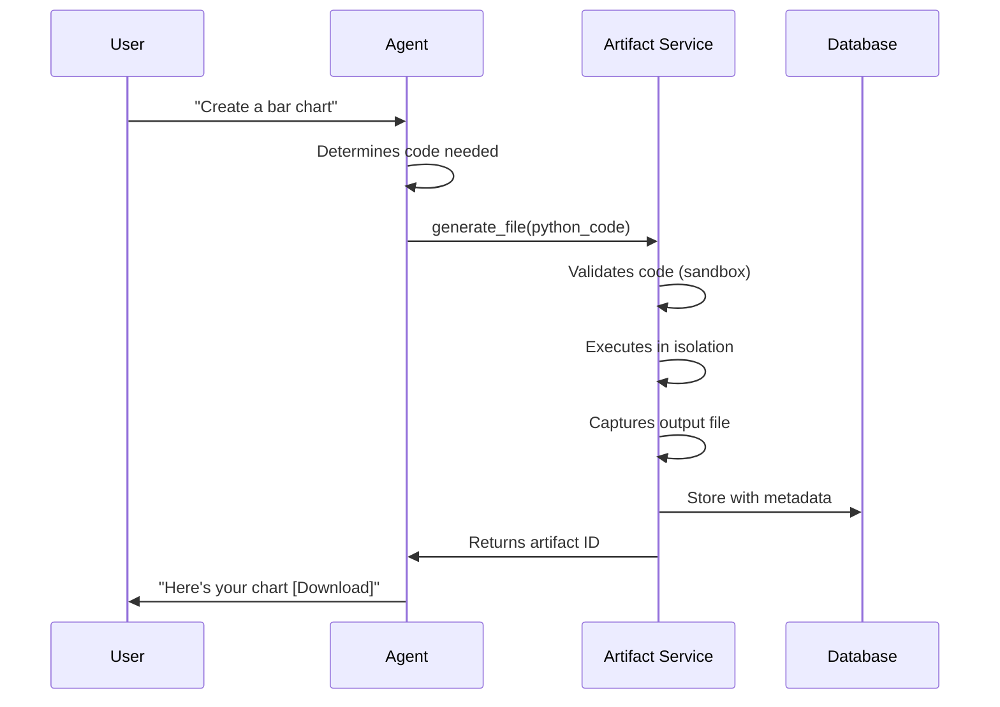

# Artifacts & File Generation

## How agents create files, charts, reports, and deliverables


Agents don't just chat - they create files. PDFs, charts, CSVs, images, code - anything you can generate with Python. The artifact system handles secure execution, storage, and delivery.


## What Are Artifacts?

Artifacts work similar to Claude's artifacts or ChatGPT's Canvas - when you ask MUXI to create something that results in a file (report, image, chart, code), it generates the file using its coding capabilities.

```
User:  "Create a sales report as PDF"
Agent: [Generates report.pdf]
Agent: "Here's your sales report: [Download PDF]"
```

**Technically:** The response includes text information ("I've done what you asked, the bottom line is...") plus a list of files with their types and Base64-encoded content. SDKs decode these for easy handling.

**Common artifact types:**
- 📊 **Charts**: Matplotlib, Plotly visualizations
- 📄 **Documents**: PDFs, Word docs, Markdown
- 📈 **Spreadsheets**: CSV, Excel files
- 🖼️ **Images**: Generated graphics, edited photos
- 💾 **Data exports**: JSON, XML, database dumps
- 📜 **Code**: Generated scripts, configuration files

---

## How It Works

### The Generation Process



1. **Agent writes code** to generate the file
2. **System validates** code for safety
3. **Sandboxed execution** with strict limits
4. **File captured** and processed
5. **Metadata extracted** (MIME type, size, etc.)
6. **Artifact stored** with unique ID
7. **User receives** downloadable link

---

## Security Model

### Sandboxed Execution

All artifact generation runs in a secure sandbox:

```
✅ Allowed:
  - Standard Python libraries (matplotlib, pandas, PIL, etc.)
  - File system writes (isolated temp directory)
  - CPU/memory within limits

❌ Blocked:
  - Network access
  - System commands
  - Dangerous imports (subprocess, os.system)
  - File reads outside temp directory
  - Execution beyond time limits
```

### Code Validation

Before execution, code is analyzed:

```python
# ❌ This would be rejected:
import os
os.system("rm -rf /")

# ✅ This is allowed:
import matplotlib.pyplot as plt
plt.bar(['A', 'B', 'C'], [10, 20, 15])
plt.savefig('chart.png')
```

**Validation checks:**
- AST parsing for dangerous patterns
- Whitelist of allowed imports
- No shell command execution
- No network requests
- No file system escapes

### IDs & limits

- Artifact IDs use `atf_{nanoid}`; execution IDs use `exc_{nanoid}`.
- Default limits: ~30s execution, ~512MB memory, ~10MB output (tune per deployment).
- Downloads are scoped to the requester’s formation and credentials.

### Resource Limits

Each artifact generation has strict limits:

```yaml
execution_timeout: 30s      # Max execution time
memory_limit: 512MB         # Max memory usage
output_size_limit: 10MB     # Max file size
```

Prevents runaway processes and resource exhaustion.

---

## Artifact Lifecycle

### Creation

```
User request
     ↓
Agent generates Python code
     ↓
System validates & executes
     ↓
File captured
     ↓
Artifact stored (with session ID)
     ↓
Unique ID assigned (art_ABC123)
```

### Storage

Artifacts are organized by session:

```
artifacts/
└── session_xyz/
    ├── art_ABC123/
    │   ├── file.pdf
    │   └── metadata.json
    └── art_DEF456/
        ├── chart.png
        └── metadata.json
```

**Metadata includes:**
- MIME type (application/pdf, image/png, etc.)
- File size
- Created timestamp
- Session ID
- Request ID that triggered creation
- Original filename

### Cleanup

Artifacts automatically expire:

```yaml
artifact_retention: 7d      # Keep for 7 days
cleanup_interval: 1h        # Check every hour
```

Old artifacts are automatically purged to save storage.

---

## What Agents Can Generate

### Data Visualizations

```
User:  "Show me sales trends as a line chart"
Agent: [Creates matplotlib chart]
Agent: [Returns PNG artifact]
```

**Supported libraries:**
- Matplotlib (charts, plots, graphs)
- Plotly (interactive visualizations)
- Seaborn (statistical graphics)
- Pandas (data tables)

### Documents

```
User:  "Generate a project report as PDF"
Agent: [Uses ReportLab or Weasyprint]
Agent: [Returns PDF artifact]
```

**Document types:**
- PDF reports (with formatting)
- HTML documents
- Markdown files
- Plain text files

### Data Files

```
User:  "Export customer data as CSV"
Agent: [Formats data as CSV]
Agent: [Returns CSV artifact]
```

**Export formats:**
- CSV (comma-separated values)
- JSON (structured data)
- Excel spreadsheets
- XML documents
- YAML configuration

### Images

```
User:  "Generate a logo with text 'ACME Corp'"
Agent: [Uses PIL/Pillow]
Agent: [Returns PNG artifact]
```

**Image operations:**
- Generate graphics
- Composite images
- Add text overlays
- Resize/crop/filter
- Convert formats

---

## Automatic File Type Detection

The system automatically detects file types:

```python
Generated: chart.png
     ↓
MIME detection
     ↓
Type: image/png
     ↓
Category: image
     ↓
Browser displays inline
```

**Categories:**
- **Text**: Markdown, plain text, code
- **Document**: PDF, Word, presentations
- **Spreadsheet**: CSV, Excel
- **Image**: PNG, JPEG, SVG
- **Data**: JSON, XML, YAML
- **Archive**: ZIP, TAR

Determines how the artifact is displayed/downloaded.

---

## Usage Patterns

### Single Artifact

```
User:  "Create a bar chart of sales by region"
Agent: [Generates chart.png]
Response: "Here's your chart: [Download]"
```

### Multiple Artifacts

```
User:  "Generate quarterly reports for Q1-Q4"
Agent: [Generates q1.pdf, q2.pdf, q3.pdf, q4.pdf]
Response: "Created 4 reports:
  - Q1 Report [Download]
  - Q2 Report [Download]
  - Q3 Report [Download]
  - Q4 Report [Download]"
```

### Complex Workflows

```
User:  "Analyze data and create visualizations"
Agent:
  1. Reads data
  2. Performs analysis
  3. Generates 3 charts (line, bar, pie)
  4. Creates PDF report with embedded charts
  5. Exports raw data as CSV
Response: "Analysis complete:
  - Report: [Download PDF]
  - Data: [Download CSV]
  - Charts: [View Gallery]"
```

---

## Why Artifacts Matter

### Before (chat-only agents)

```
User:  "Show me a chart"
Agent: "I can't generate images, but here's ASCII art:
  *****
  ****
  ***"
```

Useless for real work.

### After (with artifacts)

```
User:  "Show me a chart"
Agent: [Generates professional matplotlib chart]
Response: "Here's your chart [Download PNG]"
```

**The difference:**
- **Real deliverables** vs text descriptions
- **Professional output** vs workarounds
- **Shareable files** vs ephemeral chat
- **Actual work done** vs just advice

---

## Configuration

### Enable Artifact Generation

```yaml
# formation.afs
artifacts:
  enabled: true
  max_file_size: 10485760      # 10 MB
  execution_timeout: 30         # 30 seconds
  allowed_formats:
    - pdf
    - png
    - jpg
    - csv
    - json
```

### Storage Options

```yaml
artifacts:
  storage:
    type: local               # or "s3", "azure-blob"
    path: /var/muxi/artifacts
    retention_days: 7
    cleanup_enabled: true
```

---

## Security Considerations

### What's Protected

✅ **System is protected from:**
- Malicious code execution
- Resource exhaustion
- Network attacks
- File system access
- Data exfiltration

✅ **User data is protected:**
- Artifacts isolated per session
- No cross-user access
- Encrypted storage (optional)
- Automatic expiration

### What Users Should Know

⚠️ **Artifacts are temporary:**
- Default retention: 7 days
- Download important files
- Not a backup solution

⚠️ **Size limits exist:**
- Max file size: 10 MB (default)
- Large files may be rejected
- Consider chunking or compression

---

## Common Use Cases

### Business Reports

```
User:  "Generate monthly sales report"
Agent:
  - Pulls sales data
  - Calculates metrics
  - Creates formatted PDF
  - Includes charts and tables
Artifact: sales_report_nov_2025.pdf
```

### Data Analysis

```
User:  "Analyze customer churn and visualize trends"
Agent:
  - Loads customer data
  - Calculates churn rate
  - Creates line chart (trend)
  - Creates pie chart (reasons)
  - Creates bar chart (by segment)
Artifacts:
  - churn_analysis.png
  - churn_by_reason.png
  - churn_by_segment.png
```

### Automated Exports

```
User:  "Export last 30 days of logs as CSV"
Agent:
  - Queries log database
  - Formats as CSV
  - Compresses if large
Artifact: logs_2025_11.csv
```

### Code Generation

```
User:  "Generate a Python script to process invoices"
Agent:
  - Writes invoice_processor.py
  - Includes error handling
  - Adds documentation
Artifact: invoice_processor.py (download and run)
```

---

## Limitations

### What Can't Be Generated

❌ **Interactive web apps** - Artifacts are static files
❌ **Real-time dashboards** - No continuous updates
❌ **Large datasets** - Size limits apply
❌ **Video/audio** - Not currently supported
❌ **Compiled binaries** - Security restriction

Use cases that need these should use external services (generate code to deploy elsewhere).

### Workarounds

**Need interactivity?** Generate HTML with embedded JavaScript

**Need large files?** Generate in chunks or compress

**Need video?** Generate frames as images, assemble elsewhere

**Need compilation?** Generate source code, user compiles locally

---

## Why This Matters

| Chat-Only Agents | Agents with Artifacts |
|-----------------|----------------------|
| Describe solutions | Deliver solutions |
| "Here's how to make a chart" | "Here's your chart [Download]" |
| Advice and guidance | Actual work product |
| User does the work | Agent does the work |
| Nothing tangible | Downloadable deliverables |

The result: **agents that deliver results**, not just advice.

---

## Learn More

- [Tools & MCP](tools.md) - How agents use tools to generate artifacts
- [Deep Dive: Request Lifecycle](deep-dives/request-lifecycle.md) - How artifact generation fits into request processing
