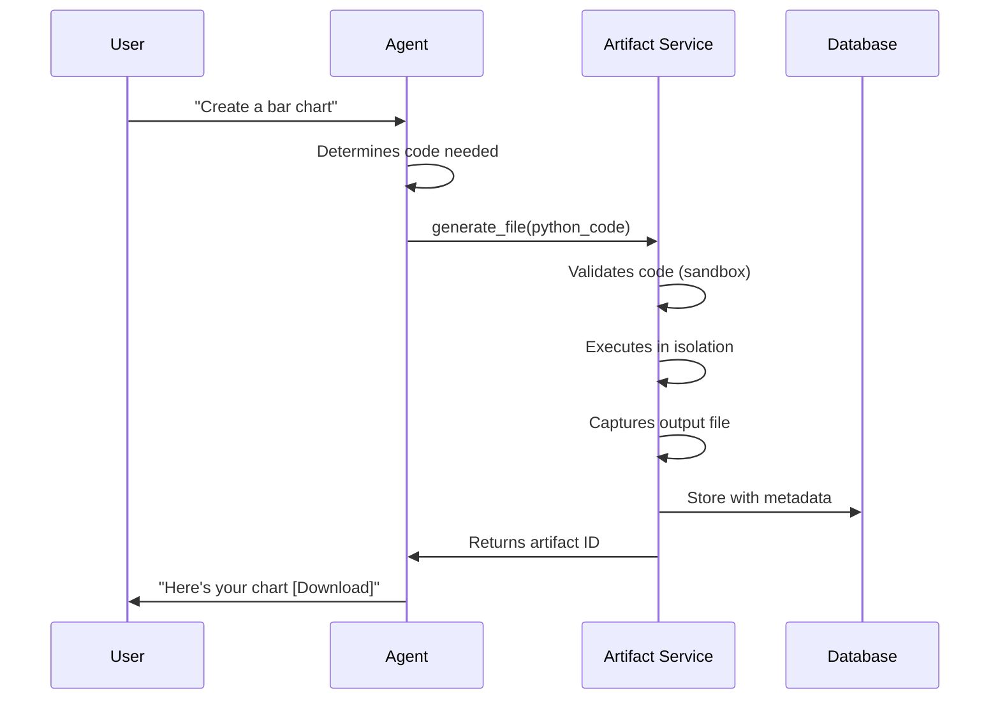

# Artifacts & File Generation

## How agents create files, charts, reports, and deliverables


Agents don't just chat - they create files. PDFs, charts, CSVs, images, code - anything you can generate with Python. The artifact system handles secure execution, storage, and delivery.


## What Are Artifacts?

Artifacts work similar to Claude's artifacts or ChatGPT's Canvas - when you ask MUXI to create something that results in a file (report, image, chart, code), it generates the file using its coding capabilities.

```
User:  "Create a sales report as PDF"
Agent: [Generates report.pdf]
Agent: "Here's your sales report: [Download PDF]"
```

**Technically:** The response includes text information ("I've done what you asked, the bottom line is...") plus a list of files with their types and Base64-encoded content. SDKs decode these for easy handling.

**Common artifact types:**
- 📊 **Charts**: Matplotlib, Plotly visualizations
- 📄 **Documents**: PDFs, Word docs, Markdown
- 📈 **Spreadsheets**: CSV, Excel files
- 🖼️ **Images**: Generated graphics, edited photos
- 💾 **Data exports**: JSON, XML, database dumps
- 📜 **Code**: Generated scripts, configuration files


## How It Works

### The Generation Process


```mermaid
sequenceDiagram
    participant U as User
    participant A as Agent
    participant S as Artifact Service
    participant D as Database

    U->>A: "Create a bar chart"
    A->>A: Determines code needed
    A->>S: generate_file(python_code)
    S->>S: Validates code (sandbox)
    S->>S: Executes in isolation
    S->>S: Captures output file
    S->>D: Store with metadata
    S->>A: Returns artifact ID
    A->>U: "Here's your chart [Download]"
```

1. **Agent writes code** to generate the file
2. **System validates** code for safety
3. **Sandboxed execution** with strict limits
4. **File captured** and processed
5. **Metadata extracted** (MIME type, size, etc.)
6. **Artifact stored** with unique ID
7. **User receives** downloadable link


## Security Model

### Sandboxed Execution

All artifact generation runs in a secure sandbox:

```
✅ Allowed:
  - Standard Python libraries (matplotlib, pandas, PIL, etc.)
  - File system writes (isolated temp directory)
  - CPU/memory within limits

❌ Blocked:
  - Network access
  - System commands
  - Dangerous imports (subprocess, os.system)
  - File reads outside temp directory
  - Execution beyond time limits
```

### Code Validation

Before execution, code is analyzed:

```python
# ❌ This would be rejected:
import os
os.system("rm -rf /")

# ✅ This is allowed:
import matplotlib.pyplot as plt
plt.bar(['A', 'B', 'C'], [10, 20, 15])
plt.savefig('chart.png')
```

**Validation checks:**
- AST parsing for dangerous patterns
- Whitelist of allowed imports
- No shell command execution
- No network requests
- No file system escapes

### IDs & limits

- Artifact IDs use `atf_{nanoid}`; execution IDs use `exc_{nanoid}`.
- Default limits: ~30s execution, ~512MB memory, ~10MB output (tune per deployment).
- Downloads are scoped to the requester’s formation and credentials.

### Resource Limits

Each artifact generation has strict limits:

```yaml
execution_timeout: 30s      # Max execution time
memory_limit: 512MB         # Max memory usage
output_size_limit: 10MB     # Max file size
```

Prevents runaway processes and resource exhaustion.


## Artifact Lifecycle

### Creation

```
User request
     ↓
Agent generates Python code
     ↓
System validates & executes
     ↓
File captured
     ↓
Artifact captured for the user
     ↓
Unique ID assigned (art_ABC123)
```

### Storage

Artifact memory stores encrypted blobs under the configured local path and
keeps searchable metadata in persistent memory. Storage is user-scoped rather
than organized by chat session.

```
artifacts/
└── <user_id>/
    └── <artifact_id_prefix>/
        └── <artifact_id>.bin
```

**Metadata includes:**
- MIME type (application/pdf, image/png, etc.)
- File size
- Created timestamp
- Producing agent and conversation ID
- Artifact name
- Version, parent artifact, summary, tags, and checksum

### Cleanup

Retention is unlimited by default. Configure a positive duration in days to
expire artifacts, with an hourly cleanup sweep:

```yaml
artifacts:
  retention:
    policy: last_accessed
    duration: 7
```

Use `last_updated` instead when reads should not extend retention.


## What Agents Can Generate

### Data Visualizations

```
User:  "Show me sales trends as a line chart"
Agent: [Creates matplotlib chart]
Agent: [Returns PNG artifact]
```

**Supported libraries:**
- Matplotlib (charts, plots, graphs)
- Plotly (interactive visualizations)
- Seaborn (statistical graphics)
- Pandas (data tables)

### Documents

```
User:  "Generate a project report as PDF"
Agent: [Uses ReportLab or Weasyprint]
Agent: [Returns PDF artifact]
```

**Document types:**
- PDF reports (with formatting)
- HTML documents
- Markdown files
- Plain text files

### Data Files

```
User:  "Export customer data as CSV"
Agent: [Formats data as CSV]
Agent: [Returns CSV artifact]
```

**Export formats:**
- CSV (comma-separated values)
- JSON (structured data)
- Excel spreadsheets
- XML documents
- YAML configuration

### Images

```
User:  "Generate a logo with text 'ACME Corp'"
Agent: [Uses PIL/Pillow]
Agent: [Returns PNG artifact]
```

**Image operations:**
- Generate graphics
- Composite images
- Add text overlays
- Resize/crop/filter
- Convert formats


## Automatic File Type Detection

The system automatically detects file types:

```python
Generated: chart.png
     ↓
MIME detection
     ↓
Type: image/png
     ↓
Category: image
     ↓
Browser displays inline
```

**Categories:**
- **Text**: Markdown, plain text, code
- **Document**: PDF, Word, presentations
- **Spreadsheet**: CSV, Excel
- **Image**: PNG, JPEG, SVG
- **Data**: JSON, XML, YAML
- **Archive**: ZIP, TAR

Determines how the artifact is displayed/downloaded.


## Usage Patterns

### Single Artifact

```
User:  "Create a bar chart of sales by region"
Agent: [Generates chart.png]
Response: "Here's your chart: [Download]"
```

### Multiple Artifacts

```
User:  "Generate quarterly reports for Q1-Q4"
Agent: [Generates q1.pdf, q2.pdf, q3.pdf, q4.pdf]
Response: "Created 4 reports:
  - Q1 Report [Download]
  - Q2 Report [Download]
  - Q3 Report [Download]
  - Q4 Report [Download]"
```

### Complex Workflows

```
User:  "Analyze data and create visualizations"
Agent:
  1. Reads data
  2. Performs analysis
  3. Generates 3 charts (line, bar, pie)
  4. Creates PDF report with embedded charts
  5. Exports raw data as CSV
Response: "Analysis complete:
  - Report: [Download PDF]
  - Data: [Download CSV]
  - Charts: [View Gallery]"
```


## Why Artifacts Matter

### Before (chat-only agents)

```
User:  "Show me a chart"
Agent: "I can't generate images, but here's ASCII art:
  *****
  ****
  ***"
```

Useless for real work.

### After (with artifacts)

```
User:  "Show me a chart"
Agent: [Generates professional matplotlib chart]
Response: "Here's your chart [Download PNG]"
```

**The difference:**
- **Real deliverables** vs text descriptions
- **Professional output** vs workarounds
- **Shareable files** vs ephemeral chat
- **Actual work done** vs just advice


## Configuration

The `artifacts:` block configures persistent artifact memory. Capture is enabled
by default for formations with persistent memory. With no block, artifacts use
local `./artifacts` storage, encryption is enabled, retention is unlimited, and
the capture limit is 50 MB per artifact.

```yaml
# formation.afs
artifacts:
  enabled: true
  storage:
    type: local               # only shipped backend; other values fail load
    path: ./artifacts
  encryption:
    enabled: true
  retention:
    policy: last_accessed     # last_accessed | last_updated
    duration: 0               # days; 0 keeps artifacts forever
  max_size_mb: 50
```


## Artifact Memory

Everything an agent produces through `generate_file` (local sandbox or RCE) is
persisted automatically - versioned, user-scoped, encrypted, and
retention-managed. There is no behavior change for agents; the data accumulates
so it can be recalled later.

- **Storage**: content is gzipped, then AES-256-GCM encrypted with a per-user
  key derived (HKDF-SHA256) from an immutable `formation_instance_id`, kept in a
  local blob store with SHA-256 checksums and a metadata row in the `artifacts`
  table.
- **Versioning**: producing an artifact with an existing name demotes the
  previous head and chains it via `parent_id`; history blobs are retained.
- **Retention**: `expires_at` is computed at capture from `artifacts.retention`;
  an hourly sweep soft-deletes expired rows and prunes blobs.
- **Safety**: capture is a tracked background task off the response path - every
  failure is logged and swallowed, and secret-interpolated content is never
  captured. S3 storage is rejected loudly at config time.

### Retrieving artifacts

Agents recall past artifacts through built-in tools, and the same data is
available over REST:

| Tool | Purpose |
|------|---------|
| `get_artifact` | Fetch an id with a 500-character preview, or search name/summary/tags with optional `category` (`limit` defaults to 5, max 20) |
| `get_artifact_content` | Read decrypted text content by id, optionally selecting `version`; binary content is kept out of model context |
| `get_artifact_history` | Walk the complete version chain from any version's id |

| REST endpoint | Purpose |
|---------------|---------|
| `GET /v1/artifacts` | List the user's latest artifact versions |
| `GET /v1/artifacts/{artifact_id}` | Read metadata and summary |
| `GET /v1/artifacts/{artifact_id}/content` | Download decrypted content |
| `GET /v1/artifacts/{artifact_id}/versions` | Read the version chain |

All reads are user-scoped. A cross-user artifact id behaves as not found.
Retrieval refreshes `last_accessed_at` and therefore extends expiry under the
`last_accessed` retention policy. If artifact memory is unavailable, listing
returns an empty collection and id reads return 404.

The per-user Knowledge Index includes up to
`memory.index.artifact_cap` artifacts (default 20), then points the agent to
`get_artifact` for further search:

```yaml
memory:
  index:
    artifact_cap: 20
```


## Security Considerations

### What's Protected

Artifact generation runs in the configured sandbox with import, path, time, and
memory controls. Persistent artifact reads are isolated by user; cross-user IDs
return not found. Local blobs are encrypted by default and integrity-checked
with SHA-256.

### What Users Should Know

- Retention is unlimited by default (`artifacts.retention.duration: 0`).
- Set a positive duration in days to enable automatic expiration.
- Artifact memory is not a replacement for an independent backup.

- The default capture limit is 50 MB per artifact
  (`artifacts.max_size_mb`).
- Larger files are returned to the user but skipped by artifact-memory capture.


## Common Use Cases

### Business Reports

```
User:  "Generate monthly sales report"
Agent:
  - Pulls sales data
  - Calculates metrics
  - Creates formatted PDF
  - Includes charts and tables
Artifact: sales_report_nov_2025.pdf
```

### Data Analysis

```
User:  "Analyze customer churn and visualize trends"
Agent:
  - Loads customer data
  - Calculates churn rate
  - Creates line chart (trend)
  - Creates pie chart (reasons)
  - Creates bar chart (by segment)
Artifacts:
  - churn_analysis.png
  - churn_by_reason.png
  - churn_by_segment.png
```

### Automated Exports

```
User:  "Export last 30 days of logs as CSV"
Agent:
  - Queries log database
  - Formats as CSV
  - Compresses if large
Artifact: logs_2025_11.csv
```

### Code Generation

```
User:  "Generate a Python script to process invoices"
Agent:
  - Writes invoice_processor.py
  - Includes error handling
  - Adds documentation
Artifact: invoice_processor.py (download and run)
```


## Limitations

### What Can't Be Generated

❌ **Interactive web apps** - Artifacts are static files
❌ **Real-time dashboards** - No continuous updates
❌ **Large datasets** - Size limits apply
❌ **Video/audio** - Not currently supported
❌ **Compiled binaries** - Security restriction

Use cases that need these should use external services (generate code to deploy elsewhere).

### Workarounds

**Need interactivity?** Generate HTML with embedded JavaScript

**Need large files?** Generate in chunks or compress

**Need video?** Generate frames as images, assemble elsewhere

**Need compilation?** Generate source code, user compiles locally


## Why This Matters

| Chat-Only Agents | Agents with Artifacts |
|-----------------|----------------------|
| Describe solutions | Deliver solutions |
| "Here's how to make a chart" | "Here's your chart [Download]" |
| Advice and guidance | Actual work product |
| User does the work | Agent does the work |
| Nothing tangible | Downloadable deliverables |

The result: **agents that deliver results**, not just advice.


## Learn More

- [Tools & MCP](../concepts/tools-and-mcp.md) - How agents use tools to generate artifacts
- [Deep Dive: Request Lifecycle](../deep-dives/request-lifecycle.md) - How artifact generation fits into request processing
