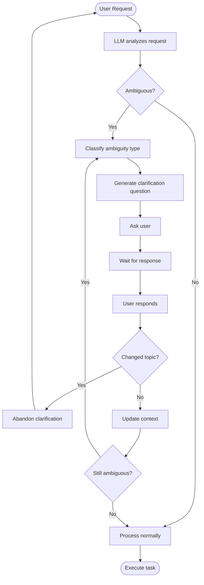

# Clarification System

## How agents handle ambiguity by asking intelligent questions


When your request is unclear, agents don't guess - they ask. The clarification system detects ambiguity and asks focused questions to understand what you really want.

---

## The Problem: Ambiguous Requests

**Common ambiguities:**

```
"Deploy the app"
  → Which app? Which environment? Which version?

"Show my files"
  → From where? What type? How many?

"Use my GitHub account"
  → You have 2 accounts - which one?

"Generate a report"
  → What data? What format? What timeframe?
```

Traditional agents either:
- ❌ **Guess** (often wrong)
- ❌ **Fail** with error messages
- ❌ **Ask everything** (annoying)

MUXI agents **clarify intelligently**.

---

## How It Works

### Intelligent Detection

The system uses LLM analysis to detect what's ambiguous:

```
User: "Deploy the app to production"
         ↓
LLM analyzes request
         ↓
Detects: Multiple apps exist, which one?
         ↓
Agent: "You have 3 apps: web-api, mobile-backend, admin-panel. Which one should I deploy?"
```

**Not pattern matching** - the LLM understands context and determines what's actually ambiguous.

### Focused Questions

Agents ask **only what they need**:

```
Bad (traditional):
  "What app? What environment? What version? What branch? 
   What tag? Should I run tests? Migrate database? ..."

Good (MUXI):
  "Which app should I deploy?"
  [User answers]
  "Deploy web-api to production. Proceeding..."
```

One question at a time, minimal friction.

---

## Types of Clarification

### 1. Missing Information

When required details are absent:

```
User: "Send an email"
Agent: "Who should I send the email to?"
User: "alice@example.com"
Agent: "What should the subject be?"
User: "Project Update"
Agent: [Sends email]
```

The agent builds up the complete picture step by step.

### 2. Ambiguous References

When multiple options exist:

```
User: "Check my GitHub repos"
Agent: "You have two GitHub accounts: ranaroussi (personal) and 
       lilyautomaze (work). Which one?"
User: "ranaroussi"
Agent: [Shows ranaroussi's repositories]
```

Clear selection from available options.

### 3. Conflicting Instructions

When requests don't make sense:

```
User: "Deploy to production without testing"
Agent: "Production deployments require tests to pass. Should I:
       1. Run tests first, then deploy
       2. Deploy to staging instead
       3. Cancel deployment"
User: "Run tests first"
Agent: [Runs tests, then deploys]
```

The agent explains the conflict and offers solutions.

### 4. Insufficient Context

When the request needs more background:

```
User: "Fix the bug"
Agent: "Which bug are you referring to? I see:
       - Issue #42: Login timeout
       - Issue #51: Chart rendering
       - Issue #63: Email formatting"
User: "Issue #51"
Agent: [Investigates chart rendering bug]
```

The agent helps you be specific.

### 5. Confirmation Needed

When the action has serious consequences:

```
User: "Delete all old logs"
Agent: "This will delete 15,234 log files (45 GB) permanently. 
       Are you sure?"
User: "Yes"
Agent: [Deletes logs]
```

Safety confirmation for destructive operations.

---

## Multi-Turn Clarification

Complex requests may need multiple clarifications:

```
User: "Generate a report"
Agent: "What type of report?"
User: "Sales report"
Agent: "For which time period?"
User: "Last quarter"
Agent: "Which format would you like?"
User: "PDF"
Agent: [Generates Q4 2025 sales report as PDF]
```

The conversation builds context naturally.

### Context Tracking

The system remembers what's been clarified:

```
User: "Generate a report"
Agent: "What type of report?"
User: "Sales"
Agent: "For which period?"
User: "Last quarter"
Agent: [Knows: type=sales, period=Q4]
User: "Actually, make it monthly"
Agent: [Updates: period=monthly, still knows type=sales]
```

No need to repeat information.

---

## Smart Features

### Context Switch Detection

The agent knows when you change topics:

```
[Clarifying deployment]
Agent: "Which environment?"
User: "Actually, can you help me with something else?"
Agent: [Abandons deployment clarification]
Agent: "Sure, what do you need?"
```

Doesn't force you to finish clarifications.

### Clarification Styles

Different communication styles for different situations:

**Conversational** (default):
```
Agent: "I need a bit more info! Which GitHub account should I use - 
       ranaroussi or lilyautomaze?"
```

**Formal** (enterprise):
```
Agent: "Please specify the GitHub account: ranaroussi or lilyautomaze."
```

**Brief** (power users):
```
Agent: "GitHub account? (ranaroussi/lilyautomaze)"
```

Configure in formation settings.

### Intelligent Defaults

When there's a reasonable default:

```
Agent: "Which branch should I deploy? (default: main)"
User: [presses enter]
Agent: [Uses 'main']
```

Smart defaults reduce clarification burden.

---

## Technical Flow



---

## Configuration

### Enable/Disable Clarification

```yaml
# formation.afs
clarification:
  enabled: true
  max_turns: 5              # Max clarification rounds
  style: conversational     # or "formal", "brief"
  timeout: 300              # 5 minutes
```

### Customize Behavior

```yaml
clarification:
  # Auto-confirm for non-destructive operations
  auto_confirm: true
  
  # Require confirmation for these operations
  require_confirmation:
    - delete
    - deploy_production
    - send_email
  
  # Default values
  defaults:
    environment: staging
    branch: main
```

---

## Why Traditional Approaches Fail

### Pattern Matching

```python
# Old approach
if "deploy" in message and "app" not in message:
    ask("Which app?")
```

**Problems:**
- Breaks in other languages
- Misses semantic ambiguity
- Too rigid
- Can't adapt to context

### Hard-Coded Rules

```python
# Old approach
required_fields = ["app_name", "environment", "version"]
for field in required_fields:
    if field not in request:
        ask(f"What is {field}?")
```

**Problems:**
- Asks everything even if obvious from context
- Can't prioritize questions
- Annoying for users
- Not intelligent

---

## MUXI's LLM-Powered Approach

```python
# MUXI approach
ambiguity = llm.analyze(message, context)
if ambiguity:
    question = llm.generate_clarification(ambiguity)
    ask(question)
```

**Benefits:**
- ✅ Understands natural language
- ✅ Works in any language
- ✅ Adapts to context
- ✅ Asks only what's needed
- ✅ Prioritizes important questions

---

## Example Scenarios

### Deployment Clarification

```
User: "Deploy to production"
Agent: "Which formation should I deploy?"
User: "The API"
Agent: [Checks: API tests passing? Yes]
Agent: "Deploying api-formation to production..."
Agent: [If tests were failing:]
       "Tests are failing. Should I:
        1. Fix tests first
        2. Deploy to staging
        3. Cancel"
```

### Data Request Clarification

```
User: "Show me customer data"
Agent: "How many customers?"
User: "Last 100"
Agent: "Which fields do you need?"
User: "Just name and email"
Agent: [Returns CSV with name and email for last 100 customers]
```

### Account Selection Clarification

```
User: "Check my Slack messages"
Agent: "You have 3 Slack workspaces:
       - acme-corp (work)
       - freelance-clients
       - personal
       Which one?"
User: "acme-corp"
Agent: [Shows messages from acme-corp workspace]
```

---

## When Clarification Happens

### Automatic Triggers

The system automatically detects need for clarification:

- **Missing required information** (deployment without app name)
- **Multiple valid options** (2+ accounts for same service)
- **Ambiguous references** ("the app", "that file")
- **Conflicting parameters** (incompatible options)
- **Destructive operations** (delete, overwrite)
- **High-impact actions** (production deployment)

### Manual Triggers

Agents can also explicitly request clarification:

```
Agent: "I'm not sure I understand. Do you want me to:
       1. Update the existing report
       2. Create a new report
       3. Delete the old report and create a new one"
```

---

## Why This Matters

| Guess-Based Agents | Clarification-Based Agents |
|-------------------|---------------------------|
| Often wrong | Gets it right |
| Wastes time on mistakes | Saves time with questions |
| Frustrating errors | Smooth conversations |
| Requires perfect prompts | Handles natural language |
| Can't handle ambiguity | Thrives on conversation |

The result: **agents that understand you**, not robots that need perfect input.

---

## Learn More

- [User Credentials](user-credentials.md) - Clarification for account selection
- [The Overlord](overlord.md) - How clarification fits into orchestration
- [Agents & Orchestration](agents.md) - Agent decision-making process
