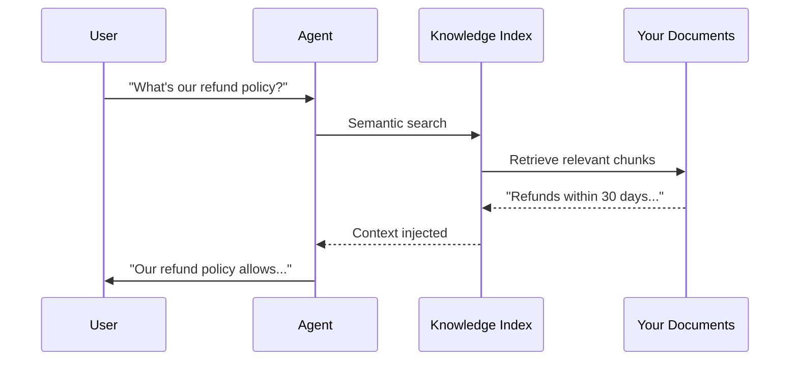

# Knowledge & RAG

## How agents access domain expertise from your documents


MUXI's knowledge system lets agents answer questions from your documents - PDFs, markdown, spreadsheets, images, and more. Automatic indexing, semantic search, and multimodal support built in.

---

## How It Works



1. **You add documents** to `knowledge/` directory
2. **MUXI indexes** them at startup (embeddings + chunking)
3. **User asks a question** related to your docs
4. **Agent searches** the index semantically
5. **Relevant context** injected into the prompt
6. **Agent answers** using your domain knowledge

---

## Supported Formats

MUXI uses [markitdown](https://github.com/microsoft/markitdown) for document conversion - any format markitdown supports works with MUXI.

### Common Formats

| Category | Examples | Notes |
|----------|----------|-------|
| **Text & Documents** | `.md`, `.txt`, `.pdf`, `.docx`, `.pptx`, `.xlsx` | Headers, structure, and formatting preserved |
| **Data** | `.csv`, `.json`, `.html` | Structure-aware chunking |
| **Multimodal** | `.jpg`, `.png`, `.gif`, and more | OCR + vision model analysis |

> [!TIP]
> MUXI handles images natively. Vision models (GPT-4V, Claude, Gemini) can analyze screenshots, diagrams, charts, and photos in your knowledge base.

---

## Multimodal Support

MUXI understands images, not just extracts text from them:

```
knowledge/
├── architecture-diagram.png    ← Vision model analyzes
├── product-screenshot.jpg      ← UI elements recognized
├── chart.png                   ← Data extracted
└── handwritten-notes.jpg       ← OCR + interpretation
```

When a user asks about your architecture, the agent can reference the diagram directly:

```
User: "How does data flow through our system?"
Agent: "Based on the architecture diagram, data flows from..."
```

---

## Agent-Specific Knowledge

Different agents can access different knowledge bases:

```yaml
agents:
  - id: support
    role: Customer support
    knowledge:
      sources:
        - path: knowledge/faq/
        - path: knowledge/troubleshooting/
  
  - id: sales
    role: Sales advisor
    knowledge:
      sources:
        - path: knowledge/pricing/
        - path: knowledge/features/
```

Support agent knows troubleshooting; sales agent knows pricing. No overlap, no confusion.

---

## How Indexing Works

### Automatic at Startup

```bash
muxi dev
# Indexing knowledge...
# ✓ 47 documents indexed
# ✓ 1,234 chunks created
# ✓ Embeddings cached
```

### Incremental Updates

When files change:
1. **MD5 hash** detects modifications
2. **Only changed files** re-indexed
3. **Cache preserved** for unchanged content

Force full reindex:
```bash
muxi dev --reindex
```

### Lazy Loading

First query triggers loading - startup stays fast even with large knowledge bases.

---

## Why This Matters

| Without MUXI | With MUXI |
|--------------|-----------|
| Fine-tune models for domain knowledge | Just add documents |
| Manually chunk and embed | Automatic indexing |
| Text-only RAG | Multimodal (images, charts, diagrams) |
| Same knowledge for all agents | Agent-specific expertise |
| Manual index management | Automatic incremental updates |

The result: **agents that know your domain**, not generic chatbots that need everything explained.

---

## Quick Setup

```yaml
agents:
  - id: assistant
    knowledge:
      enabled: true
      sources:
        - path: knowledge/docs/
          description: Product documentation
```

Add your docs to `knowledge/docs/`, restart, done.

---

## Learn More

- [Configure knowledge](../reference/knowledge.md) - YAML syntax
- [Add Knowledge Guide](../guides/add-knowledge.md) - Step-by-step tutorial
