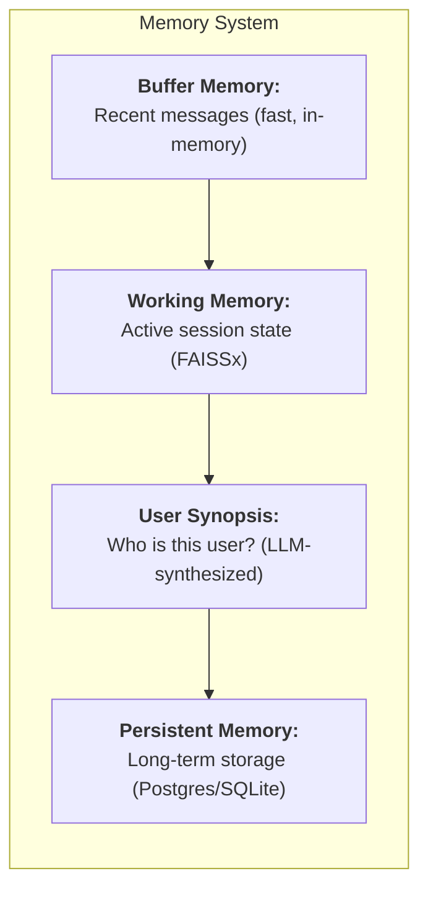

# Memory System

## How MUXI remembers context across conversations and sessions

MUXI's four-layer memory system handles everything from immediate conversation context to long-term user knowledge. Automatic tiering, intelligent caching, and semantic search - all built in.

## The Four Layers



| Layer | Purpose | Storage |
|-------|---------|---------|
| **Buffer** | Recent messages | In-memory |
| **Working** | Session state, tool outputs | FAISSx (vector) |
| **User Synopsis** | Who the user is | Derived from persistent |
| **Persistent** | Long-term facts | Postgres/SQLite |


## FAISSx: MUXI's Vector Store

MUXI uses **FAISSx** - our wrapper around Meta's FAISS library - for vector storage in working memory.

**Why FAISSx?**
- Can be deployed as a **server** for multi-instance setups
- When you deploy formations across multiple servers, they can share memory
- Fast semantic search for context retrieval

```yaml
memory:
  working:
    provider: faissx
    server: "tcp://faissx.internal:45678"  # Optional: shared server
```


## Multi-Tenancy Requires Postgres

> **Important:** By default (without persistent storage), MUXI supports only a single user with no long-term memory.

| Setup | Users | Long-term Memory | Use Case |
|-------|-------|------------------|----------|
| No persistent storage | Single user | ❌ None | Local testing |
| SQLite | Single user | ✅ Yes | Simple deployments |
| **Postgres** | Multi-tenant | ✅ Yes, per user | Production |

**To enable multi-tenancy:**

```yaml
memory:
  persistent:
    provider: postgres
    connection_string: ${{ secrets.POSTGRES_URL }}
```

With Postgres:
- Each user gets a namespace
- Memory is segregated by user
- User synopsis works properly
- Long-term memory persists across sessions


## User Synopsis: "Who Am I Talking To?"

The Overlord always knows who it's communicating with via user synopsis - an LLM-synthesized profile:

```
User Synopsis for alice@acme.com:
- Name: Alice Johnson
- Role: Product Manager at Acme Corp
- Timezone: PST
- Prefers concise, data-driven responses
- Working on Q4 planning
- Recent topics: API performance, monitoring
```

**How it's built:**
1. User interacts over time
2. Important facts extracted to persistent memory
3. LLM synthesizes synopsis on demand
4. Cached for performance (configurable TTL)

**Why it matters:**
- Overlord personalizes responses
- Agents have context about who they're helping
- No need to repeat background info

```yaml
memory:
  persistent:
    user_synopsis:
      enabled: true
      cache_ttl: 3600  # Refresh every hour
```


## How Memory Flows

```
New message arrives
         ↓
Stored in buffer memory
         ↓
Relevant context retrieved from working memory (FAISSx)
         ↓
User synopsis loaded (who is this?)
         ↓
Agent processes request with full context
         ↓
Important information saved to persistent memory
         ↓
Working memory updated with session state
```

You don't manage this manually - MUXI handles tiering automatically.


## Semantic Search

When agents need context, MUXI searches across memory layers:

```
User:  "What's my API key?"
         ↓
MUXI searches:
  - Buffer: recent conversation
  - Working: tool outputs, session state
  - Persistent: "API key xyz123 shared on Jan 5"
         ↓
Agent: "Your API key is xyz123, from January 5th."
```

Vector embeddings enable semantic similarity, not just keyword matching.


## User Isolation

Each user's memory is completely isolated (when using Postgres):

```
User A: "My password is secret123"
        → stored in user_a namespace

User B: "What's my password?"
        → searches user_b namespace
        → "I don't have that information"
```

No data leaks between users.


## Token Savings with Synopsis

Without synopsis, every request includes full history:
```
100 messages × 100 tokens = 10,000 tokens per request
```

With synopsis:
```
Synopsis: ~300 tokens
Savings: 97% reduction!
```

For users with long histories, this dramatically reduces costs.


## Configuration

### Basic Setup (Single User)

```yaml
memory:
  buffer:
    size: 50
  working:
    provider: faissx
```

### Production Setup (Multi-Tenant)

```yaml
memory:
  buffer:
    size: 50

  working:
    provider: faissx
    server: "tcp://faissx.internal:45678"

  persistent:
    provider: postgres
    connection_string: ${{ secrets.POSTGRES_URL }}
    user_synopsis:
      enabled: true
      cache_ttl: 3600
```


## Summary

| Layer | What It Stores | When It's Used |
|-------|---------------|----------------|
| **Buffer** | Recent messages | Immediate context |
| **Working** | Session state, tool outputs | Current task |
| **User Synopsis** | Who the user is | Every request |
| **Persistent** | Long-term facts | Returning users |

**Key points:**
- FAISSx for vector storage (can be shared across instances)
- Postgres required for multi-tenancy
- User synopsis reduces token costs dramatically
- All memory is user-isolated in production


## Learn More

- [Configure Memory](../reference/memory.md) - YAML syntax
- [Add Memory Guide](../guides/add-memory.md) - Step-by-step tutorial
- [Memory Internals](../deep-dives/memory-internals.md) - Technical deep dive
