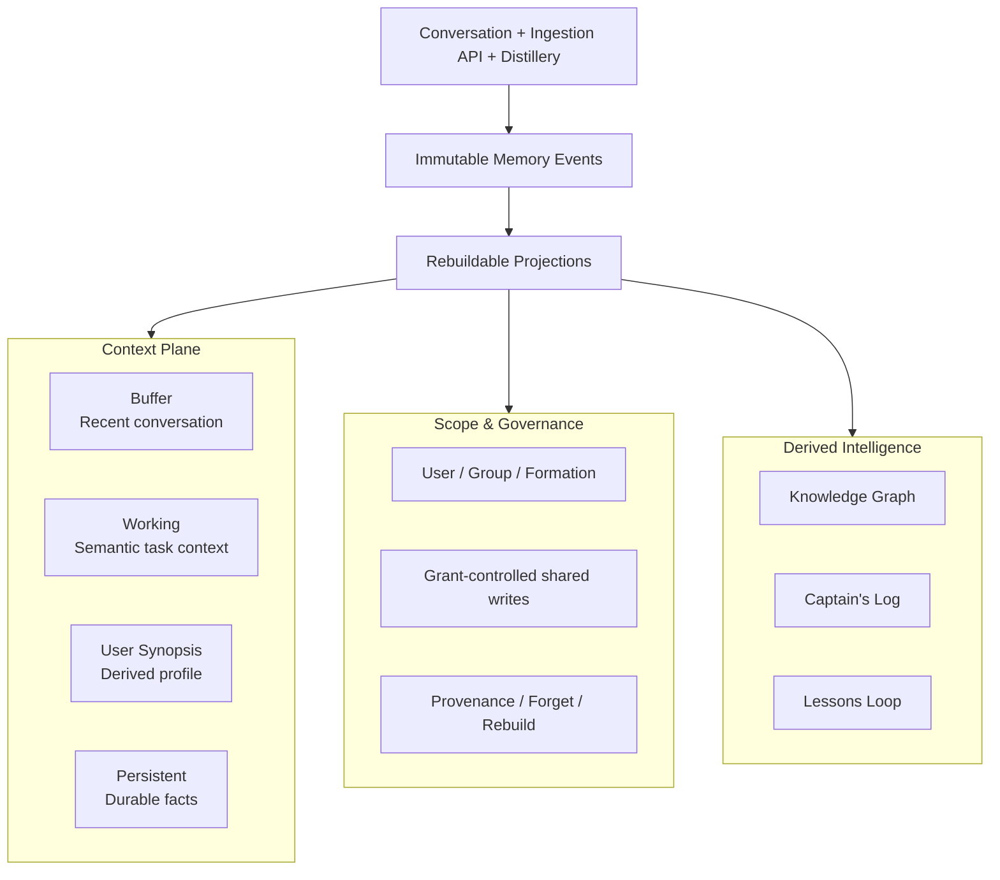

# Memory Platform

## Memory that can explain, rebuild, and forget itself

MUXI memory is more than conversation history plus a vector store. It combines
fast context assembly with scoped sharing, immutable events, rebuildable
projections, ingestion pipelines, provenance, lifecycle controls, and derived
intelligence.

## Platform Architecture


```mermaid
flowchart TB
    Sources["Conversation + Ingestion API + Distillery"] --> Events["Immutable Memory Events"]
    Events --> Projections["Rebuildable Projections"]

    subgraph Context["Context Plane"]
        Buffer["Buffer<br>Recent conversation"]
        Working["Working<br>Semantic task context"]
        Synopsis["User Synopsis<br>Derived profile"]
        Persistent["Persistent<br>Durable facts"]
    end

    subgraph Governance["Scope & Governance"]
        Scopes["User / Group / Formation"]
        Grants["Grant-controlled shared writes"]
        Provenance["Provenance / Forget / Rebuild"]
    end

    subgraph Intelligence["Derived Intelligence"]
        Graph["Knowledge Graph"]
        Log["Captain's Log"]
        Lessons["Lessons Loop"]
    end

    Projections --> Context
    Projections --> Governance
    Projections --> Intelligence
```

| Plane | What it provides |
|-------|------------------|
| **Context** | Buffer, semantic working context, persistent facts, and derived user synopses |
| **Scope** | Isolated user memory plus grant-controlled group and formation knowledge |
| **Events** | Immutable writes, provenance, idempotent ingestion, and rebuildable projections |
| **Intelligence** | Knowledge graph, contradiction handling, Captain's Log, and reusable lessons |
| **Lifecycle** | Backfill, selective forgetting, decay, compaction, pruning, indexing, and linting |
| **Enterprise ingestion** | Batch APIs and signed on-premises distillery submissions |

The context plane still uses buffer, working, synopsis, and persistent stores
for fast request assembly. Those stores are implementation layers inside the
platform, not the complete memory architecture.


## FAISSx: MUXI's Vector Store

MUXI uses **FAISSx** - our wrapper around Meta's FAISS library - for vector storage in working memory.

**Why FAISSx?**
- Can be deployed as a **server** for multi-instance setups
- When you deploy formations across multiple servers, they can share memory
- Fast semantic search for context retrieval

```yaml
memory:
  working:
    provider: faissx
    server: "tcp://faissx.internal:45678"  # Optional: shared server
```


## Multi-Tenancy Requires Postgres

> **Important:** By default (without persistent storage), MUXI supports only a single user with no long-term memory.

| Setup | Users | Long-term Memory | Use Case |
|-------|-------|------------------|----------|
| No persistent storage | Single user | ❌ None | Local testing |
| SQLite | Single user | ✅ Yes | Simple deployments |
| **Postgres** | Multi-tenant | ✅ Yes, per user | Production |

**To enable multi-tenancy:**

```yaml
memory:
  persistent:
    provider: postgres
    connection_string: ${{ secrets.POSTGRES_URL }}
```

With Postgres:
- Each user gets a namespace
- Memory is segregated by user
- User synopsis works properly
- Long-term memory persists across sessions


## User Synopsis: "Who Am I Talking To?"

The Overlord always knows who it's communicating with via user synopsis - an LLM-synthesized profile:

```
User Synopsis for alice@acme.com:
- Name: Alice Johnson
- Role: Product Manager at Acme Corp
- Timezone: PST
- Prefers concise, data-driven responses
- Working on Q4 planning
- Recent topics: API performance, monitoring
```

**How it's built:**
1. User interacts over time
2. Important facts extracted to persistent memory
3. LLM synthesizes synopsis on demand
4. Cached for performance (configurable TTL)

**Why it matters:**
- Overlord personalizes responses
- Agents have context about who they're helping
- No need to repeat background info

```yaml
memory:
  persistent:
    user_synopsis:
      enabled: true
      cache_ttl: 3600  # Refresh every hour
```


## How Memory Flows

```
New message arrives
         ↓
Stored in buffer memory
         ↓
Relevant context retrieved from working memory (FAISSx)
         ↓
User synopsis loaded (who is this?)
         ↓
Agent processes request with full context
         ↓
Important information saved to persistent memory
         ↓
Working memory updated with session state
```

You don't manage this manually - MUXI handles tiering automatically.


## Semantic Search

When agents need context, MUXI searches across memory layers:

```
User:  "What's my API key?"
         ↓
MUXI searches:
  - Buffer: recent conversation
  - Working: tool outputs, session state
  - Persistent: "API key xyz123 shared on Jan 5"
         ↓
Agent: "Your API key is xyz123, from January 5th."
```

Vector embeddings enable semantic similarity, not just keyword matching.

### Embedding Models

MUXI supports both API-based and local embedding models. The embedding dimension is detected automatically and each dimension gets its own storage table, so different formations can coexist in the same database.

```yaml
llm:
  models:
    # API-based
    - embedding: "openai/text-embedding-3-small"    # 1536 dims
    # Or local (no API key needed; full HuggingFace repo id)
    - embedding: "local/nomic-ai/nomic-embed-text-v1.5"   # 768 dims (default)
```

The default local model is pre-downloaded by `muxi-server init` and shared across formations via a host cache bind-mounted at `/opt/hf-cache`.

> [!IMPORTANT]
> **Slug shape matters, and the runtime now fails fast on typos.** OneLLM's `local/` provider expects `local/<owner>/<repo>` (HuggingFace's required two-segment shape) — `local/all-MiniLM-L6-v2` is invalid; the canonical form is `local/sentence-transformers/all-MiniLM-L6-v2`. As of Runtime v0.20260503.0, every formation-declared model is exercised with a minimal real round-trip at load time. A 404 / shape-invalid slug aborts startup with a `ConfigurationValidationError` and a precise corrected-form suggestion, instead of silently falling back to recency-only retrieval on the first user request.

> [!TIP]
> If you don't need a custom embedding model, omit the `embedding:` line entirely. The runtime will use its tested default, which is pre-warmed in the official Docker images. Declaring a slug only to match the default just creates an opportunity for typos.


## User Isolation

Each user's memory is completely isolated (when using Postgres):

```
User A: "My password is secret123"
        → stored in user_a namespace

User B: "What's my password?"
        → searches user_b namespace
        → "I don't have that information"
```

No data leaks between users.


## Token Savings with Synopsis

Without synopsis, every request includes full history:
```
100 messages × 100 tokens = 10,000 tokens per request
```

With synopsis:
```
Synopsis: ~300 tokens
Savings: 97% reduction!
```

For users with long histories, this dramatically reduces costs.


## Configuration

### Basic Setup (Single User)

Persistent memory is enabled by default with SQLite -- no configuration needed. For basic customization:

```yaml
memory:
  buffer:
    size: 50
  working:
    provider: faissx
```

> [!NOTE]
> When `persistent` is omitted, SQLite is automatically enabled with `memory.db` in the formation directory. Your formation has persistent memory out of the box.

### Production Setup (Multi-Tenant)

```yaml
memory:
  buffer:
    size: 50

  working:
    provider: faissx
    server: "tcp://faissx.internal:45678"

  persistent:
    provider: postgres
    connection_string: ${{ secrets.POSTGRES_URL }}
    user_synopsis:
      enabled: true
      cache_ttl: 3600
```


## Summary

| Layer | What It Stores | When It's Used |
|-------|---------------|----------------|
| **Buffer** | Recent messages | Immediate context |
| **Working** | Session state, tool outputs | Current task |
| **User Synopsis** | Who the user is | Every request |
| **Persistent** | Long-term facts | Returning users |

**Key points:**
- FAISSx for vector storage (can be shared across instances)
- Postgres required for multi-tenancy
- User synopsis reduces token costs dramatically
- All memory is user-isolated in production


## Platform capabilities

The context plane assembles each request. The rest of the platform makes memory
durable, structured, shareable, and auditable:

- **Scopes** - a memory is written to one scope (`user`, `group`, or
  `formation`) and read up the chain, so shared knowledge is separate from
  personal recall. Shared writes are [grant-gated](access-control.md#shared-memory-grants).
- **Ingestion** - developers and pipelines push content through `POST /v1/memories`
  (idempotent by `(source, source_id)`), not just conversation.
- **Event substrate** - every write is an immutable event; the stores are
  rebuildable projections. This powers provenance ("why do you think X?"),
  `POST /v1/memory/rebuild`, decay, and GDPR `POST /v1/memory/forget`.
- **Knowledge graph & Captain's Log** - structured entity/relationship
  extraction with contradiction handling, a temporal per-user narrative digest
  (via `/history`), and a lessons loop that feeds agent prompts.

See the [memory reference](../reference/memory.md#memory-scopes) for the full
config and API surface.


## Learn More

- [Configure Memory](../reference/memory.md) - YAML syntax
- [Add Memory Guide](../guides/add-memory.md) - Step-by-step tutorial
- [Memory Internals](../deep-dives/memory-internals.md) - Technical deep dive
