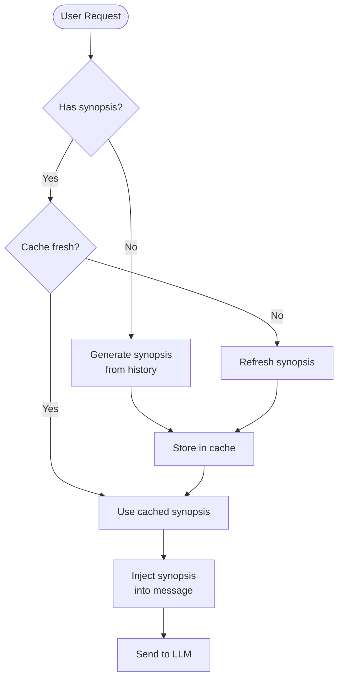

# Memory System

## How MUXI remembers context across conversations and sessions


MUXI's three-tier memory handles everything from immediate conversation context to long-term user knowledge. Automatic tiering, intelligent caching, and semantic search - built in.


## The Three Tiers

```
┌──────────────────────────────────────────┐
│              Buffer Memory               │
│    Recent messages (fast, in-memory)     │
│              ~50 messages                │
└───────────────────┬──────────────────────┘
                    ↓ overflow
┌──────────────────────────────────────────┐
│              Working Memory              │
│     Tool outputs, intermediate state     │
│              Vector-indexed              │
└───────────────────┬──────────────────────┘
                    ↓ important info
┌──────────────────────────────────────────┐
│            Persistent Memory             │
│    Long-term storage (SQLite/Postgres)   │
│            Survives restarts             │
└──────────────────────────────────────────┘
```

Each tier serves a purpose:

| Tier | Speed | Capacity | Survives Restart |
|------|-------|----------|------------------|
| Buffer | Fastest | ~50 msgs | No |
| Working | Fast | Configurable | No |
| Persistent | Slower | Unlimited | Yes |

---

## How It Works

### Automatic Flow

1. **New message arrives** → stored in buffer
2. **Buffer fills up** → older messages summarized, moved to working memory
3. **Important information detected** → promoted to persistent storage
4. **Query arrives** → all three tiers searched for relevant context

You don't manage this manually - MUXI handles tiering automatically.

### Semantic Search

When an agent needs context, MUXI doesn't just look at recent messages:

```
User: "What's my API key?"
      ↓
MUXI searches:
  - Buffer: recent conversation
  - Working: tool outputs, cached results
  - Persistent: "You mentioned API key xyz123 on Jan 5"
      ↓
Agent: "Your API key is xyz123, which you shared on January 5th."
```

Vector embeddings enable semantic similarity, not just keyword matching.

---

## User Synopsis Caching

For each user, MUXI maintains an LLM-synthesized profile:

```
User Synopsis (cached):
- Prefers Python over JavaScript
- Works at Acme Corp
- Timezone: PST
- Communication style: Direct, technical
- Recent projects: ML pipeline, API integration
```

This synopsis:
- **Updates automatically** as new information emerges
- **Two-tier caching**: identity (long-term) + context (refreshed regularly)
- **Reduces tokens by 80%+** vs. including full history every time

Configure synopsis behavior:

```yaml
memory:
  persistent:
    user_synopsis:
      enabled: true       # default true
      cache_ttl: 3600     # seconds for context synopsis refresh
```

- `enabled`: disable if you want to skip synopsis generation to save LLM cost.
- `cache_ttl`: refresh cadence for the context synopsis; identity synopsis persists until updated.

---

## Context Management

### Intelligent Prioritization

Not all context is equal. MUXI scores relevance:

```
High priority (always included):
- User preferences and identity
- Current session context
- Explicitly remembered facts

Medium priority (included if space):
- Related past conversations
- Relevant tool outputs

Low priority (summarized or dropped):
- Old, unrelated messages
- Redundant information
```

### FIFO Cleanup

When memory limits are reached:

```yaml
memory:
  working:
    max_memory_mb: 10
    fifo_interval_min: 5
```

Oldest, least relevant items are removed first. Important information is preserved.

---

## Multi-User Isolation

Each user gets completely isolated memory:

```
User A: "My password is secret123"
        ↓ stored under user_a

User B: "What's my password?"
        ↓ searches user_b namespace
        → "I don't have that information"
```

This happens automatically with `user_isolation: true` - no data leaks between users.

---

## User Synopsis: Smart Context Compression

For returning users, MUXI generates LLM-synthesized summaries instead of sending full conversation history. This dramatically reduces token usage while preserving context.

### The Problem

```
Returning user with 100 previous messages
         ↓
Traditional: Send all 100 messages to LLM
         ↓
Cost: ~50,000 tokens
```

Expensive and slow.

### The Solution

```
Returning user with 100 previous messages
         ↓
MUXI: Generate synopsis once, cache it
         ↓
Send synopsis instead of full history
         ↓
Cost: ~2,000 tokens (96% reduction!)
```

### Two-Tier Synopsis

MUXI splits user information into two types with different caching:

**Tier 1: Identity Synopsis** (rarely changes)
```
User identity:
  - Name: Alice
  - Role: Product Manager
  - Company: Acme Corp
  - Email: alice@acme.com
  - Time zone: EST
```

Cached permanently until explicitly updated. Doesn't change often.

**Tier 2: Context Synopsis** (changes frequently)
```
Recent preferences and activities:
  - Prefers Python over JavaScript
  - Working on Q4 OKRs
  - Last asked about API rate limits
  - Interested in performance optimization
```

Cached with configurable TTL (default: 1 hour). Updates as user interacts.

### How It Works



**First request:**
1. No synopsis exists
2. LLM analyzes full conversation history
3. Generates concise synopsis
4. Caches synopsis (1 hour TTL)
5. Injects synopsis into current request

**Subsequent requests (within TTL):**
1. Synopsis exists and is fresh
2. Injects cached synopsis
3. No LLM call needed for history analysis!

**After TTL expires:**
1. Synopsis is stale
2. LLM regenerates synopsis from recent history
3. Updates cache
4. Continues with new synopsis

### Configuration

```yaml
memory:
  persistent:
    user_synopsis:
      enabled: true           # Enable synopsis generation
      cache_ttl: 3600         # Cache TTL in seconds (1 hour)
```

**Parameters:**

- **`enabled`** (default: true) - Enable/disable synopsis feature
- **`cache_ttl`** (default: 3600) - How long to cache context synopsis

**Tuning cache_ttl:**

| TTL | Use Case | Trade-off |
|-----|----------|-----------|
| 300 (5min) | Rapidly evolving conversations | More fresh, higher LLM cost |
| 3600 (1hr) | Balanced (default) | Good freshness, reasonable cost |
| 7200 (2hr) | Long-term projects | Less fresh, lower cost |
| 86400 (24hr) | Stable contexts | Stale data possible, minimal cost |

### Token Savings

**Example: User with 50 previous messages**

Without synopsis:
```
50 messages × avg 100 tokens = 5,000 tokens per request
```

With synopsis:
```
Synopsis: ~200 tokens
Savings: 4,800 tokens (96% reduction)
```

**For heavy users:**
```
User with 500 messages in history
Without: 50,000 tokens
With: 500 tokens
Savings: 99% reduction!
```

### What Gets Synthesized

**Identity synopsis includes:**
- Name, role, company
- Email, time zone
- Explicit user-provided information
- Stable facts that rarely change

**Context synopsis includes:**
- Recent preferences
- Current projects/goals
- Recent topics of interest
- Behavioral patterns
- Tool usage patterns

**NOT included:**
- Sensitive data (passwords, keys)
- Full conversation verbatim
- Temporary information
- Noise and small talk

The LLM extracts what matters and discards the rest.

### Automatic Updates

Synopsis updates happen automatically:

```
User: "I now prefer TypeScript over Python"
     ↓
Next synopsis refresh:
  - OLD: "Prefers Python over JavaScript"
  - NEW: "Prefers TypeScript"
```

No manual maintenance needed.

### Example Synopsis

```
# Identity Synopsis (Tier 1)
User: Alice Johnson
Role: Senior Product Manager
Company: Acme Corp
Team: Platform Team
Location: New York (EST)

# Context Synopsis (Tier 2)
Current focus:
  - Leading Q4 OKR planning for Platform Team
  - Investigating API performance issues
  - Evaluating new monitoring solutions

Preferences:
  - Prefers detailed technical explanations
  - Values data-driven decisions
  - Likes visual charts and graphs

Recent activities:
  - Analyzed API latency metrics (2 days ago)
  - Created deployment runbook (last week)
  - Set up alerting for critical services
```

This compact summary replaces hundreds of messages.

### When Synopsis Helps Most

✅ **Great for:**
- Returning users with long history
- Users who interact daily/weekly
- Users with clear preferences
- Long-running projects

❌ **Less helpful for:**
- First-time users (no history to summarize)
- One-off questions
- Anonymous users
- Users who clear history frequently

---

## Why This Matters

| Without MUXI | With MUXI |
|--------------|-----------|
| Manually manage context windows | Automatic tiering |
| Forget after session ends | Persistent memory |
| Same context for everyone | Per-user isolation |
| Full history = high token costs | Synopsis caching saves 80%+ |
| Keyword search only | Semantic similarity |

The result: **agents that remember**, not stateless chatbots.

---

## Quick Setup

```yaml
memory:
  buffer:
    size: 50
    vector_search: true
  persistent:
    enabled: true
    provider: sqlite
```

That's it. Three-tier memory, semantic search, automatic management.

---

## Learn More

- [Configure memory](../reference/memory.md) - YAML syntax
- [Add Memory Guide](../guides/add-memory.md) - Step-by-step tutorial
- [Memory Internals](../deep-dives/memory.md) - Technical deep dive
