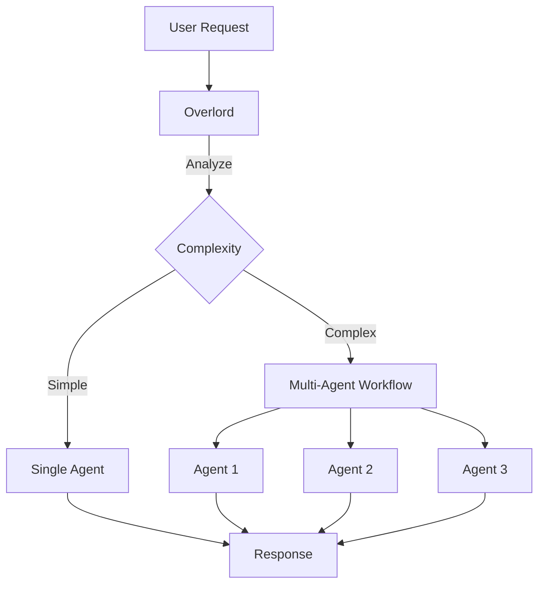

# The Overlord

## MUXI's intelligent orchestrator that routes requests and coordinates agents


MUXI's orchestrator that decides which agent handles each request, breaks complex tasks into steps, and coordinates multi-agent workflows - all automatically.


## What the Overlord Does



The Overlord:
1. **Analyzes** every incoming request for complexity and intent
2. **Routes** to the best agent (or creates a workflow)
3. **Decomposes** complex tasks into manageable steps
4. **Coordinates** multi-agent execution
5. **Synthesizes** the final response

---

## Automatic Routing

You don't specify which agent to use - the Overlord figures it out:

```
User: "What's our refund policy?"
      ↓
Overlord: Simple factual question
      ↓
Routes to: support agent
```

```
User: "Research AI trends and write a blog post"
      ↓
Overlord: Complex, requires multiple skills
      ↓
Creates workflow:
  1. researcher (gather information)
  2. writer (create content)
  3. reviewer (check quality)
```

---

## Routing Priority

The Overlord follows this decision order:

1. **SOP Match** - If request matches a Standard Operating Procedure, execute it
2. **Explicit Agent** - If user specifies an agent (`agent: researcher`), use it
3. **Complexity Analysis** - Score the request (0-10)
4. **Best Agent Selection** - Route to most capable agent

```
Request: "onboard new customer"
         ↓
    SOP "customer-onboarding" exists
         ↓
    Execute SOP (bypass all other routing)
```

---

## Complexity Scoring

The Overlord scores requests from 0-10:

| Score | Example | Action |
|-------|---------|--------|
| 0-3 | "What's your name?" | Simple, single agent |
| 4-6 | "Explain quantum computing" | Moderate, may use tools |
| 7-10 | "Research, analyze, and create report" | Complex, multi-agent workflow |

Configure the threshold:

```yaml
overlord:
  auto_decomposition: true
  complexity_threshold: 7.0  # Trigger workflow at 7+
```

---

## Task Decomposition

Complex requests are broken into steps automatically:

```
User: "Plan our product launch"

Overlord decomposes:
  Step 1: researcher → "Research competitor launches"
  Step 2: strategist → "Create launch strategy"
  Step 3: writer → "Draft announcement"
  Step 4: reviewer → "Review all materials"
```

Each step:
- Runs in sequence or parallel (depending on dependencies)
- Has its own context and agent
- Contributes to the final response

---

## Persona Customization

The Overlord has its own personality that affects how it coordinates:

```yaml
overlord:
  persona: |
    You are a professional, knowledgeable assistant.
    Communicate efficiently and helpfully.
```

This affects:
- How it frames questions to agents
- How it synthesizes responses
- How it communicates status to users

---

## Override Behavior

### Explicit Agent Selection

```bash
# CLI
muxi chat --agent researcher "Find info on X"

# API
curl -d '{"message": "...", "agent": "researcher"}'
```

### Disable Auto-Decomposition

```yaml
overlord:
  auto_decomposition: false  # All requests go to single agent
```

---

## Why This Matters

| Without Overlord | With Overlord |
|-----------------|---------------|
| Manually route every request | Automatic intelligent routing |
| Hard-code workflows in code | Dynamic task decomposition |
| One agent does everything | Right specialist for each task |
| Static rules | Adaptive complexity analysis |

The result: **formations that coordinate themselves**, not rigid chatbots.

---

## Configuration Example

```yaml
overlord:
  # Task decomposition
  auto_decomposition: true
  complexity_threshold: 7.0
  
  # Persona
  persona: "You are a professional, helpful assistant."
  
  # Response
  response:
    format: markdown
    streaming: true
```

---

## Learn More

- [Agents & Orchestration](agents.md) - How agents work with the Overlord
- [How Orchestration Works](../deep-dives/orchestration.md) - Technical internals
- [Create SOPs](../guides/sops.md) - Priority routing with procedures
