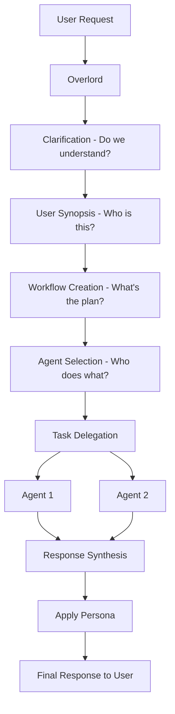

# The Overlord

## The main brain of MUXI that handles everything

The Overlord is MUXI's central intelligence. Think of it like a coding agent that uses sub-agents to perform actions and handles all coordination. **Users never talk to agents directly - they talk to MUXI, and MUXI is the Overlord.**

## What the Overlord Does

From the user's perspective, they're talking to "MUXI" - a single, coherent assistant. Behind the scenes, the Overlord:



1. **Clarification** - Ensures the request is clear and actionable
2. **User Synopsis** - Knows who it's talking to (context, history, preferences)
3. **Workflow Creation** - Breaks complex requests into tasks dynamically
4. **Agent Selection** - Picks the best agent for each task
5. **Task Delegation** - Sends tasks to agents with context and tools
6. **Response Synthesis** - Combines agent outputs into coherent response
7. **Persona Application** - Formats response with configured personality
8. **Credential Handling** - Manages user credentials and access

---

## Users Talk to MUXI, Not Agents

> **Key concept:** From the UX standpoint, users are talking to MUXI - one entity. They don't know or care about individual agents.

```
User: "Help me write a blog post about AI trends"

What user sees:
  MUXI: "I'll research the latest trends and draft something for you..."
  MUXI: "Here's your blog post about AI trends in 2025..."

What actually happens:
  Overlord → routes research task to Researcher agent
  Overlord → routes writing task to Writer agent
  Overlord → synthesizes outputs
  Overlord → applies persona and formats response
```

The SDK does allow talking to specific agents directly, but that's for debugging - not the intended UX.

---

## Clarification System

The first thing that happens when a request arrives:

```
User: "I need a report about bicycles"
         ↓
Overlord: Is this actionable? Do I have enough info?
         ↓
Overlord: "What should the report include? Financial analysis? 
          Buyer's guide? Specific brands?"
         ↓
User: "A buyer's guide for mountain bikes under $1000"
         ↓
Overlord: Now I have enough info → proceed
```

The Overlord also detects whether a user's response is:
- An answer to a clarification question
- A completely new request

This ensures the Overlord always has enough information before acting.

---

## Dynamic Workflow Creation

> **Key insight:** Workflows are NOT predefined. The Overlord creates them dynamically based on each request.

```
User: "Research our competitors, analyze their pricing, and create a presentation"

Overlord creates workflow on-the-fly:
  Task 1: researcher → "Research competitor companies"
  Task 2: analyst → "Analyze pricing strategies"  
  Task 3: writer → "Create presentation"
```

This is different from SOPs (Standard Operating Procedures), which ARE predefined templates.

| Workflows | SOPs |
|-----------|------|
| Created dynamically per request | Predefined templates |
| Overlord decides structure | Developer defines structure |
| Adapts to context | Consistent execution |

---

## Complexity Threshold & Approval

The Overlord scores each request's complexity (0-10):

| Score | Action |
|-------|--------|
| Below threshold | Execute immediately |
| Above threshold | Present plan for user approval |

```yaml
overlord:
  workflow:
    complexity_threshold: 7.0  # Ask approval for complex tasks
```

**Above threshold:**
```
User: "Research and create comprehensive market analysis"
         ↓
Overlord: "This is complex. Here's my plan:
          1. Research market trends
          2. Analyze competitor data
          3. Create visualizations
          4. Write executive summary
          
          Do you approve? Any adjustments?"
         ↓
User: "Looks good, go ahead"
         ↓
Overlord: Executes plan
```

---

## Agent Selection

The Overlord picks the best agent for each task based on:
- Agent capabilities (from their metadata)
- Agent specialties
- Task requirements
- Historical performance

```yaml
# agents/researcher.afs
id: researcher
name: Research Specialist
description: Expert at finding and synthesizing information
role: researcher
specialties:
  - web research
  - data gathering
  - fact checking
```

The Overlord reads this metadata and routes research tasks to this agent.

---

## Persona (Overlord Only)

> **Note:** Agent personas don't exist. Only the Overlord has a persona.

The persona defines how MUXI communicates with users:

```yaml
overlord:
  persona: |
    You are a professional, knowledgeable assistant.
    Be concise but thorough. Use clear language.
    When uncertain, ask clarifying questions.
```

This affects:
- How responses are formatted
- Tone and style
- How status updates are communicated

Agents have **system prompts** (instructions) and **capabilities** (metadata), but not personas.

---

## Routing Priority

When a request arrives, the Overlord follows this order:

```
1. SOP Match? → Execute SOP (highest priority)
         ↓ No
2. Complexity Analysis → Score request
         ↓
3. Above threshold? → Present plan for approval
         ↓ No
4. Agent Selection → Route to best agent
```

SOPs always win - if a request matches an SOP, it executes regardless of complexity.

---

## Configuration

```yaml
overlord:
  # Persona
  persona: "You are a helpful professional assistant."
  
  # Workflow settings
  workflow:
    auto_decomposition: true
    complexity_threshold: 7.0
    max_parallel_tasks: 5
    
  # Clarification
  clarification:
    style: conversational
    max_rounds:
      direct: 3
      brainstorm: 10
```

### LLM Override

Give the Overlord different models for planning vs execution:

```yaml
overlord:
  llm:
    text: "anthropic/claude-sonnet-4-20250514"  # For planning/reasoning
```

---

## Learn More

- [Agents & Orchestration](agents-and-orchestration.md) - How agents work with the Overlord
- [SOPs](standard-operating-procedures.md) - Predefined workflow templates
- [Clarifications](clarification.md) - The clarification system
- [How Orchestration Works](../deep-dives/how-orchestration-works.md) - Technical internals
