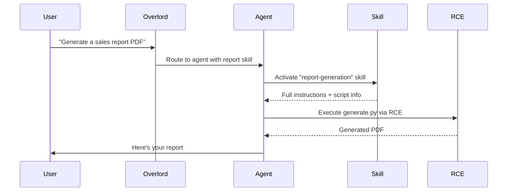

# Skills

## How agents gain specialized abilities through structured knowledge and scripts


Skills are self-contained packages of instructions, references, and scripts that give agents deep expertise in specific tasks. Unlike tools (MCP), which connect agents to external services, skills teach agents **how** to do something -- with domain knowledge, step-by-step procedures, and optional executable scripts.


## How Skills Work



1. **User sends a request** that matches a skill's domain
2. **Overlord routes** to an agent that has the skill
3. **Agent activates** the skill (loads full instructions)
4. **Agent executes** a script via RCE if the skill includes one
5. **Results return** to the user


## Skills vs Tools (MCP)

| Category | Skills | Tools (MCP) |
|----------|--------|-------------|
| **Purpose** | Teach agents *how* to do things | Connect agents to external services |
| **Content** | Instructions, references, scripts | API endpoints, commands |
| **Protocol** | SKILL.md (Agent Skills spec) | Model Context Protocol |
| **Execution** | Optional scripts via RCE | Always remote service calls |
| **Example** | "How to generate financial reports" | "Call the Stripe API" |

Use skills when the agent needs **knowledge and procedures**. Use tools when the agent needs to **call an external service**.


## Progressive Disclosure

Skills use a two-tier loading strategy to keep context usage low:

| Tier | What loads | When | Token cost |
|------|-----------|------|------------|
| **Metadata** | Name, description | Formation startup | ~100 tokens per skill |
| **Full content** | Instructions, references, scripts | First activation | Varies by skill |

At startup, agents only see a lightweight catalog of available skills. The full SKILL.md body and resource list are loaded into context only when the agent decides to activate a skill -- keeping the baseline token footprint minimal.


## Skill Discovery

Agents receive a skill catalog in their system prompt:

```
Available Skills:
- report-generation: Generate PDF/Excel reports from data
- data-analysis: Analyze datasets and produce visualizations
- file-generation: Generate files (PDFs, images, spreadsheets)
```

The agent decides when to activate a skill based on the user's request. No explicit trigger required -- the model reads the catalog and activates what it needs.


## Skill Activation

When an agent activates a skill:

1. Full SKILL.md content loads into context (instructions, constraints, examples)
2. Resource list becomes available (scripts, references, assets)
3. If the skill has scripts, the `run_skill` tool becomes available
4. Activation is tracked per session -- repeated activations are deduplicated

```
User:  "Create a chart showing Q4 revenue"

Agent: [Sees "data-analysis" in skill catalog]
Agent: [Activates skill → full instructions load]
Agent: [Runs generate.py via RCE with parameters]
Agent: [Returns chart to user]
```


## Skill Isolation

Skills follow a three-layer isolation model:

1. **Catalog filtering** -- Each agent only sees skills assigned to it (public skills are visible to all agents)
2. **Tool restriction** -- Skills declare which tools they need via `allowed-tools`; the agent can only use those tools during skill execution
3. **Planning scoping** -- When the Overlord decomposes complex tasks, only authorized skills appear in each agent's planning context


## Skill Types

### Knowledge-only skills

Contain instructions and references but no executable scripts. The agent uses the knowledge to guide its responses.

```
skills/
└── writing-style/
    ├── SKILL.md              # Brand voice guidelines
    └── references/
        └── style-guide.md    # Detailed examples
```

### Script-bearing skills

Include executable scripts that run in a sandboxed RCE container. The agent calls `run_skill` to execute them.

```
skills/
└── report-generation/
    ├── SKILL.md              # Instructions for the agent
    └── scripts/
        └── generate.py       # Executed via RCE
```

### Built-in skills

Ship with the runtime. Currently includes `file-generation` for producing PDFs, images, spreadsheets, and other artifacts.


## Formation Directory Structure

```
my-formation/
├── formation.afs
├── agents/
│   └── assistant.afs
├── skills/                    # Formation-level skills (public)
│   ├── report-generation/
│   │   ├── SKILL.md
│   │   └── scripts/
│   │       └── generate.py
│   └── data-analysis/
│       ├── SKILL.md
│       └── references/
│           └── methods.md
└── agents/
    └── analyst/
        └── skills/            # Agent-specific skills
            └── forecasting/
                └── SKILL.md
```

- **Formation-level skills** (`skills/`) are public -- all agents see them
- **Agent-level skills** (`agents/{id}/skills/`) are private to that agent


## Secrets in Skills

Skills can reference formation secrets using the same `${{ secrets.X }}` syntax used everywhere else in MUXI.

### In SKILL.md instructions

Secret references in the SKILL.md body are interpolated when the agent activates the skill. The agent sees the resolved value:

```markdown
---
name: notion-sync
description: Sync data with Notion
---

# Notion Sync

Authenticate using the API key: ${{ secrets.NOTION_KEY }}
```

### In bundled scripts

Scripts are executed by the RCE service and cannot use `${{ }}` syntax directly. Instead, use standard environment variable syntax -- the runtime resolves the secrets and injects them as env vars into the subprocess:

**Python:**
```python
import os
notion_key = os.environ["NOTION_KEY"]
```

**Bash:**
```bash
curl -H "Authorization: Bearer $NOTION_KEY" https://api.notion.com/...
```

The mapping is direct: `${{ secrets.NOTION_KEY }}` becomes env var `NOTION_KEY`. Secrets are passed only to the subprocess environment -- they are never written to disk and are gone when the process exits.

At startup, the runtime scans your skill files for secret references and logs a warning if any referenced secret is missing from the formation's secrets store. This catches misconfiguration early without blocking formation startup.

> [!WARNING]
> **Secrets are passed over HTTP to the RCE service.** This is safe when the runtime and RCE service run on the same host or private network, which is the standard deployment. Never expose the Skills RCE service publicly -- it is an internal service designed for trusted callers only.


## RCE (Remote Code Execution)

Script-bearing skills execute in a sandboxed container via the Skills RCE service. The runtime:

1. Zips the skill directory and uploads it to the RCE service at startup
2. Uses content hashing to skip re-uploads when nothing changed
3. Executes scripts on demand via the `run_skill` tool

To use a custom RCE instance, configure it in your formation:

```yaml
rce:
 url: "http://my-rce-server:7891"
 token: "${{ secrets.RCE_TOKEN }}"
```

> [!IMPORTANT]
> **Server-managed formations get RCE automatically.** The MUXI Server includes a built-in Skills RCE instance -- formations use it with no configuration. The RCE service bundles Python, Node.js, Bun, Go, Bash, and common packages (numpy, pandas, matplotlib, reportlab, etc.).


> [!NOTE]
> RCE is optional. Skills without scripts work purely through knowledge injection -- no RCE service required.

See [Skills RCE](../server/skills-rce.md) for deployment options, available runtimes, and the full API.


## Why This Matters

| Without Skills | With Skills |
|----------------|-------------|
| Long system prompts with everything | Progressive disclosure, load on demand |
| Agents need all knowledge upfront | Activate only what's needed per request |
| Scripts hardcoded in tools | Portable skill packages with versioned scripts |
| Same capabilities for all agents | Agent-specific skill assignments |

The result: **agents that learn on demand**, keeping context lean and capabilities precise.


## Quick Setup

Create `skills/my-skill/SKILL.md`:

```yaml
---
name: my-skill
description: Does something useful
---
```

```markdown
# Instructions

Here's how to do the thing...
```

All agents in the formation automatically see it. Done.


## Learn More

- [Configure skills](../reference/skills.md) - SKILL.md syntax and formation config
- [Add Skills Guide](../guides/add-skills.md) - Step-by-step tutorial
- [Agent Skills specification](https://agentskills.io/specification) - The open standard
