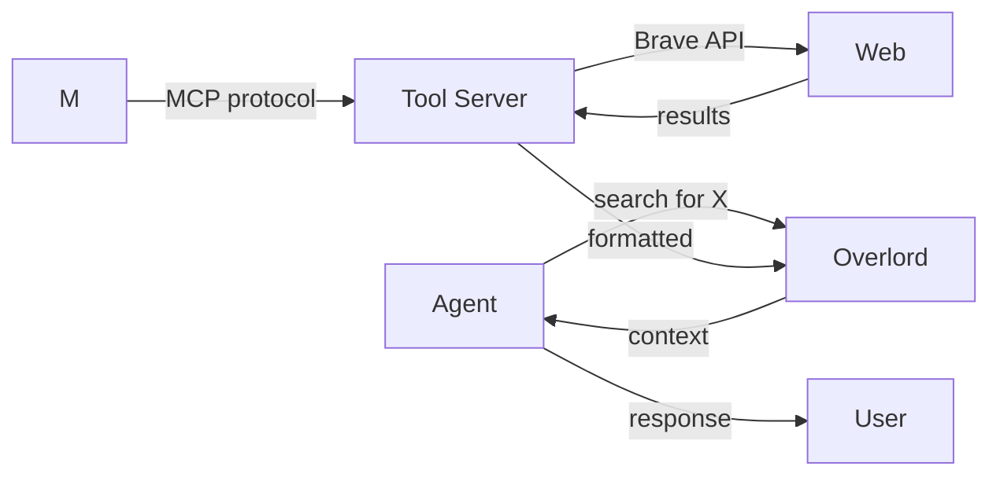

# Tools & MCP

## How agents interact with the world through MCP tools


MUXI speaks the **Model Context Protocol (MCP)** to connect agents with tools – web search, databases, file systems, APIs, and more. Any compliant MCP server works: Anthropic's, community/open-source servers, or your own. No registry or vendor lock-in required.


## How MCP Works



1. **Agent decides** it needs a tool (e.g., web search)
2. **Overlord invokes** the MCP server
3. **Tool executes** the action (API call, query, etc.)
4. **Results return** to the agent
5. **Agent synthesizes** a response

The agent decides when to use tools - you don't need to explicitly request them.

---

## Available Tools

### MCP server types (where they live in a formation)

| Server type | When to use | Where in formation structure |
|-------------|-------------|------------------------------|
| **command (CLI)** | Run a local/server-side process (e.g., `npx @modelcontextprotocol/server-json-rpc`, Bash, Python) | `mcp/your-tool.afs` |
| **http** | Call a remote MCP server over HTTPS (any provider or your own) | `mcp/your-tool.afs` |

Example  –  command/CLI MCP:

```yaml
# mcp/local-tools.afs
schema: "1.0.0"
id: local-tools
type: command
command: npx
args: ["-y", "@modelcontextprotocol/server-json-rpc"]
timeout_seconds: 60
auth:
  type: env
  API_KEY: "${{ secrets.API_KEY }}"
```

Example  –  HTTP MCP:

```yaml
# mcp/web-tools.afs
schema: "1.0.0"
id: web-tools
type: http
endpoint: "https://external.com/mcp"
timeout_seconds: 30
retry_attempts: 3
auth:
  type: bearer
  token: "${{ secrets.MCP_TOKEN }}"
```

> Use any MCP server address you control. There is no required registry; just point to the server URL.

> [!TIP]
> **Start with one tool per agent.** Add tools incrementally and test each one. Too many tools confuse the agent about which to use.

---

## Solving Context Contamination

> **Key insight:** MUXI solves the biggest problem with MCP today - **context contamination**.

Traditional MCP implementations dump all tool schemas into every request. Add 10 tools and you've burned 10,000+ tokens before the user even says hello. Agents get confused about which tool to use.

**MUXI's approach:**

```
On formation init:
  1. Load all MCP servers
  2. Build capability registry (indexed by semantic meaning)
  3. Cache tool schemas

On each request:
  1. Overlord analyzes task requirements
  2. Passes ONLY relevant capabilities to agents
  3. Agents see tools they need, nothing else
```

```
Traditional MCP:
  Agent sees: ALL 50 tools (confusing, token-heavy)

MUXI:
  Agent sees: 3-5 relevant tools for this specific task
```

**Results:**
- ~90% token reduction
- Agents make better tool choices
- No confusion from irrelevant tools
- Dozens of tools without burning context window

---

## Multi-User Tool Access

Each user can store their own credentials:

```
User A: GitHub token → their repos
User B: GitHub token → their repos

Same formation, personalized access.
```

In your MCP config file, reference user secrets:

```yaml
# mcp/github.afs
schema: "1.0.0"
id: github
type: command
command: npx
args: ["-y", "@modelcontextprotocol/server-github"]
auth:
  type: env
  GITHUB_TOKEN: "${{ user.credentials.GITHUB_TOKEN }}"
```

Credentials encrypted at rest. Complete isolation between users.

**Formation structure:**
- Server definitions live in `mcp/*.afs` files (auto-discovered)
- Per-user secrets referenced as `user.credentials.*`
- All agents have access to formation-level MCP servers
- Agent-specific tools use `mcp_servers:` in agent files

---

## Agent-Specific Tools

> [!IMPORTANT]
> **Prefer per-agent tools over global tools.** Define MCP servers in agent files (`mcp_servers:`) rather than formation-level (`mcp/*.afs`) whenever possible.
>
> **Why this matters:**
> - **Better agent selection** - Overlord uses tool capabilities to route requests to the right agent
> - **Better tool selection** - Agents only see tools relevant to their role, reducing confusion
> - **Cleaner architecture** - Each agent has exactly what it needs, nothing more
>
> Only use formation-level MCP servers for tools that genuinely apply to ALL agents (e.g., a shared logging service).

Formation-level MCP servers (in `mcp/*.afs`) are available to all agents. For agent-specific tools, define `mcp_servers` in the agent file:

```yaml
# agents/researcher.afs
schema: "1.0.0"
id: researcher
name: Researcher
description: Research specialist

system_message: Research specialist with web search.

mcp_servers:
  - id: web-search
    description: Web search
    type: command
    command: npx
    args: ["-y", "@modelcontextprotocol/server-brave-search"]
```

```yaml
# agents/developer.afs
schema: "1.0.0"
id: developer
name: Developer
description: Code assistant

system_message: Code assistant.

mcp_servers:
  - id: filesystem
    description: File access
    type: command
    command: npx
    args: ["-y", "@modelcontextprotocol/server-filesystem"]
```

Or define formation-level MCP servers in `mcp/` directory (available to all agents):

```yaml
# mcp/web-search.afs
schema: "1.0.0"
id: web-search
type: command
command: npx
args: ["-y", "@modelcontextprotocol/server-brave-search"]
auth:
  type: env
  BRAVE_API_KEY: "${{ secrets.BRAVE_API_KEY }}"
```

```yaml
# mcp/filesystem.afs
schema: "1.0.0"
id: filesystem
type: command
command: npx
args: ["-y", "@modelcontextprotocol/server-filesystem", "./workspace"]
```

```yaml
# mcp/database.afs
schema: "1.0.0"
id: database
type: command
command: npx
args: ["-y", "@modelcontextprotocol/server-postgres"]
auth:
  type: env
  DATABASE_URL: "${{ secrets.DATABASE_URL }}"
```

Right tools for right agents. No accidental file access from the writer.

---

## Tool Security

### Path Restrictions

Restrict filesystem access in the MCP command args:

```yaml
# mcp/filesystem.afs
schema: "1.0.0"
id: filesystem
type: command
command: npx
args:
  - "-y"
  - "@modelcontextprotocol/server-filesystem"
  - "/home/user/documents"
  - "/tmp/workspace"
  # NOT: /, /etc, /root
```

### Credential Isolation

Each tool gets only its required secrets:

```yaml
# mcp/github.afs - only gets GITHUB_TOKEN
auth:
  type: env
  GITHUB_TOKEN: "${{ secrets.GITHUB_TOKEN }}"
  # Cannot access DATABASE_URL
```

---

## Self-Healing Agents: Tool Chaining

> **Key differentiator:** Agents don't give up on first error - they analyze failures and take corrective action automatically.

### How It Works

When a tool fails, the agent:
1. Analyzes the error message
2. Determines if it can fix the problem
3. Makes corrective tool calls
4. Retries the original operation

```
User: "Create a file at /reports/q4/summary.txt"

Agent: write_file("/reports/q4/summary.txt", content)
Tool:  Error - "Directory /reports/q4 does not exist"

Agent: [Analyzes error: missing directory]
Agent: create_directory("/reports/q4")
Tool:  Success

Agent: write_file("/reports/q4/summary.txt", content)
Tool:  Success!
```

**The user never sees the error** - the agent just handles it.

### Common Self-Healing Patterns

| Error | Automatic Resolution |
|-------|---------------------|
| Directory doesn't exist | Create the directory |
| Resource already exists | Delete and recreate, or update |
| Authentication expired | Trigger re-auth flow |
| Rate limited | Wait and retry |
| Missing dependency | Install or create dependency |

### Why This Matters

**Traditional agents:**
```
User: "Create a file in /new/path/"
Agent: "Error: Directory does not exist"
User: "Create the directory first"
Agent: "Done"
User: "Now create the file"
Agent: "Done"
```
Three turns, user has to troubleshoot.

**MUXI agents:**
```
User: "Create a file in /new/path/"
Agent: "Done - created the directory and file"
```
One turn, agent handled it.

### Safety Mechanisms

Tool chaining has built-in limits to prevent infinite loops:

```yaml
mcp:
  max_tool_iterations: 10     # Max correction attempts per chain
  max_tool_calls: 50          # Total tool calls allowed
  max_repeated_errors: 3      # Stop if same error repeats
  max_timeout_in_seconds: 120 # Total time limit
```

Each chain gets a unique ID (`chn_xxx`) for observability tracking.

---

## Why This Matters

| Traditional Approach | MUXI Approach |
|---------------------|---------------|
| Build custom integrations | MCP standard protocol |
| Tool schemas in every request | Indexed, loaded on demand |
| Single set of credentials | Per-user credential storage |
| All tools for all agents | Agent-specific restrictions |

The result: **agents that act**, not just talk.

---

## Quick Setup

Create `mcp/web-search.afs`:

```yaml
schema: "1.0.0"
id: web-search
type: command
command: npx
args: ["-y", "@modelcontextprotocol/server-brave-search"]
auth:
  type: env
  BRAVE_API_KEY: "${{ secrets.BRAVE_API_KEY }}"
```

All agents in the formation automatically have access to MCP servers in `mcp/`. Or create an agent file:

```yaml
# agents/researcher.afs
schema: "1.0.0"
id: researcher
name: Researcher
description: Research specialist

system_message: Research specialist with web access.
```

---

## Learn More

- [Configure tools](../reference/tools.md) - YAML syntax
- [Add Tools Guide](../guides/add-mcp-tools.md) - Step-by-step tutorial
