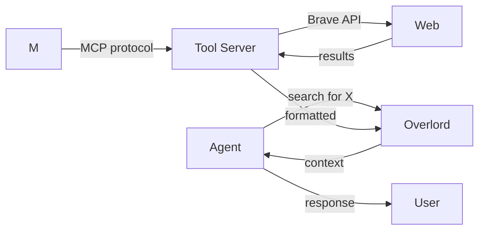

# Tools & MCP

## How agents interact with the world through MCP tools


MUXI uses the **Model Context Protocol (MCP)** to connect agents with tools - web search, databases, file systems, APIs, and more. 1,000+ tools available, with intelligent loading that keeps token usage low.

---

## How MCP Works



1. **Agent decides** it needs a tool (e.g., web search)
2. **Overlord invokes** the MCP server
3. **Tool executes** the action (API call, query, etc.)
4. **Results return** to the agent
5. **Agent synthesizes** a response

The agent decides when to use tools - you don't need to explicitly request them.

---

## Available Tools

### Official MCP Servers

| Tool | What It Does |
|------|--------------|
| `@anthropic/brave-search` | Web search |
| `@anthropic/filesystem` | Read/write files |
| `@anthropic/github` | GitHub API |
| `@anthropic/postgres` | PostgreSQL queries |
| `@anthropic/sqlite` | SQLite queries |
| `@anthropic/slack` | Slack integration |
| `@anthropic/google-drive` | Google Drive access |

### 1,000+ Community Tools

Browse at [registry.muxi.org/mcps](https://registry.muxi.org/mcps) - Stripe, Notion, Jira, Salesforce, and more.

---

## MCP Without the Bloat

> [!TIP]
> This solves the biggest problem with MCP today: **context window hogging**.

Traditional MCP implementations dump all tool schemas into every context window. Add 10 tools and you've burned 10,000+ tokens before the user even says hello.

MUXI takes a different approach:

```
Traditional MCP:
  10 tools × 1,000 tokens each = 10,000 tokens per request
  User message + tool schemas = bloated context

MUXI:
  Tool definitions loaded once at startup
  Schemas indexed for semantic lookup
  Subagents pull only what they need at runtime
  ~90% token reduction
```

The result: **use dozens of tools without burning your context window**.

This is why MUXI can offer 1,000+ MCP tools while keeping your costs low and responses fast.

---

## Multi-User Tool Access

Each user can store their own credentials:

```
User A: GitHub token → their repos
User B: GitHub token → their repos

Same formation, personalized access.
```

Agents automatically use the requesting user's credentials:

```yaml
mcps:
  - id: github
    server: "@anthropic/github"
    env:
      GITHUB_TOKEN: ${{ user.secrets.GITHUB_TOKEN }}
```

Credentials encrypted at rest. Complete isolation between users.

---

## Natural Language Scheduling

Agents understand time expressions:

```
User: "Check my email every hour"
User: "Remind me tomorrow at 2pm"
User: "Run this report every Monday"
```

No cron syntax required. MUXI parses natural language and creates scheduled tasks:

```yaml
# Equivalent to what MUXI creates:
triggers:
  - schedule: "0 * * * *"  # every hour
    action: check_email
```

Timezone-aware, recurring or one-time.

---

## Agent-Specific Tools

Restrict tools to specific agents:

```yaml
mcps:
  - id: web-search
    server: "@anthropic/brave-search"
  - id: filesystem
    server: "@anthropic/filesystem"
  - id: database
    server: "@anthropic/postgres"

agents:
  - id: researcher
    mcps: [web-search]      # Can only search

  - id: developer
    mcps: [filesystem, database]  # Can access files and DB

  - id: writer
    # No tools - pure writing
```

Right tools for right agents. No accidental file access from the writer.

---

## Tool Security

### Path Restrictions

```yaml
mcps:
  - id: filesystem
    config:
      allowed_directories:
        - /home/user/documents
        - /tmp/workspace
        # NOT: /, /etc, /root
```

### Credential Isolation

Each tool gets only its required secrets:

```yaml
mcps:
  - id: github
    env:
      GITHUB_TOKEN: ${{ secrets.GITHUB_TOKEN }}
      # Cannot access DATABASE_URL
```

---

## Tool Chaining & Error Recovery

Agents don't give up on first error - they intelligently retry and recover.

### Automatic Error Recovery

When a tool fails, agents analyze the error and attempt to fix it:

```
User: "Create a GitHub repo called 'my-project'"
Agent: Calls create_repo("my-project")
GitHub: Error - "Repository already exists"
Agent: Analyzes error
Agent: Calls delete_repo("my-project")  # Remove old one
Agent: Calls create_repo("my-project")  # Recreate
Success!
```

**Traditional approach:**
```
Tool fails → Show error to user → User figures it out → User retries
```

**MUXI approach:**
```
Tool fails → Agent analyzes → Agent fixes → Success
```

### Multi-Step Tool Chains

Agents can chain multiple tool calls to accomplish complex tasks:

```
User: "Deploy the app"
Agent: 
  1. Calls run_tests() → Passes ✓
  2. Calls build_docker_image() → Success ✓
  3. Calls push_to_registry() → Success ✓
  4. Calls deploy_to_k8s() → Success ✓
Done!
```

Each step depends on the previous one. If step 2 fails, the agent doesn't blindly continue to step 3.

### Intelligent Retry Logic

Not just dumb retries:

```
Example: GitHub API rate limit

Dumb retry:
  Call API → 429 Too Many Requests
  Wait 1 second
  Call API → 429 Too Many Requests
  Wait 1 second
  Call API → 429 Too Many Requests
  Give up ❌

Smart retry:
  Call API → 429 Too Many Requests
  Parse error: "Rate limit reset at 10:15 AM"
  Wait until 10:15 AM
  Call API → Success ✓
```

The agent understands the error and responds appropriately.

### Safety Mechanisms

To prevent infinite loops:

```yaml
tool_chaining:
  max_iterations: 10          # Max retry attempts per chain
  max_tool_calls: 50          # Total tool calls across all chains
  max_repeated_errors: 3      # Stop if same error repeats
  timeout: 120                # 2 minutes max per chain
```

**Example - Repeated Error Detection:**
```
Try 1: create_file() → "Permission denied"
Try 2: chmod +w → create_file() → "Permission denied"
Try 3: sudo create_file() → "Permission denied"
Stop! Same error 3 times. Report to user.
```

The agent knows when to escalate to the user.

### Error Pattern Recognition

Agents learn from errors:

```
Error: "Database connection refused"
Agent recognizes: Network/connectivity issue
Action: Check if database is running, restart if needed

Error: "File not found: /tmp/data.csv"
Agent recognizes: Missing dependency
Action: Check if previous step completed, regenerate file if needed

Error: "Invalid API key"
Agent recognizes: Credential issue
Action: Ask user to update credentials
```

Different error types get different recovery strategies.

### When Recovery Fails

If the agent can't fix it, you get a detailed explanation:

```
Agent: "I tried to deploy the app but encountered an error:
       
       1. Ran tests → Passed ✓
       2. Built Docker image → Failed ✗
          Error: 'docker' command not found
       
       I attempted to:
       - Check if Docker is installed
       - Restart Docker service
       
       This appears to be a system configuration issue. 
       Please install Docker and try again."
```

Clear explanation of what failed and what was attempted.

---

## Why This Matters

| Traditional Approach | MUXI Approach |
|---------------------|---------------|
| Build custom integrations | MCP standard protocol |
| Tool schemas in every request | Indexed, loaded on demand |
| Single set of credentials | Per-user credential storage |
| Manual scheduling code | Natural language scheduling |
| All tools for all agents | Agent-specific restrictions |

The result: **agents that act**, not just talk.

---

## Quick Setup

```yaml
mcps:
  - id: web-search
    server: "@anthropic/brave-search"
    config:
      api_key: ${{ secrets.BRAVE_API_KEY }}

agents:
  - id: researcher
    role: Research specialist
    mcps:
      - web-search
```

---

## Learn More

- [Configure tools](../reference/tools.md) - YAML syntax
- [Add Tools Guide](../guides/add-tools.md) - Step-by-step tutorial
