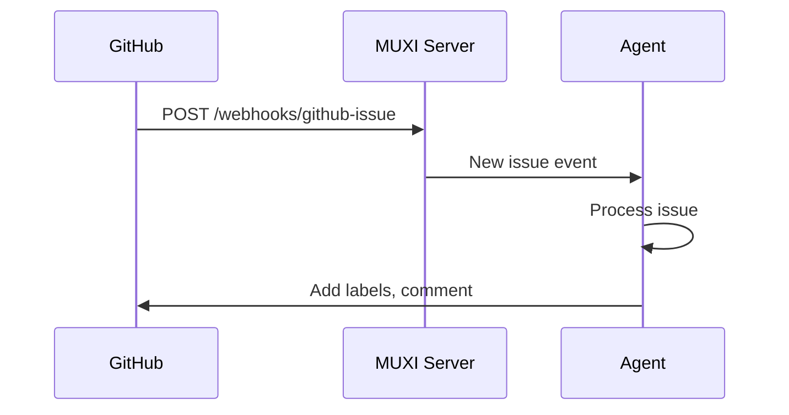

# Triggers & Automation

## How agents respond to webhooks, schedules, and events automatically


Triggers let agents respond to external events automatically - GitHub issues, scheduled tasks, Slack messages, monitoring alerts, and more. No manual intervention needed.

---

## What Are Triggers?

```
Traditional:
  Event happens → Manual action required

With Triggers:
  Event happens → Agent acts automatically
```

Examples:
- **GitHub issue opened** → Agent triages and labels it
- **Every Monday 9am** → Agent sends weekly report
- **Slack mention** → Agent responds in thread
- **Monitoring alert** → Agent investigates and reports

---

## Types of Triggers

### Webhooks

External systems call your formation via HTTP:

```
GitHub → POST /webhooks/github-issue
             ↓
         Agent receives event
             ↓
         Agent processes issue
```

Any system that can send HTTP requests can trigger your agents.

### Scheduled Tasks

Time-based automation:

```yaml
triggers:
  - schedule: "0 9 * * MON"  # Every Monday 9am
    action: weekly_report
```

Or natural language:

```
"Send me a summary every morning at 9am"
→ MUXI creates scheduled trigger
```

### Event-Driven

Agents respond to system events:

```yaml
triggers:
  - event: formation.deployed
    action: notify_team
  
  - event: agent.error
    action: alert_oncall
```

---

## How Webhooks Work

### Incoming Webhooks



1. **External system** sends event to your webhook URL
2. **MUXI Server** receives and validates
3. **Agent** processes the event with full context
4. **Agent can respond** back to the source system

### Webhook Templates

MUXI provides templates for common services:

```yaml
triggers:
  - webhook: github-issue
    agent: support
    
  - webhook: slack-mention
    agent: assistant
    
  - webhook: stripe-payment
    agent: billing
```

Templates handle authentication and payload parsing automatically.

---

## Scheduled Triggers

### Cron Syntax

```yaml
triggers:
  - schedule: "0 9 * * MON"     # Every Monday 9am
    action: weekly_report
    
  - schedule: "*/15 * * * *"    # Every 15 minutes
    action: check_status
    
  - schedule: "0 0 1 * *"       # First of month
    action: monthly_summary
```

Standard cron syntax - five fields: minute, hour, day, month, weekday.

### Natural Language

Agents can create schedules from conversation:

```
User: "Remind me every Friday afternoon to review open tasks"
Agent: Creates schedule: "0 14 * * FRI"

User: "Check the API health every 5 minutes"
Agent: Creates schedule: "*/5 * * * *"
```

MUXI parses natural language and creates proper cron expressions.

---

## Trigger Actions

### Execute SOP

Run a Standard Operating Procedure:

```yaml
triggers:
  - webhook: github-issue
    sop: triage-issue
```

When the webhook fires, the agent executes the SOP.

### Agent Task

Send a task to a specific agent:

```yaml
triggers:
  - schedule: "0 9 * * *"
    agent: reporter
    prompt: "Generate daily metrics report"
```

### Tool Invocation

Directly call a tool:

```yaml
triggers:
  - schedule: "*/30 * * * *"
    tool: health-check
    params:
      endpoint: "https://api.example.com/health"
```

---

## Webhook Security

### HMAC Signatures

MUXI validates webhook signatures:

```yaml
triggers:
  - webhook: github-issue
    secret: ${{ secrets.GITHUB_WEBHOOK_SECRET }}
```

Requests without valid signatures are rejected.

### IP Allowlists

Restrict webhooks to known sources:

```yaml
triggers:
  - webhook: internal-alert
    allowed_ips:
      - 10.0.0.0/8
      - 192.168.1.100
```

Only requests from these IPs are accepted.

---

## Payload Context

Webhooks provide full event context to agents:

```
Trigger: GitHub issue opened

Agent receives:
{
  "event": "issues",
  "action": "opened",
  "issue": {
    "number": 123,
    "title": "Bug in login flow",
    "body": "Steps to reproduce...",
    "author": "alice",
    "labels": []
  },
  "repository": "acme/app"
}
```

Agents use this context to make intelligent decisions.

---

## Responding to Triggers

Agents can respond back to the source:

```
1. GitHub issue opened
2. Agent analyzes issue
3. Agent adds labels: ["bug", "authentication"]
4. Agent posts comment: "Thanks! Triaged as authentication bug"
5. Agent assigns to @security-team
```

The agent has full access to the source system's API (via tools).

---

## Trigger Chaining

One trigger can activate another:

```yaml
triggers:
  - webhook: monitoring-alert
    sop: investigate-alert
    on_complete:
      webhook: slack-notify  # Notify team when done
```

Build complex automation workflows.

---

## Example: GitHub Integration

```yaml
triggers:
  # New issue
  - webhook: github-issue
    secret: ${{ secrets.GITHUB_SECRET }}
    agent: triage
    sop: issue-triage
  
  # PR review requested
  - webhook: github-pr-review
    agent: reviewer
    sop: code-review
  
  # Daily summary
  - schedule: "0 9 * * *"
    agent: reporter
    prompt: "Summarize yesterday's GitHub activity"
```

Complete GitHub automation with three triggers.

---

## When to Use Triggers

| Use Triggers For | Don't Use Triggers For |
|-----------------|----------------------|
| Automated responses | Interactive conversations |
| Scheduled reports | One-time tasks |
| Event reactions | Exploratory work |
| Background processing | Real-time chat |
| Integration automation | User-initiated requests |

---

## Why This Matters

| Without Triggers | With Triggers |
|-----------------|---------------|
| Manual monitoring | Automatic response |
| Delayed reactions | Instant action |
| Human-initiated | Event-driven |
| Business hours only | 24/7 automation |
| Context switching | Agent handles it |

The result: **agents that work while you sleep**, not chatbots waiting for input.

---

## Quick Setup

```yaml
triggers:
  - webhook: github-issue
    secret: ${{ secrets.GITHUB_SECRET }}
    agent: support
    sop: triage-issue
```

Configure webhook in GitHub settings:
- URL: `https://your-server.com/webhooks/github-issue`
- Secret: Your webhook secret
- Events: Issues

---

## Learn More

- [Create Triggers Guide](../guides/triggers.md) - Set up your first trigger
- [Triggers Reference](../reference/triggers.md) - Syntax and options
- [Create SOPs](../guides/sops.md) - SOPs work great with triggers
