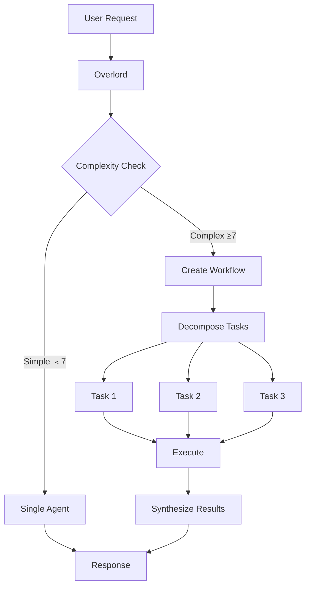
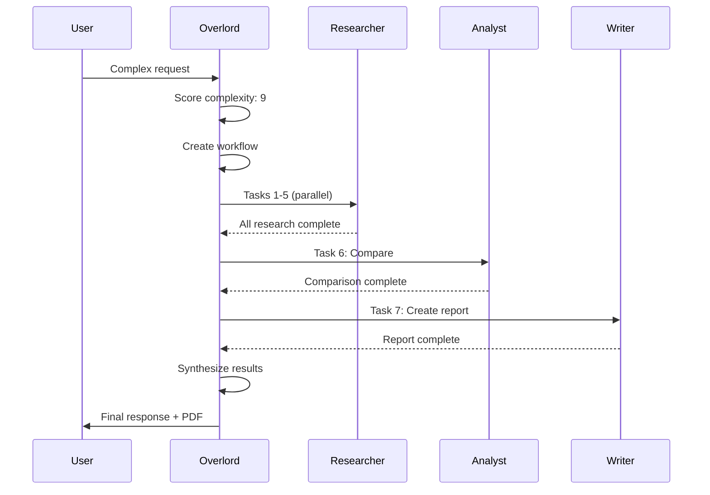

# Workflows & Task Decomposition

## How MUXI breaks complex requests into multi-agent workflows

Complex tasks need multiple agents with different skills. MUXI automatically decomposes requests into workflows, coordinates execution, and synthesizes results - no manual orchestration needed.

## The Problem

**Traditional approach:**
```
User:  "Research AI trends, write blog post, create social media posts"

You manually:
1. Call researcher agent
2. Wait for results
3. Pass to writer agent
4. Wait for blog post
5. Pass to social media agent
6. Combine everything
```

Manual orchestration, error-prone, slow.

**MUXI approach:**
```
User:  "Research AI trends, write blog post, create social media posts"

MUXI automatically:
1. Analyzes complexity
2. Creates workflow
3. Executes in parallel
4. Returns combined results
```

Automatic orchestration, reliable, fast.

## How It Works



## Complexity Scoring

The Overlord scores requests from 0-10:

| Score | Example | Action |
|-------|---------|--------|
| 0-3 | "What's the weather?" | Simple, single agent |
| 4-6 | "Explain quantum computing" | Moderate, may use tools |
| 7-10 | "Research, analyze, create report" | Complex, trigger workflow |

**Configure threshold:**
```yaml
overlord:
  workflow:
    auto_decomposition: true
    complexity_threshold: 7.0  # Workflows trigger at 7+
```

> [!TIP]
> **Start with a higher threshold (8+) and lower it if needed.** Too many workflows slow things down. Only decompose when the task genuinely needs multiple agents.

## Workflow Creation

**When complexity ≥ threshold:**

```
User:  "Analyze our codebase, create security audit, file GitHub issues"
         ↓
Overlord analyzes:
  - Multiple steps mentioned
  - Different skills needed (analysis, security, GitHub)
  - Multiple output artifacts
         ↓
Complexity score: 9/10
         ↓
Create workflow:
  Task 1: Analyze codebase → code-reviewer agent
  Task 2: Security audit → security-agent (depends on Task 1)
  Task 3: Create issues → github-agent (depends on Task 2)
```

## Workflow Components

### 1. Task Decomposition

Break request into subtasks:

```
Original: "Research competitors and create comparison report"

Decomposed:
  - Task 1: Research company A (researcher)
  - Task 2: Research company B (researcher)
  - Task 3: Research company C (researcher)
  - Task 4: Compare features (analyst)
  - Task 5: Create report (writer)
```

### 2. Dependency Management

Determine task order:

```
Task 1, 2, 3: Can run in parallel (no dependencies)
Task 4: Depends on 1, 2, 3 (needs research results)
Task 5: Depends on 4 (needs comparison)
```

### 3. Agent Assignment

Match agents to tasks:

```
Tasks 1-3: researcher (has web-search tool)
Task 4: analyst (has data-analysis tool)
Task 5: writer (has document-creation tool)
```

### 4. Parallel Execution

Run independent tasks simultaneously:

```
Start: Tasks 1, 2, 3 execute in parallel
         ↓
    All complete
         ↓
Start: Task 4 executes (uses results from 1, 2, 3)
         ↓
    Complete
         ↓
Start: Task 5 executes (uses result from 4)
         ↓
    Complete
         ↓
Return combined result to user
```

## Workflow Example

### Simple Request (Score: 4)
```
User:  "What's the capital of France?"

Overlord:
  - Score: 4 (factual question)
  - Route to: assistant agent
  - No workflow needed

Response: "The capital of France is Paris."
```

### Complex Request (Score: 9)
```
User:  "Research top 5 project management tools, compare features,
       create a recommendation report"

Overlord:
  - Score: 9 (multiple steps, research, analysis, creation)
  - Create workflow:

    Task 1: Research Asana
      Agent: researcher
      Tools: web-search
      Output: feature_list_asana

    Task 2: Research Monday
      Agent: researcher
      Tools: web-search
      Output: feature_list_monday

    Task 3: Research ClickUp
      Agent: researcher
      Tools: web-search
      Output: feature_list_clickup

    Task 4: Research Jira
      Agent: researcher
      Tools: web-search
      Output: feature_list_jira

    Task 5: Research Trello
      Agent: researcher
      Tools: web-search
      Output: feature_list_trello

    [Tasks 1-5 run in parallel]

    Task 6: Compare features
      Agent: analyst
      Tools: data-analysis
      Input: feature_lists from Tasks 1-5
      Output: comparison_matrix

    Task 7: Create recommendation report
      Agent: writer
      Tools: document-creation
      Input: comparison_matrix from Task 6
      Output: recommendation_report.pdf

Response: "Here's your report comparing the top 5 PM tools..."
         [Attached: recommendation_report.pdf]
```

## Execution Flow



## Error Handling

**What happens when a task fails?**

```
Task 1: ✅ Success
Task 2: ❌ Failed (API timeout)
Task 3: ✅ Success
         ↓
Overlord:
  - Retry Task 2 (up to 3 times)
  - If still fails, mark as partial failure
  - Continue with available results
         ↓
Task 4: Executes with results from 1 and 3
         ↓
Response: "I completed the analysis, but encountered an issue
           accessing one data source. Here are the results..."
```

## Configuration

### Enable Workflows
```yaml
overlord:
  workflow:
    auto_decomposition: true      # Enable automatic workflows
    complexity_threshold: 7.0     # Score to trigger workflow (default: 7.0)
```

### Workflow Settings
```yaml
overlord:
  workflow:
    max_parallel_tasks: 5         # Max concurrent tasks (default: 5)
    parallel_execution: true      # Enable parallel task execution
    timeouts:
      task_timeout: 300           # Seconds per task (default: 300)
      workflow_timeout: 3600      # Max duration for entire workflow (default: 3600)
    retry:
      max_attempts: 3             # Max retry attempts (default: 3)
```

### Disable for Testing
```yaml
overlord:
  workflow:
    auto_decomposition: false     # Force single-agent mode
```

## Task Types

### Sequential Tasks
Tasks that must run in order:

```
Task 1: Fetch data
         ↓
Task 2: Process data (needs Task 1 output)
         ↓
Task 3: Generate report (needs Task 2 output)
```

### Parallel Tasks
Tasks that can run simultaneously:

```
    ┌─ Task 1: Research A
    ├─ Task 2: Research B
    └─ Task 3: Research C
         ↓
    All complete → Task 4: Compare
```

### Conditional Tasks
Tasks that depend on previous results:

```
Task 1: Check if user has credentials
         ↓
    ├─ Yes → Task 2A: Use existing
    └─ No  → Task 2B: Prompt for credentials
```

## When Workflows Trigger

**Automatic triggers:**

- ✅ Multiple distinct steps mentioned
- ✅ Different domains/skills required
- ✅ Research + creation/analysis
- ✅ Multiple output artifacts
- ✅ Time-consuming operations

**Examples:**
```
✅ "Research and write blog post" → Workflow
✅ "Analyze codebase and create report" → Workflow
✅ "Search docs, find answer, create ticket" → Workflow
✅ "Compare 3 products and recommend best" → Workflow

❌ "What's the weather?" → Single agent
❌ "Explain this code" → Single agent
❌ "Search for information" → Single agent
```

## Benefits

### 1. Automatic Orchestration
No manual coordination needed - MUXI handles everything.

### 2. Parallel Execution
Independent tasks run simultaneously, reducing total time:

```
Sequential: 5 tasks × 10s = 50s total
Parallel:   5 tasks → 10s total (all at once)
```

### 3. Intelligent Routing
Each task goes to the most capable agent.

### 4. Error Recovery
Failed tasks retry automatically, partial results still useful.

### 5. Consistent Results
Same workflow structure for similar requests.

## Comparison with SOPs

| Feature | Workflows | SOPs |
|---------|-----------|------|
| **Trigger** | Automatic (complexity score) | Manual (keyword match) |
| **Definition** | AI-generated on-the-fly | Pre-defined template |
| **Flexibility** | Adapts to request | Fixed structure |
| **Use case** | One-off complex tasks | Repeatable processes |

**When to use workflows:**
- New, complex requests
- Ad-hoc analysis
- Creative projects

**When to use SOPs:**
- Repeatable processes
- Standardized workflows
- Compliance requirements

## Advanced: Workflow Routing

Configure how tasks are routed to agents:

```yaml
overlord:
  workflow:
    routing_strategy: "capability_based"  # Default: match task to agent capabilities
    # Other strategies: load_balanced, priority_based, round_robin, specialized
    enable_agent_affinity: true  # Prefer agents that succeeded with similar tasks
```

## Performance Optimization

### Adjust Timeouts
```yaml
overlord:
  workflow:
    timeouts:
      task_timeout: 600          # Longer timeout for complex tasks
      workflow_timeout: 7200     # Max duration for entire workflow (2 hours)
```

### Control Parallelism
```yaml
overlord:
  workflow:
    parallel_execution: true     # Enable parallel execution
    max_parallel_tasks: 3        # Reduce if hitting rate limits (default: 5)
```

### Configure Retries
```yaml
overlord:
  workflow:
    retry:
      max_attempts: 5            # More retries for flaky operations (default: 3)
      initial_delay: 1.0         # Seconds before first retry (default: 1.0)
      max_delay: 60.0            # Max retry delay (default: 60.0)
      backoff_factor: 2.0        # Exponential backoff multiplier (default: 2.0)
```

## Debugging Workflows

**Enable detailed logging:**

Configure logging streams to capture workflow details (see [Logging Configuration](logging.md) for more options).

**Output:**
```
[WORKFLOW] Created workflow for request req_abc123
[WORKFLOW]   Task 1: research (researcher) - no dependencies
[WORKFLOW]   Task 2: research (researcher) - no dependencies
[WORKFLOW]   Task 3: analyze (analyst) - depends on [1, 2]
[WORKFLOW] Executing Task 1 and Task 2 in parallel
[WORKFLOW] Task 1 completed in 3.2s
[WORKFLOW] Task 2 completed in 4.1s
[WORKFLOW] Executing Task 3 (dependencies met)
[WORKFLOW] Task 3 completed in 2.8s
[WORKFLOW] Workflow completed in 7.3s total
```

## Best Practices

**DO:**
- ✅ Let MUXI handle decomposition automatically
- ✅ Set reasonable timeouts (balance speed vs completion)
- ✅ Monitor workflow performance in production
- ✅ Adjust complexity threshold based on your use case
- ✅ Use default values unless you have specific performance needs

**DON'T:**
- ❌ Disable `auto_decomposition` in production (only for testing)
- ❌ Set `task_timeout` too low (causes premature failures)
- ❌ Set `max_parallel_tasks` too high (can hit API rate limits)
- ❌ Manually orchestrate tasks (MUXI does this automatically)

## Learn More

- **[Agent Formation Schema](https://github.com/agent-formation/afs-spec)** - Official formation schema specification
- [The Overlord](overlord.md) - How orchestration works
- [Human-in-the-Loop](approvals.md) - Plan approval workflow
- [Workflow Configuration Reference](reference/workflows.md) - Complete workflow settings
- [Request Lifecycle](deep-dives/request-lifecycle.md) - See workflows in action
