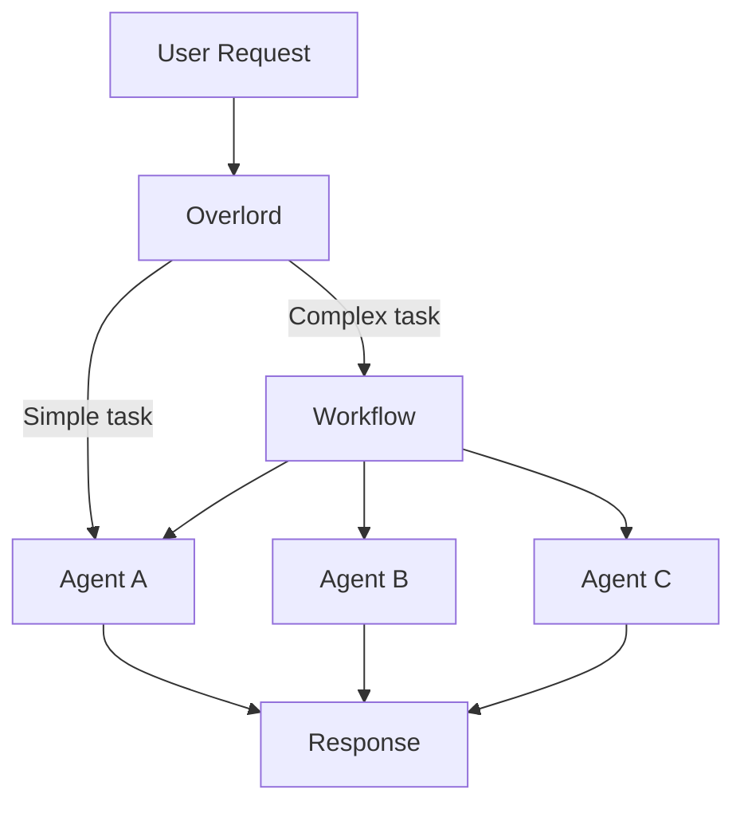
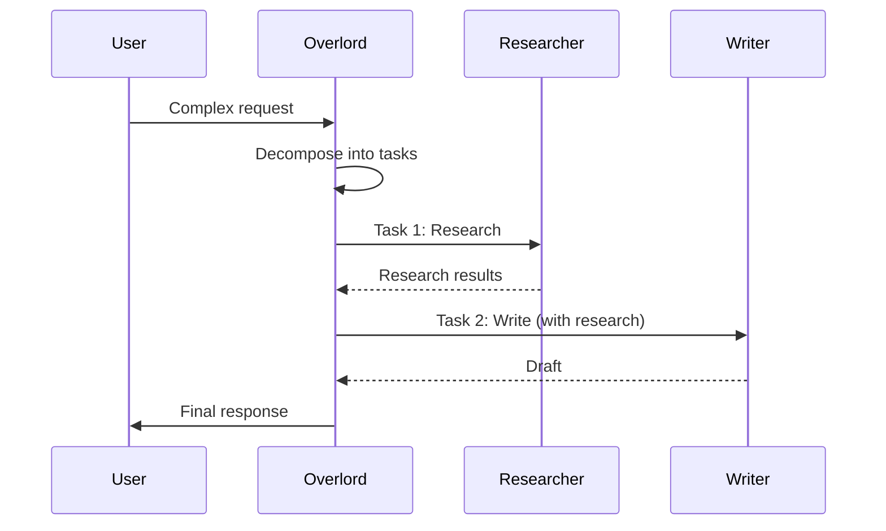

# Multi-Agent Orchestration

## How agents work together

MUXI uses an **Overlord** pattern for coordinating agents. The Overlord analyzes requests, routes to the right agent, and manages complex multi-step workflows.

---

## The Overlord Pattern



The Overlord:
1. **Analyzes** incoming requests
2. **Routes** to the appropriate agent(s)
3. **Coordinates** multi-agent workflows
4. **Synthesizes** final responses

---

## Routing Logic

```
Request Arrives
      ↓
┌─────────────────────────────┐
│ 1. SOP Match?               │ → Yes → Execute SOP
└─────────────────────────────┘
      ↓ No
┌─────────────────────────────┐
│ 2. Agent Specified?         │ → Yes → Use that agent
└─────────────────────────────┘
      ↓ No
┌─────────────────────────────┐
│ 3. Complexity Analysis      │
│    Score < threshold?       │ → Simple → Best agent
│    Score ≥ threshold?       │ → Complex → Workflow
└─────────────────────────────┘
```

> [!NOTE]
> **SOPs have highest priority.** If a request matches an SOP's keywords, it executes immediately, bypassing other routing logic.

---

## Agent Selection

For simple requests, the Overlord selects based on:

| Factor | How It's Used |
|--------|---------------|
| **Role match** | Agent's role description matches request intent |
| **Tool availability** | Agent has the tools needed for the task |
| **Knowledge match** | Agent has relevant knowledge sources |

Example routing:

```
"Search for AI news"
→ researcher (has web-search tool)

"Write a blog post about our product"
→ writer (role: content writer)

"How do I reset my password?"
→ support (knowledge: FAQ, troubleshooting)
```

---

## Complexity Analysis

MUXI scores requests to determine if they need a workflow:

| Factor | Score Impact |
|--------|--------------|
| Multiple steps mentioned | +2 to +5 |
| Research required | +3 |
| Multiple domains involved | +2 |
| Tool usage needed | +1 to +3 |
| Long output expected | +2 |

### Configuration

```yaml
overlord:
  auto_decomposition: true
  complexity_threshold: 7.0   # Score above this triggers workflow
```

Example:

```
"What's 2+2?"
→ Score: 1 → Simple → Direct to agent

"Research AI trends and write a comprehensive blog post with citations"
→ Score: 9 → Complex → Workflow mode
```

---

## Workflow Mode

For complex tasks, the Overlord creates a workflow:



### Workflow Steps

1. **Decomposition** - Break request into subtasks
2. **Planning** - Determine order and dependencies
3. **Execution** - Run tasks (parallel when possible)
4. **Synthesis** - Combine results into response

---

## Agent Communication

Agents don't communicate directly. The Overlord mediates:

```
Agent A Output → Overlord → Agent B Input
```

This enables:

- Consistent context between agents
- Progress tracking
- Error handling and retries
- Audit trail

---

## Approval Flow

For very complex tasks, require human approval:

```yaml
workflow:
  requires_approval: true
  approval_threshold: 10
```

When triggered:

```
User: Create a comprehensive market analysis report

MUXI: I've created a plan for this task:

1. Research market size and trends (researcher)
2. Analyze competitor landscape (analyst)
3. Compile findings into report (writer)
4. Review for accuracy (reviewer)

Estimated time: 5-10 minutes
Proceed? [y/N]
```

---

## Configuration Reference

```yaml
overlord:
  auto_decomposition: true     # Enable workflow mode
  complexity_threshold: 7.0    # Score threshold

  persona:
    name: Assistant
    style: professional        # professional, casual, technical
    tone: helpful

workflow:
  requires_approval: false     # Require user approval
  approval_threshold: 10       # Approval trigger score
  max_parallel_tasks: 10       # Concurrent task limit
  task_timeout: 300            # Seconds per task
```

---

## Best Practices

> [!TIP]
> **Clear roles = better routing.** Non-overlapping responsibilities help the Overlord make better decisions.

1. **Define distinct roles** - Avoid overlap between agents
2. **Match tools to agents** - Right capabilities for right agents
3. **Use SOPs for repeatable work** - Bypass complexity analysis
4. **Set appropriate thresholds** - Balance automation vs. control
5. **Test routing** - Verify requests go to expected agents

---

## Debugging Routing

See which agent handles a request:

```bash
muxi chat --debug "Your request here"
```

Output includes:

- Complexity score
- Selected agent
- Routing reason

---

## Next Steps

[+] [Request Lifecycle](request-lifecycle.md) - Full request flow
[+] [Multi-Agent Guide](../guides/multi-agent.md) - Building agent teams
[+] [SOPs](../formations/sops.md) - Standard operating procedures
