# Request Lifecycle

## The complete journey from user request to agent response

This is the definitive guide to understanding how MUXI processes requests - from the moment a user sends a message to the final response delivery. Follow along to see how MUXI's orchestration intelligence works.

---

## What Makes MUXI Different

MUXI isn't just a request-response system. It's an intelligent processing pipeline that:

- **Adapts to complexity** - Routes simple queries to single agents, decomposes complex requests into multi-agent workflows
- **Maintains context** - Three-tier memory system ensures coherent, personalized conversations
- **Clarifies ambiguity** - Multi-turn clarification resolves unclear requests before processing
- **Orchestrates intelligence** - Coordinates multiple AI agents with specialized capabilities
- **Optimizes execution** - Dynamically chooses sync/async processing based on estimated time
- **Ensures consistency** - Applies configurable personas across all agents
- **Handles complexity** - Supports SOPs (Standard Operating Procedures) for repeatable workflows

---

## The Request Journey

A request passing through MUXI undergoes:

1. **Session & Memory Initialization** - Context loading from three memory tiers
2. **Credential Detection** - Intercepts credential-related requests before processing
3. **Clarification & Actionability** - Resolves unclear requests via multi-turn dialog
4. **Intelligent Routing** - Priority-based: agent specification → SOP match → complexity analysis
5. **SOP-First Processing** - Standard procedures override all other routing when matched
6. **Workflow Analysis** - Complex requests trigger multi-agent orchestration
7. **Agent Processing** - Tool execution, agent-to-agent delegation, parallel tasks
8. **Response Generation** - Batch, streaming, or webhook delivery
9. **Persona Application** - Style and tone consistency regardless of which agents were involved
10. **Memory Updates** - Learning from interactions for future personalization

The system seamlessly handles everything from simple queries ("What's the weather?") to complex orchestrations ("Analyze my codebase, generate security audit, create Linear issues, and notify my team").

---

## Complete Flow Diagram

```mermaid
flowchart TD
    Start([User Sends Request])

    %% Input Methods
    Start -->|API/MCP/SDK/CLI/Embedded| InitReq[Initialize Request]

    %% Session Check
    InitReq --> CheckSession{Check Session}
    CheckSession -->|New Session| CreateSession[Create Session ID]
    CheckSession -->|Existing| UseSession[Use Existing Session]

    CreateSession --> ReqTracking[Request Tracking<br/>- Generate Request ID<br/>- Start Timer<br/>- Log Event]
    UseSession --> ReqTracking

    %% File Upload Check
    ReqTracking --> HasFiles{Has File<br/>Uploads?}
    HasFiles -->|Yes| ProcessFiles[Process Files<br/>- Store in temp<br/>- Extract metadata<br/>- Update context]
    HasFiles -->|No| InitMemory[Initialize Memory<br/>Systems]
    ProcessFiles --> InitMemory

    %% Memory Systems
    InitMemory --> SmartBuffer[Smart Buffer Memory<br/>- Load last N messages<br/>- Vector similarity search<br/>- Auto-summarization<br/>- FIFO with multiplier]

    SmartBuffer --> LongTermCheck{Long-term<br/>Enabled?}
    LongTermCheck -->|Yes| LongTermMem[Long-term Memory<br/>- PostgreSQL/SQLite<br/>- User preferences<br/>- Historical context<br/>- Semantic search]
    LongTermCheck -->|No| BuildContext

    LongTermMem --> BuildContext[Build User Context<br/>- Merge preferences<br/>- Apply personalization<br/>- Load user history<br/>- Extract patterns]

    BuildContext --> WorkingMem[Working Memory<br/>- Current task state<br/>- Active file refs<br/>- Tool outputs<br/>- Session data]

    WorkingMem --> FormatMsg[Format Message with Full Context<br/>- User context<br/>- Recent history<br/>- Current state]

    %% Credential Check
    FormatMsg --> CredentialCheck{Need<br/>Credentials?}
    CredentialCheck -->|SERVICE_USE| HandleCredentials[Handle Credentials<br/>- Check MCP registry<br/>- Verify user has creds<br/>- Redirect or prompt]
    CredentialCheck -->|CREDENTIAL_REQUEST| HandleCredentials
    CredentialCheck -->|NONE| PendingClarification

    HandleCredentials -->|Handled| End([Return Response])
    HandleCredentials -->|Has Credentials| PendingClarification

    %% Clarification Check
    PendingClarification{Has pending<br/>Clarification?}
    PendingClarification -->|Yes| ProcessClarification[Process Clarification<br/>Response]
    PendingClarification -->|No| NeedClarification{Need<br/>Clarification?}

    ProcessClarification --> NeedClarification
    NeedClarification -->|Yes| InitClarification[Initialize Clarification<br/>- Analyze gaps<br/>- Generate questions<br/>- Store context]
    NeedClarification -->|No| IsActionable{Is actionable?}

    InitClarification --> WriteQuestion[Write Clarification<br/>Question]
    WriteQuestion --> ApplyPersona1[[Apply Overlord Persona]]

    %% Main Processing Path
    IsActionable -->|Yes| AgentSpecified{Agent<br/>Specified?}
    IsActionable -->|No| ApplyPersona1

    AgentSpecified -->|Yes| RequestAgent[Request Specific<br/>Agent]
    AgentSpecified -->|No| SOPMatch{SOP<br/>Matched?}
    RequestAgent --> AgentProcessing

    %% SOP and Workflow Path
    SOPMatch -->|Yes| ExecuteSOP[Execute SOP<br/>- Load template<br/>- Decompose tasks<br/>- Execute workflow]
    SOPMatch -->|No| ComplexCheck{Complex<br/>Request?}

    ExecuteSOP --> AgentProcessing
    ComplexCheck -->|≥Threshold| WorkflowDecomp[Workflow<br/>Decomposition<br/>- Create task graph<br/>- Assign agents<br/>- Execute parallel]
    ComplexCheck -->|<Threshold| AutoRoute[Auto-Route to<br/>Best Agent]

    WorkflowDecomp --> AgentProcessing
    AutoRoute --> AgentProcessing

    %% Plan Confirmation
    ComplexCheck2{Requires plan<br/>confirmation?}
    WorkflowDecomp --> ComplexCheck2
    ComplexCheck2 -->|Yes| AskConfirmation[Ask user for<br/>confirmation]
    ComplexCheck2 -->|No| EstimateTime

    AskConfirmation -->|Approved| EstimateTime
    AskConfirmation -->|Declined| WorkflowDecomp

    %% Time Estimation
    EstimateTime[Estimate Execution Time<br/>- Analyze task complexity<br/>- Check tool requirements<br/>- Review historical data]

    EstimateTime --> TimeThreshold{Estimated<br/>Time?}
    TimeThreshold -->|≥Threshold| NotifyUser[Notify User of Estimated Time<br/>- Return task ID<br/>- Provide time estimate<br/>- Setup webhook]
    TimeThreshold -->|<Threshold| ProcessAgent[Process with Agent<br/>- Load agent config<br/>- Apply system prompt<br/>- Initialize context]

    NotifyUser --> ProcessAgent

    %% Agent Processing
    ProcessAgent --> AgentProcessing[Agent Processing]

    AgentProcessing --> NeedTools{Need Tools?}
    NeedTools -->|Yes| MCPTools[MCP Tool Calls<br/>- Connect to server<br/>- Execute tools<br/>- Handle responses]
    NeedTools -->|No| NeedHelp{Need Help<br/>from another<br/>Agent?}

    MCPTools --> ProcessToolResults[Process Tool Results<br/>- Parse outputs<br/>- Update context<br/>- Check errors]

    ProcessToolResults --> NeedHelp

    %% Agent Communication
    NeedHelp -->|Yes| A2A[A2A Communication<br/>- Format request<br/>- Call internal/external agent<br/>- Await response]
    NeedHelp -->|No| MoreProcessing{Need more<br/>Processing?}

    A2A --> HandoffType{Handoff<br/>Type?}
    HandoffType -->|Delegation| DelegateAgent[Delegate to Agent<br/>- Transfer context<br/>- Wait for completion<br/>- Aggregate results]
    HandoffType -->|Consultation| ConsultAgent[Consult Agent<br/>- Request specific info<br/>- Continue processing<br/>- Integrate insights]
    HandoffType -->|Parallel| ParallelAgents[Parallel Agents<br/>- Split tasks<br/>- Execute concurrently<br/>- Merge results]

    DelegateAgent --> AgentResponse[Agent Response<br/>- Collect outputs<br/>- Update memory<br/>- Format results]
    ConsultAgent --> AgentResponse
    ParallelAgents --> AgentResponse

    AgentResponse --> MoreProcessing
    MoreProcessing -->|Yes| AgentProcessing
    MoreProcessing -->|No| GenerateResponse[Generate Response<br/>- Format output<br/>- Add explanations<br/>- Include artifacts]

    %% Final Response Path
    GenerateResponse --> ApplyPersona2[Apply Overlord Persona<br/>- Maintain tone consistency<br/>- Apply style preferences<br/>- Format for user<br/>- Add personality touches]

    ApplyPersona1 --> ApplyPersona2

    ApplyPersona2 --> ResponseMode{Response<br/>Mode?}

    ResponseMode -->|Async| WebhookDelivery[Webhook Delivery<br/>- Format payload<br/>- Call webhook URL<br/>- Retry on failure]
    ResponseMode -->|Sync| UserPref{User<br/>Preference?}

    UserPref -->|Batch| BatchResponse[Batch Response<br/>- Complete processing<br/>- Return full response<br/>- Single payload]
    UserPref -->|Stream| StreamResponse[Stream Response<br/>- Chunk generation<br/>- Progressive delivery<br/>- Real-time updates]

    WebhookDelivery --> UpdateMemory[Update Memory<br/>- Buffer: conversation<br/>- Working: context<br/>- Long-term: persist]
    BatchResponse --> UpdateMemory
    StreamResponse --> UpdateMemory

    UpdateMemory --> HasArtifacts{Has<br/>Artifacts?}
    HasArtifacts -->|Yes| AttachArtifacts[Attach Artifacts<br/>- PDFs<br/>- Files<br/>- Data URLs]
    HasArtifacts -->|No| FinalizeResponse[Finalize Response<br/>- Add metadata<br/>- Log completion<br/>- Update metrics]

    AttachArtifacts --> FinalizeResponse

    FinalizeResponse --> End([Return to User])

    class Start,End startEnd
    class CheckSession,HasFiles,LongTermCheck,PendingClarification,NeedClarification,IsActionable,AgentSpecified,SOPMatch,ComplexCheck,ComplexCheck2,TimeThreshold,NeedTools,NeedHelp,HandoffType,MoreProcessing,ResponseMode,UserPref,HasArtifacts decision
    class UseSession,CreateSession warning
```



---

## Phase-by-Phase Breakdown

### Phase 1: Entry & Session Management

**How requests arrive:**
- **REST API** - Primary HTTP interface for web apps
- **MCP Protocol** - Native AI-to-AI communication
- **SDKs** - Python, TypeScript, Go client libraries
- **CLI** - Command-line interface
- **Embedded** - Direct library integration

**Session handling:**
```
New user → Generate session ID
Existing user → Load session
         ↓
Track request:
  - request_id: req_abc123
  - user_id: user@example.com
  - session_id: sess_xyz789
  - timestamp: 2025-01-09T10:30:00Z
```

**Request ID reuse:**
- Multi-turn clarifications reuse same `request_id`
- Enables complete trace of conversation
- Simplifies debugging and observability

---

### Phase 2: File Upload Processing

**If user uploads files:**

```
Files received
     ↓
Store in /tmp/muxi_uploads/{session_id}/
     ↓
Extract metadata:
  - MIME type
  - File size
  - Content preview
     ↓
Add to context for agent access
```

**Supported files:**
- Documents (PDF, DOCX, TXT, MD)
- Images (PNG, JPG, GIF)
- Data (CSV, JSON, YAML)
- Code (various languages)

---

### Phase 3: Memory System Initialization

**Three-tier memory loading:**

#### 1. Smart Buffer Memory
```
Load last N messages (default: 50)
     ↓
Vector similarity search (if enabled)
     ↓
Auto-summarization for old messages
     ↓
FIFO eviction with importance weighting
```

**Features:**
- Multiplier system (N × multiplier for effective size)
- Preserves critical messages longer
- Context window optimization

#### 2. Long-Term Memory (Optional)
```
Load user profile from PostgreSQL/SQLite
     ↓
User preferences:
  - Communication style
  - Expertise level
  - Response format
     ↓
Historical context:
  - Past interactions
  - Learned patterns
  - Domain knowledge
     ↓
Semantic search:
  - "previous discussions about API design"
  - Relevance threshold: 0.7
  - Time range: 30 days
```

#### 3. Working Memory
```
Session state:
  - Current task progress
  - Active file references
  - Tool call results
  - Temporary data (TTL)
```

**Message enhancement with context priority:**

```
=== USER SYNOPSIS ===
[Cached user profile - multi-user mode only]

=== LONG-TERM MEMORIES ===
[Top 3 relevant memories from vector search]

=== RECENT CONVERSATION ===
[Last N messages from buffer memory]

=== CURRENT REQUEST ===
User: [actual message from user]
```

**Why this order?**
- User synopsis first (identity/preferences)
- Long-term memories second (historical patterns)
- Recent conversation third (immediate context)
- Current request last (highest priority)

---

### Phase 4: Credential Detection & Handling

**Critical:** Happens BEFORE clarification analysis.

```
Check for credential needs:
  - SERVICE_USE: "Show my GitHub repos"
  - CREDENTIAL_REQUEST: "Add my GitHub token"
         ↓
User has credentials?
  ├─ Yes → Continue processing
  └─ No → Handle based on mode:
           - Redirect mode: "Please add credentials at https://..."
           - Dynamic mode: "Please provide your GitHub token:"
                   ↓
                User provides token
                   ↓
                Validate via MCP connection
                   ↓
                Store encrypted
                   ↓
                Discover identity ("ranaroussi")
                   ↓
                Retry original request
```

**For multiple accounts:**
```
User: "Check my GitHub repos"
Agent: "You have 2 GitHub accounts: ranaroussi, lilyautomaze. Which one?"
User: "ranaroussi"
Agent: [Uses ranaroussi's credentials]
```

---

### Phase 5: Clarification System

**Detects unclear requests:**

```
LLM analyzes message:
  - Missing information?
  - Ambiguous references?
  - Conflicting instructions?
  - Insufficient context?
  - Needs confirmation?
         ↓
Needs clarification?
  ├─ Yes → Ask focused question
  │        Store clarification state
  │        Wait for user response
  │        Reuse same request_id
  └─ No → Continue to routing
```

**Multi-turn clarification:**
```
User: "Deploy the app"
Agent: "Which app? You have 3: web-api, mobile-backend, admin-panel"
User: "web-api"
Agent: "Which environment?"
User: "production"
Agent: [Deploys web-api to production]
```

All turns share same `request_id` for complete trace.

**Context switch detection:**
```
[Clarifying deployment]
Agent: "Which environment?"
User: "Actually, can you help me with something else?"
Agent: [Abandons clarification, starts fresh]
```

---

### Phase 6: Actionability Check

**Is the request actionable?**

```
Actionable:
  ✓ "Deploy the app"
  ✓ "Search for API docs"
  ✓ "Create a report"

Not actionable:
  ✗ "That sounds good"
  ✗ "Thanks!"
  ✗ "Okay"
```

**For non-actionable:**
```
Agent responds directly:
"You're welcome! Let me know if you need anything else."
         ↓
Apply persona
         ↓
Return response
         ↓
Done (no agent processing needed)
```

---

### Phase 7: Intelligent Routing

**Priority-based routing:**

```
1. Agent Specified?
   "Ask @researcher to find info..."
   → Route to specified agent

2. SOP Matched?
   "Onboard new customer"
   → Execute "customer-onboarding" SOP

3. Complexity Analysis
   Complexity score ≥ threshold?
   → Multi-agent workflow
   → Single agent routing
```

#### Agent Specification

```yaml
User: "@researcher search for AI trends"
     ↓
Route directly to researcher agent
Skip SOP matching and complexity analysis
```

#### SOP Matching

```
User message → Semantic similarity search
     ↓
Match SOP templates:
  - "customer-onboarding"
  - "refund-processing"
  - "incident-response"
     ↓
Similarity ≥ threshold?
  ├─ Yes → Execute SOP workflow
  └─ No → Continue to complexity analysis
```

**SOPs override everything** when matched - ensures consistent execution.

#### Complexity Analysis

```
LLM scores request complexity (0-10):
  - Number of steps required
  - Multiple domains involved
  - Tool requirements
  - Subtask dependencies
         ↓
Score ≥ 7 (configurable threshold)?
  ├─ Yes → Workflow decomposition
  └─ No → Single agent routing
```

**Single agent routing:**
```
Analyze request requirements:
  - Required tools
  - Domain expertise
  - Agent capabilities
         ↓
Score each agent:
  - Capability match
  - Tool access
  - Past performance
         ↓
Route to highest scoring agent
```

---

### Phase 8: Workflow Decomposition (Complex Requests)

**When complexity score ≥ threshold:**

```
LLM decomposes request:
"Analyze codebase, create security audit, file issues"
         ↓
Subtasks:
  1. Code analysis → researcher agent
  2. Security audit → security agent
  3. Create issues → developer agent
  4. Send notification → notifier agent
         ↓
Build task graph:
  - Dependencies (task 2 depends on task 1)
  - Parallel execution (tasks 3 and 4 can run together)
  - Agent assignments
         ↓
Confirm plan (if enabled):
"I'll analyze the code, run a security audit, create 
 Linear issues, and notify your team. Proceed?"
         ↓
User approves → Execute workflow
User declines → Revise plan
```

**Parallel execution:**
```
Task 1 (Analysis) → Completes
         ↓
    ┌────┴────┐
Task 2        Task 3
(Audit)       (Issues)
[Parallel execution]
         ↓
    Both complete
         ↓
Task 4 (Notify)
```

---

### Phase 9: Execution Time Estimation

**Before starting execution:**

```
Estimate execution time based on:
  - Task complexity
  - Number of subtasks
  - Tool requirements
  - Historical data
  - Agent workload
         ↓
Estimated time ≥ threshold (e.g., 10 seconds)?
  ├─ Yes → Switch to async mode
  │        Return: "Task started, ID: task_abc123"
  │        Setup webhook
  │        Execute in background
  └─ No → Execute synchronously
          Return response when done
```

**Async notification:**
```
Immediate response:
{
  "status": "processing",
  "task_id": "task_abc123",
  "estimated_time": "45 seconds",
  "webhook_url": "https://your-app.com/webhook"
}

[Later, when done]
POST https://your-app.com/webhook
{
  "task_id": "task_abc123",
  "status": "completed",
  "result": "..."
}
```

---

### Phase 10: Agent Processing

**Agent executes the task:**

```
Agent receives:
  - Enhanced message (with context)
  - System prompt
  - Available tools
  - Memory state
         ↓
Agent processes:
  - Analyzes request
  - Plans approach
  - Decides tool use
         ↓
Need tools?
  ├─ Yes → Call MCP tools
  └─ No → Continue processing
         ↓
Need help from another agent?
  ├─ Yes → A2A communication
  └─ No → Generate response
```

#### MCP Tool Execution

```
Agent: "I need to search the web"
         ↓
Select tool: web-search
         ↓
Prepare arguments: {"query": "AI trends 2025"}
         ↓
Call MCP server
         ↓
Receive results
         ↓
Parse and integrate into response
         ↓
Continue processing or return result
```

**Tool chaining (automatic error recovery):**
```
Call tool → Error: "Repository not found"
         ↓
Agent analyzes error
         ↓
Agent: "I'll create the repository first"
         ↓
Call create_repo tool
         ↓
Retry original operation
         ↓
Success!
```

#### A2A Communication (Agent-to-Agent)

**Three handoff types:**

**1. Delegation** - Transfer complete task:
```
Developer Agent: "I need security review"
         ↓
Delegate to Security Agent
         ↓
Security Agent: [Performs complete review]
         ↓
Returns full audit report
         ↓
Developer Agent: [Uses report in response]
```

**2. Consultation** - Request specific info:
```
Backend Agent: "What data format does frontend need?"
         ↓
Consult Frontend Agent
         ↓
Frontend Agent: "JSON with these fields: ..."
         ↓
Backend Agent: [Continues with that knowledge]
```

**3. Parallel** - Split work across agents:
```
Overlord: "Build analytics dashboard"
         ↓
Parallel execution:
  - Data Engineer: Design schema
  - Backend Dev: Build API
  - Frontend Dev: Create UI
  - DevOps: Set up monitoring
         ↓
All agents work simultaneously
         ↓
Aggregate results
```

#### Agent Decision Making

```
Agent continuously evaluates:
  - Have I answered the question?
  - Do I need more information?
  - Should I call a tool?
  - Should I consult another agent?
  - Am I stuck (need to escalate)?
         ↓
Decision → Action → Evaluate → Repeat
```

---

### Phase 11: Persona Application

**The Overlord applies consistent persona:**

```
Agent responses (may vary in style)
         ↓
Overlord persona instructions:
  - Tone: "professional but friendly"
  - Style: "concise and clear"
  - Voice: "active voice, no jargon"
  - Format: "markdown with headers"
         ↓
All responses transformed to match persona
         ↓
Consistent user experience regardless of agents used
```

**Example:**
```
Agent: "The analysis has been completed. Results show..."
         ↓
After persona:
"I've analyzed the data for you. Here's what I found..."
```

**Persona maintains:**
- Consistent tone across agents
- User's preferred communication style
- Format preferences (verbose vs concise)
- Language/terminology level

---

### Phase 12: Response Generation

**Three delivery modes:**

#### 1. Synchronous Batch
```
Wait for complete processing
         ↓
Generate full response
         ↓
Return JSON:
{
  "content": "Complete response text...",
  "request_id": "req_abc123",
  "agents_used": ["researcher", "writer"],
  "tools_called": ["web-search", "file-read"],
  "duration_ms": 3420
}
```

#### 2. Synchronous Streaming
```
Open SSE connection
         ↓
Stream chunks as generated:

event: chunk
data: {"text": "I've analyzed"}

event: chunk
data: {"text": " the data"}

event: tool_start
data: {"tool": "web-search"}

event: tool_end
data: {"tool": "web-search", "result": "..."}

event: chunk
data: {"text": " and found..."}

event: done
data: {"request_id": "req_abc123"}
```

User sees response appear in real-time (typewriter effect).

#### 3. Asynchronous Webhook
```
Immediate response:
{
  "status": "processing",
  "task_id": "task_abc123",
  "estimated_time": "60 seconds"
}
         ↓
[Processing happens in background]
         ↓
When complete, POST to webhook:
{
  "task_id": "task_abc123",
  "status": "completed",
  "result": "...",
  "duration_ms": 58230
}
```

---

### Phase 13: Artifact Handling

**If agent generated files:**

```
Agent created:
  - report.pdf
  - chart.png
  - data.csv
         ↓
Process artifacts:
  - Generate base64 data URLs
  - Extract metadata (MIME, size)
  - Create download links
         ↓
Attach to response:
{
  "content": "Here's your report",
  "artifacts": [
    {
      "name": "report.pdf",
      "type": "application/pdf",
      "size": 245678,
      "data_url": "data:application/pdf;base64,..."
    }
  ]
}
```

**Artifact types:**
- Documents (PDF, DOCX)
- Charts (PNG, SVG)
- Data files (CSV, JSON)
- Code files (Python, JavaScript)

---

### Phase 14: Memory Updates

**After response delivered:**

```
1. Buffer Memory Update:
   - Add user message
   - Add agent response
   - Update vector index (if enabled)
   - Trigger summarization (if buffer near capacity)

2. Working Memory Update:
   - Increment request count
   - Update last interaction time
   - Clear temporary tool outputs
   - Update task state

3. Long-Term Memory Update (if enabled):
   - Extract learnings from interaction
   - Update user preferences
   - Store interaction metadata
   - Update patterns and trends
```

**What gets learned:**
- User preferences ("prefers Python over JavaScript")
- Interaction patterns (asks for detailed explanations)
- Domain knowledge (works on e-commerce platform)
- Tool usage (frequently uses GitHub integration)

---

### Phase 15: Observability Events

**Events emitted throughout lifecycle:**

| Phase | Event | When |
|-------|-------|------|
| Entry | `request.received` | Request arrives |
| Session | `session.created` | New session |
| Memory | `memory.loaded` | Context loaded |
| Credential | `credential.needed` | Credentials required |
| Clarification | `clarification.started` | Unclear request |
| Routing | `agent.selected` | Agent chosen |
| SOP | `sop.matched` | SOP triggered |
| Workflow | `workflow.decomposed` | Complex request |
| Agent | `agent.processing` | Agent starts |
| Tool | `tool.invoked` | MCP tool called |
| A2A | `agent.delegated` | Agent-to-agent |
| Response | `response.generated` | Response ready |
| Streaming | `chunk.sent` | Chunk streamed |
| Memory | `memory.updated` | Memory persisted |
| Complete | `request.completed` | Done |

**Use for:**
- Debugging request flow
- Performance monitoring
- Usage analytics
- Error tracking

---

## Performance Timing

**Typical latency breakdown:**

| Phase | Typical Time | Details |
|-------|--------------|---------|
| Auth & Routing | 1-5ms | Minimal overhead |
| Session Load | 5-20ms | Retrieve session |
| Memory Loading | 10-100ms | 3-tier memory |
| Credential Check | 1-10ms | Cache hit: <1ms |
| Clarification | 500ms-3s | LLM analysis |
| Complexity Analysis | 500ms-2s | LLM scoring |
| Agent Selection | 10-50ms | Scoring logic |
| LLM Call | 500ms-10s | Model dependent |
| Tool Execution | 100ms-5s | MCP tools |
| A2A Communication | 500ms-10s | Remote agent |
| Memory Update | 5-50ms | Database write |
| **Total (simple)** | **1-15s** | Single agent |
| **Total (complex)** | **10-60s** | Multi-agent |

---

## Error Handling

**Errors handled at each phase:**

| Phase | Error Type | Handling |
|-------|-----------|----------|
| Auth | Invalid API key | 401 Unauthorized |
| Session | Session not found | Create new session |
| Memory | Database error | Log, use buffer only |
| Clarification | Too many turns | Force processing |
| Routing | No agent match | Use default agent |
| Agent | Agent failure | Try fallback agent |
| LLM | API timeout | Retry with backoff |
| Tool | Tool error | Agent sees error, adapts |
| A2A | Agent unavailable | Return error to agent |
| Response | Streaming failed | Fallback to batch |
| Memory | Update failed | Log, continue |

**Graceful degradation:**
- Long-term memory fails → Use buffer only
- Tool fails → Agent works around it
- Streaming fails → Return batch response
- Agent fails → Try another agent

---

## Request Lifecycle Examples

### Example 1: Simple Query

```
User: "What's the weather in SF?"
         ↓
Session: Load/create
Memory: Load buffer (recent messages)
Credentials: None needed
Clarification: None needed (clear request)
Actionability: Actionable
Routing: Auto-route to assistant agent
Agent: Calls weather tool
Tool: Returns weather data
Agent: Formats response
Persona: Applied
Response: "It's 68°F and sunny in San Francisco"
Memory: Updated
         ↓
Total time: ~2 seconds
```

### Example 2: Ambiguous Request

```
User: "Deploy the app"
         ↓
Session: Existing
Memory: Load context
Credentials: None needed
Clarification: Multiple apps exist
Agent: "Which app? web-api, mobile-backend, admin-panel"
User: "web-api"
Clarification: "Which environment?"
User: "production"
Actionability: Now clear
Routing: Auto-route to devops agent
Agent: Runs deployment
Tool: kubectl deploy
Agent: Confirms success
Response: "Deployed web-api to production. Version 1.2.3 is now live."
Memory: Updated
         ↓
Total time: ~15 seconds (with clarifications)
```

### Example 3: Complex Multi-Agent Workflow

```
User: "Analyze my codebase, run security audit, create issues for problems"
         ↓
Session: Existing
Memory: Load context + user preferences
Credentials: GitHub credentials needed → Already stored
Clarification: None (clear intent)
Actionability: Actionable
Routing: Complexity score: 9/10 → Workflow decomposition
Workflow:
  Task 1: Code analysis → researcher agent
  Task 2: Security audit → security agent (depends on task 1)
  Task 3: Create issues → developer agent (depends on task 2)
Execution:
  - Researcher: Scans codebase, generates report
  - Security: Reviews report, finds 5 vulnerabilities
  - Developer: Creates 5 GitHub issues
Aggregation: Combine all results
Persona: Applied
Response: "I've analyzed your codebase and found 5 security issues.
           Created GitHub issues #123-#127 for each one. Here's the summary..."
Artifacts: security-audit.pdf attached
Memory: Updated
         ↓
Total time: ~45 seconds (async mode)
```

### Example 4: Credential Collection

```
User: "Show my GitHub repos"
         ↓
Session: New
Memory: Empty buffer
Credentials: Check → User has no GitHub credentials
Mode: Dynamic
Agent: "I need access to GitHub. Please provide your personal access token:"
User: "ghp_xxxxxxxxxxxxx"
Validation: Connects to GitHub, validates token
Identity: Discovers username: "ranaroussi"
Storage: Encrypts and stores credential
Retry: Original request with credentials
Agent: Calls GitHub API with user's token
Tool: Returns repositories
Response: "You have 15 repositories: ..."
Memory: Updated with credential info
         ↓
Total time: ~10 seconds (with credential collection)
```

---

## Key Takeaways

**What makes this lifecycle special:**

1. **Intelligence at every stage** - LLM analysis drives routing, not hardcoded rules
2. **Context preservation** - 3-tier memory ensures coherent conversations
3. **Automatic error recovery** - Agents adapt when tools fail
4. **Seamless complexity handling** - Same pipeline for simple and complex requests
5. **User privacy** - Per-user credentials and memory isolation
6. **Flexible delivery** - Batch, streaming, or async based on needs
7. **Consistent experience** - Persona ensures uniform style
8. **Complete observability** - Events at every stage for debugging

**The result:** A request processing system that feels intelligent, not mechanical.

---

## Learn More

- [How Orchestration Works](orchestration.md) - Deep dive into the Overlord
- [Memory Internals](memory.md) - Technical memory system details
- [Clarification System](../concepts/clarification.md) - How ambiguity is handled
- [Agent Collaboration](../concepts/agents.md) - A2A communication patterns
- [Observability](observability.md) - Monitoring and debugging
