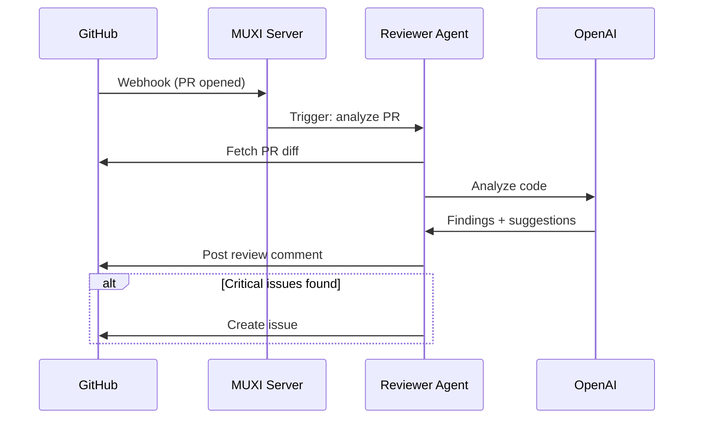

# Code Reviewer

## An AI code reviewer integrated with GitHub. Reviews pull requests, suggests improvements, checks for security issues, and comments directly on GitHub.

**Difficulty:** Advanced
**Time to setup:** 15 minutes


## What It Does

- Automatically reviews GitHub pull requests
- Analyzes code quality, security, performance
- Posts review comments on GitHub
- Creates follow-up issues for significant problems
- Tracks review history

## Features

- ✅ **GitHub Integration**: Triggered by PR webhooks
- ✅ **Security Analysis**: Detects common vulnerabilities
- ✅ **Best Practices**: Suggests code improvements
- ✅ **Auto-Comment**: Posts reviews directly to GitHub
- ✅ **Issue Creation**: Files issues for critical problems

## Prerequisites

- MUXI Server running (public URL required for webhooks)
- OpenAI API key
- GitHub Personal Access Token with `repo` scope
- GitHub repository with webhook access

## Setup

### 1. Copy Example
```bash
cp -r examples/04-code-reviewer my-code-reviewer
cd my-code-reviewer
```

### 2. Install MCP Server
```bash
npm install -g @modelcontextprotocol/server-github
```

### 3. Set Secrets
```bash
muxi secrets setup
# You'll need:
# - OPENAI_API_KEY
# - GITHUB_TOKEN (create at github.com/settings/tokens)
```

### 4. Deploy (needs public URL)
```bash
# Local testing won't work (needs webhook)
muxi deploy production
```

### 5. Setup GitHub Webhook
In your GitHub repo:
1. Go to Settings → Webhooks → Add webhook
2. Payload URL: `https://your-muxi-server.com:7890/formations/code-reviewer/triggers/github-pr`
3. Content type: `application/json`
4. Events: Select "Pull requests"
5. Active: ✓

## How It Works



## Test It

### Manual Trigger (Testing)
```bash
curl -X POST https://your-server.com/formations/code-reviewer/triggers/github-pr \
  -H "Content-Type: application/json" \
  -d '{
    "action": "opened",
    "pull_request": {
      "number": 123,
      "html_url": "https://github.com/user/repo/pull/123"
    },
    "repository": {
      "full_name": "user/repo"
    }
  }'
```

### Real PR
1. Create a pull request in your repo
2. GitHub sends webhook to MUXI
3. Agent reviews code
4. Comment appears on GitHub

## Example Review

**PR Changes:**
```python
# New file: api/auth.py
def login(username, password):
    user = db.query(f"SELECT * FROM users WHERE username='{username}'")
    if user and user.password == password:
        return create_token(user)
```

**Agent Comment:**
```markdown
## Code Review

### 🚨 Security Issues

1. **SQL Injection Vulnerability** (Line 2)
   The query uses string formatting which is vulnerable to SQL injection.

   **Fix:**
   ```python
   user = db.query("SELECT * FROM users WHERE username=?", (username,))
   ```

2. **Plaintext Password Comparison** (Line 3)
   Passwords should be hashed, not stored/compared in plaintext.

   **Fix:**
   ```python
   if user and verify_password(password, user.password_hash):
   ```

### ⚠️ Best Practices

- Add input validation for username/password
- Add rate limiting to prevent brute force
- Log failed login attempts

### ✅ Positive

- Clean function naming
- Simple, readable code structure

**Overall:** Reject - Critical security issues must be fixed before merge.

I've created issue #456 to track the security improvements.
```

## Configuration Highlights

### GitHub MCP

`mcp/github.afs`:
```yaml
schema: "1.0.0"
id: github
type: command
command: npx
args: ["-y", "@modelcontextprotocol/server-github"]
auth:
  type: env
  GITHUB_TOKEN: "${{ secrets.GITHUB_TOKEN }}"
```

### Trigger
```yaml
triggers:
  - name: github-pr
    description: "Triggered when PR is opened/updated"
    template: |
      Review this pull request:

      Repository: {{repository.full_name}}
      PR #{{pull_request.number}}: {{pull_request.title}}
      Author: {{pull_request.user.login}}
      URL: {{pull_request.html_url}}

      Analyze the code changes and post a review comment on GitHub.
```

### Reviewer Instructions
```yaml
# agents/code-reviewer.afs
schema: "1.0.0"
id: code-reviewer
name: Code Reviewer
description: Expert code reviewer

system_message: |
  You are an expert code reviewer focusing on:

  Security:
  - SQL injection, XSS, CSRF vulnerabilities
  - Authentication/authorization issues
  - Sensitive data exposure

  Code Quality:
  - Code complexity and readability
  - Error handling
  - Test coverage

  Performance:
  - N+1 queries
  - Inefficient algorithms
  - Memory leaks

  Best Practices:
  - Language/framework conventions
  - Documentation
  - Naming conventions
```

## Customization

### Review Criteria
Customize the system_message in `agents/code-reviewer.afs`:
```yaml
system_message: |
  Focus your review on:
  - TypeScript best practices
  - React patterns and hooks
  - Accessibility (WCAG 2.1)
  - No console.log() in production code
```

### Auto-Approve Simple PRs
```yaml
sops:
  - name: auto-approve-docs
    trigger: "documentation-only changes"
    steps:
      - agent: code-reviewer
        task: "Verify only .md files changed"
      - agent: code-reviewer
        task: "If yes, approve PR automatically"
```

### Create Issues for Problems
Already built-in - agent creates GitHub issues for critical problems.

## Common Issues

### "Webhook not received"
1. Check webhook URL is correct and public
2. Check GitHub webhook delivery logs
3. Test with curl (see above)

### "Permission denied: GitHub"
GitHub token needs `repo` scope:
```bash
# Check token permissions
curl -H "Authorization: token $GITHUB_TOKEN" \
  https://api.github.com/user
```

### "Agent doesn't comment"
Check GitHub MCP tool is working:
```bash
# Test GitHub connection
muxi formation exec code-reviewer \
  "List issues in user/repo repository"
```

## Next Steps

- [Multi-Agent Team](../05-multi-agent-team/) - Add security specialist, performance expert
- [SOPs Guide](../../guides/create-sops.md) - Create standard review workflows
- [Triggers Guide](../../guides/create-triggers.md) - Add more GitHub events
