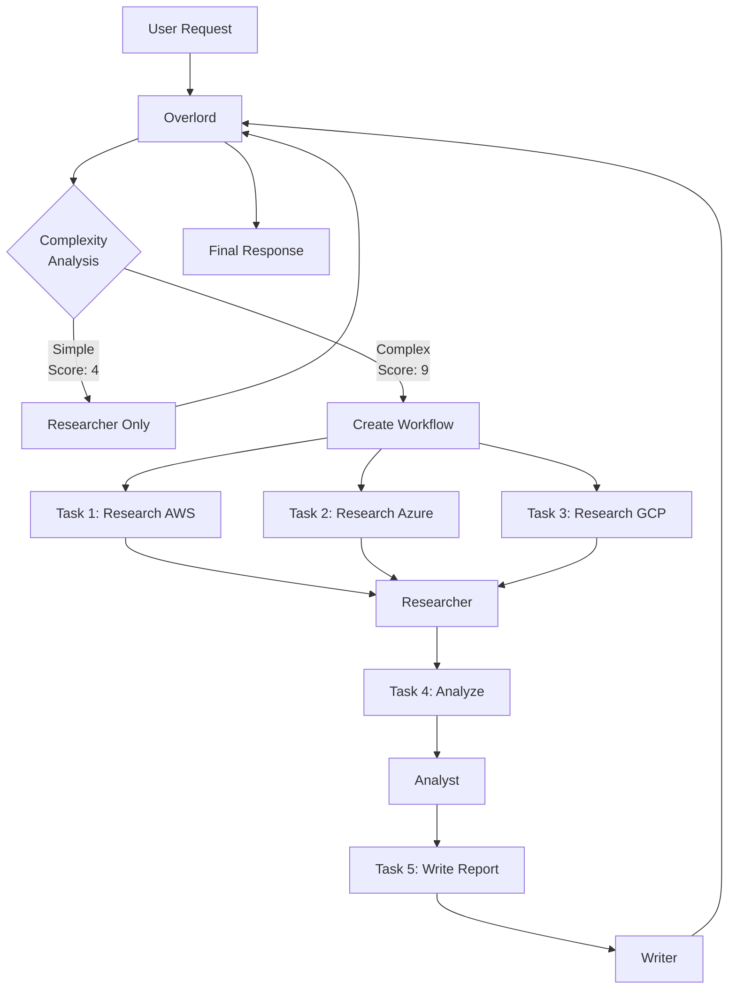

# Multi-Agent Team

## A team of specialized AI agents that automatically coordinate to handle complex requests. Demonstrates MUXI's automatic workflow decomposition and agent orchestration.

**Difficulty:** Advanced
**Time to setup:** 10 minutes


## What It Does

- Multiple specialized agents (researcher, analyst, writer)
- Automatic task decomposition
- Parallel execution when possible
- Agent-to-agent collaboration (A2A)
- Produces comprehensive outputs

## The Team

**🔍 Researcher**
- Gathers information from web and documents
- Identifies relevant sources
- Summarizes findings

**📊 Analyst**
- Processes data and findings
- Identifies patterns and trends
- Creates visualizations

**✍️ Writer**
- Creates reports and summaries
- Ensures consistent tone
- Formats output professionally

**🎯 Overlord**
- Coordinates the team
- Assigns tasks to agents
- Synthesizes final output

## Features

- ✅ **Automatic Orchestration**: No manual coordination needed
- ✅ **Parallel Execution**: Independent tasks run simultaneously
- ✅ **Agent Specialization**: Each agent has distinct expertise
- ✅ **Workflow Intelligence**: Determines optimal execution order
- ✅ **Error Recovery**: Failed tasks retry automatically

## Prerequisites

- MUXI Server running
- OpenAI API key
- Brave Search API key (for researcher)

## Setup

```bash
# 1. Copy example
cp -r examples/05-multi-agent-team my-team
cd my-team

# 2. Install MCP servers
npm install -g @modelcontextprotocol/server-brave-search
npm install -g @modelcontextprotocol/server-filesystem

# 3. Set secrets
muxi secrets setup

# 4. Run
muxi dev
```

## Test It

### Simple Request (Single Agent)
```bash
curl -X POST http://localhost:8001/v1/chat \
  -d '{"message": "What is machine learning?"}'

# Overlord routes to researcher (simple factual question)
```

### Complex Request (Multi-Agent Workflow)
```bash
curl -X POST http://localhost:8001/v1/chat \
  -d '{"message": "Research the top 3 cloud providers, analyze their pricing and features, and create a comparison report"}'

# Overlord creates workflow:
# 1. Researcher: Search for AWS, Azure, GCP (parallel)
# 2. Analyst: Compare pricing and features
# 3. Writer: Create formatted report
```

## How It Works



## Example Workflow

**User Request:**
```
"Research AI trends in 2025, analyze market growth, create an executive summary"
```

**Overlord Analysis:**
- Complexity score: 9/10
- Triggers workflow mode
- Creates plan:

**Workflow Execution:**

```
[WORKFLOW] Created workflow for request req_abc123

Task 1: Research AI trends 2025
  Agent: researcher
  Tools: brave-search
  Status: ✓ Completed (3.2s)

Task 2: Research market data
  Agent: researcher
  Tools: brave-search
  Status: ✓ Completed (2.8s)

[Tasks 1-2 ran in parallel]

Task 3: Analyze trends and market data
  Agent: analyst
  Input: Results from Tasks 1-2
  Tools: data-analysis
  Status: ✓ Completed (4.1s)

Task 4: Create executive summary
  Agent: writer
  Input: Analysis from Task 3
  Tools: document-creation
  Status: ✓ Completed (5.3s)

[WORKFLOW] Completed in 15.4s total
```

**Final Output:**
```markdown
# AI Trends 2025: Executive Summary

## Key Findings

Based on analysis of 12 recent reports and market data...

[Comprehensive 3-page executive summary with data, trends, and recommendations]
```

## Configuration Highlights

### Multiple Agents

Each agent is defined in `agents/*.yaml`:

```yaml
# agents/researcher.yaml
schema: "1.0.0"
id: researcher
name: Researcher
description: Expert at gathering information

system_message: Expert at gathering information...

llm_models:
  - text: "openai/gpt-4-turbo"  # Faster for research
```

```yaml
# agents/analyst.yaml
schema: "1.0.0"
id: analyst
name: Analyst
description: Data analyst who identifies patterns

system_message: Data analyst who identifies patterns...

llm_models:
  - text: "openai/gpt-4o"  # Best reasoning
```

```yaml
# agents/writer.yaml
schema: "1.0.0"
id: writer
name: Writer
description: Professional writer

system_message: Professional writer who creates reports...

llm_models:
  - text: "openai/gpt-4"  # Best writing quality
```

### Workflow Settings
```yaml
overlord:
  auto_decomposition: true
  complexity_threshold: 7.0

workflow:
  max_parallel_tasks: 5
  task_timeout: 120
  retry_failed_tasks: true
```

### Agent Selection
Overlord automatically chooses based on task:
```yaml
overlord:
  agent_selection:
    - match: "research|find|search"
      agent: researcher

    - match: "analyze|compare|trends"
      agent: analyst

    - match: "write|create|summary|report"
      agent: writer
```

## Use Cases

### Business Intelligence
```
"Research our competitors' Q4 earnings, analyze trends, create investor report"

Workflow:
- Researcher: Finds earnings reports
- Analyst: Analyzes financial trends
- Writer: Creates investor-ready report
```

### Content Creation
```
"Research sustainable energy, analyze adoption rates, write blog post"

Workflow:
- Researcher: Gathers facts and stats
- Analyst: Identifies key insights
- Writer: Creates engaging blog post
```

### Market Research
```
"Research electric vehicle market in Europe, analyze growth, create executive summary"

Workflow:
- Researcher: Market data and reports
- Analyst: Growth analysis and forecasts
- Writer: Executive summary for C-suite
```

## Customization

### Add More Agents

Create additional agent files in `agents/`:

```yaml
# agents/editor.yaml
schema: "1.0.0"
id: editor
name: Editor
description: Proofreads and improves written content

system_message: Proofreads and improves written content.
```

```yaml
# agents/translator.yaml
schema: "1.0.0"
id: translator
name: Translator
description: Translates content to multiple languages

system_message: Translates content to multiple languages.
```

### Adjust Complexity Threshold
```yaml
overlord:
  complexity_threshold: 6.0  # More workflows (more aggressive)
  # or
  complexity_threshold: 8.0  # Fewer workflows (more selective)
```

### Force Specific Workflow
```yaml
sops:
  - name: market-research
    trigger: "market research"
    steps:
      - agent: researcher
        task: "Gather market data"
      - agent: analyst
        task: "Analyze data"
      - agent: writer
        task: "Create report"
```

## Monitoring Workflows

Enable workflow logging:
```yaml
workflow:
  log_workflows: true
```

See execution:
```bash
muxi logs my-team --follow

# Output shows:
[WORKFLOW] Task 1 started (researcher)
[WORKFLOW] Task 2 started (researcher)
[WORKFLOW] Task 1 completed in 3.2s
[WORKFLOW] Task 2 completed in 2.8s
[WORKFLOW] Task 3 started (analyst)
...
```

## Performance Tuning

### Reduce Latency
```yaml
workflow:
  max_parallel_tasks: 10  # More parallelization

agents:
  - name: researcher
    llm:
      model: gpt-4-turbo  # Faster model
```

### Reduce Costs
```yaml
agents:
  - name: researcher
    llm:
      model: gpt-3.5-turbo  # Cheaper model

workflow:
  max_parallel_tasks: 2  # Less parallel API calls
```

## Common Issues

### "All requests go to one agent"
Complexity threshold too high:
```yaml
overlord:
  complexity_threshold: 7.0  # Lower to 6 or 5
```

### "Tasks timeout"
Increase timeout:
```yaml
workflow:
  task_timeout: 180  # 3 minutes
```

### "No parallel execution"
Check tasks have no dependencies:
```yaml
workflow:
  min_tasks_for_parallel: 2  # Enable for 2+ tasks
```

## Next Steps

- [Workflows Guide](../../concepts/workflows.md) - Understand workflow system
- [Approvals](../../concepts/approvals.md) - Add human-in-the-loop
- [SOPs](../../guides/sops.md) - Create repeatable workflows
