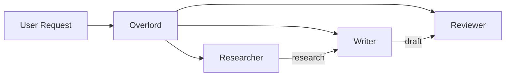

# Agents

## Define AI personas with specific roles and capabilities

Agents are the workers in your formation. Each has a role, personality, and set of tools. MUXI automatically routes requests to the right agent.

---

## Your First Agent

```yaml
agents:
  - id: assistant
    role: You are a helpful assistant who answers questions clearly.
```

That's it. One agent, ready to chat.

---

## Agent Configuration

### Full Example

```yaml
agents:
  - id: researcher
    name: Research Specialist
    role: |
      You research topics thoroughly and provide accurate,
      well-sourced information. Always cite your sources.
    model: openai/GPT-5
    temperature: 0.7
    mcps:
      - web-search
    knowledge:
      enabled: true
      sources:
        - path: knowledge/docs/
          description: Internal documentation
```

### Configuration Fields

| Field | Type | Required | Description |
|-------|------|----------|-------------|
| `id` | string | Yes | Unique identifier (used in routing) |
| `name` | string | No | Display name |
| `role` | string | Yes | System prompt defining behavior |
| `model` | string | No | Override default LLM |
| `temperature` | float | No | Creativity (0-1, default: 0.7) |
| `mcps` | list | No | Tools this agent can use |
| `knowledge` | object | No | RAG sources for this agent |

---

## Multi-Agent Formations

The real power comes from multiple specialized agents:

```yaml
agents:
  - id: researcher
    role: Research topics and gather accurate information
    mcps:
      - web-search

  - id: writer
    role: Write clear, engaging content based on research

  - id: reviewer
    role: Review content for accuracy, clarity, and tone
```



> [!TIP]
> MUXI's **Overlord** automatically routes requests to the best agent based on the task. You can also specify agents explicitly.

---

## Agent Routing

### Automatic Routing

MUXI analyzes requests and picks the right agent:

```
User: "Find information about AI trends"
→ Routes to: researcher (has web-search)

User: "Write a blog post about our product"
→ Routes to: writer (writing role)
```

### Explicit Routing

Override automatic routing when needed:

[[tabs]]

[[tab CLI]]
```bash
muxi chat --agent researcher "Find info about AI trends"
```
[[/tab]]

[[tab curl]]
```bash
curl -X POST http://localhost:8001/v1/chat \
  -d '{"message": "...", "agent": "researcher"}'
```
[[/tab]]

[[tab Python]]
```python
response = formation.chat(
    "Find info about AI trends",
    agent="researcher"
)
```
[[/tab]]

[[tab TypeScript]]
```typescript
const response = await formation.chat('Find info about AI trends', {
  agent: 'researcher'
});
```
[[/tab]]

[[tab Go]]
```go
response, _ := formation.ChatWithOptions("Find info about AI trends", muxi.ChatOptions{
    Agent: "researcher",
})
```
[[/tab]]

[[/tabs]]

---

## Agent-Specific Tools

Give different agents different capabilities:

```yaml
mcps:
  - id: web-search
    server: "@anthropic/brave-search"
  - id: filesystem
    server: "@anthropic/filesystem"
  - id: database
    server: "@anthropic/postgres"

agents:
  - id: researcher
    role: Research specialist
    mcps:
      - web-search      # Can search the web

  - id: developer
    role: Code assistant
    mcps:
      - filesystem      # Can read/write files
      - database        # Can query databases

  - id: writer
    role: Content writer
    # No tools - focuses purely on writing
```

---

## Agent-Specific Knowledge

Different agents can access different knowledge bases:

```yaml
agents:
  - id: support
    role: Customer support specialist
    knowledge:
      sources:
        - path: knowledge/faq/
          description: Customer FAQs
        - path: knowledge/troubleshooting/
          description: Troubleshooting guides

  - id: sales
    role: Sales advisor
    knowledge:
      sources:
        - path: knowledge/pricing/
          description: Pricing and plans
        - path: knowledge/features/
          description: Product features
```

---

## Separate Agent Files

For complex agents, use separate files:

```bash
muxi new agent researcher
```

Creates `agents/researcher.afs`:

```yaml
# agents/researcher.afs
id: researcher
name: Research Specialist
role: |
  You are an expert researcher who:
  - Gathers accurate information from multiple sources
  - Cites all sources properly
  - Provides balanced, objective analysis
  - Admits uncertainty when appropriate
```

Reference in your main formation:

```yaml
# formation.afs
agents:
  - $include: agents/researcher.afs
  - $include: agents/writer.afs
  - $include: agents/reviewer.afs
```

---

## Best Practices

> [!IMPORTANT]
> **Clear roles matter.** Well-defined, non-overlapping roles lead to better routing and results.

1. **Be specific** - "Customer support for Acme SaaS products" beats "helpful assistant"
2. **Match tools to roles** - Researchers get search, developers get filesystem
3. **One specialty per agent** - Let each agent focus on what they do best
4. **Use separate files** - Keep complex agent definitions organized

---

## Next Steps

[+] [Tools (MCP)](tools.md) - Give agents capabilities
[+] [Knowledge](knowledge.md) - Add domain expertise
[+] [Multi-Agent Guide](../guides/multi-agent.md) - Build agent teams
[+] [Examples](examples.md) - Complete agent examples
