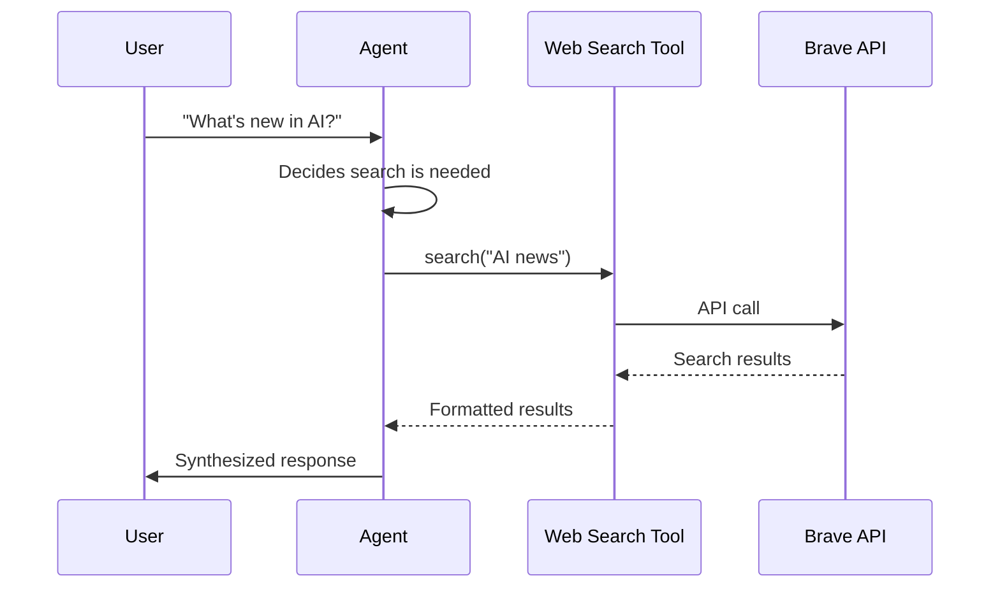

# Add Tools (MCP)

## Give your agents superpowers

Tools let agents interact with the real world - search the web, access files, query databases, call APIs. MUXI uses the **Model Context Protocol (MCP)** standard for tools.

> [!NOTE]
> **This guide uses Brave Search as an example.** You can use any MCP-compatible tool server. The patterns shown here apply to all MCP integrations.


## MCP Protocol Support

MUXI supports both MCP transport protocols:

| Protocol | Use Case | Example |
|----------|----------|---------|
| **stdio** (command) | Local tools, CLI wrappers | `npx @modelcontextprotocol/server-brave-search` |
| **HTTP** (sse) | Remote services, hosted tools | `https://mcp.example.com/tools` |

Both protocols support authentication via environment variables, headers, or OAuth.

→ [Tools Schema Reference](../reference/tools.md) - Full configuration options for both protocols


## What You'll Build

By the end of this guide, your agent will:
1. Detect when you need information
2. Search the web using Brave Search
3. Synthesize results into a response


## Prerequisites

- A working formation (`muxi dev` succeeds)
- **For this example:** Brave Search API key ([get one free](https://brave.com/search/api/))

> [!TIP]
> **Test tools in isolation first.** Before adding a new MCP server to your formation, run it standalone and verify it works with direct calls. This saves debugging time.

---

[[steps]]

[[step Create the MCP Configuration]]

```bash
cd my-formation
mkdir -p mcp
```

Create `mcp/web-search.afs`:

```yaml
schema: "1.0.0"
id: web-search
description: Brave web search
type: command
command: npx
args: ["-y", "@modelcontextprotocol/server-brave-search"]
auth:
  type: env
  BRAVE_API_KEY: "${{ secrets.BRAVE_API_KEY }}"
```

[[/step]]

[[step Add the Secret]]

```bash
muxi secrets set BRAVE_API_KEY
```

Enter your Brave API key when prompted.

[[/step]]

[[step Update Formation]]

Update your `formation.afs`:

Formation file:

```yaml
# formation.afs
schema: "1.0.0"
id: my-assistant
description: Assistant with web search

llm:
  api_keys:
    openai: "${{ secrets.OPENAI_API_KEY }}"
  models:
    - text: "openai/gpt-4o"

agents:
  - assistant

mcp:
  servers:
    - web-search
```

Agent file:

```yaml
# agents/assistant.afs
schema: "1.0.0"
id: assistant
name: Assistant
description: Assistant with web search

system_message: |
  You are a helpful assistant with web search capabilities.
  Use web search when you need current information.
```

[[/step]]

[[step Test It]]

```bash
muxi dev
```

Then try:

```
You: What are the latest AI developments this week?
Assistant: [searches the web] Based on my search, here are the latest developments...
```

[[/step]]

[[/steps]]


## How It Works



> [!TIP]
> The agent decides when to use tools based on the request. You don't need to explicitly ask it to search.


## Popular Tools to Add

### File System

```yaml
# mcp/filesystem.afs
schema: "1.0.0"
id: filesystem
type: command
command: npx
args: ["-y", "@modelcontextprotocol/server-filesystem", "/home/user/documents"]
```

### Database

[[tabs]]

[[tab PostgreSQL]]
```yaml
# mcp/database.afs
schema: "1.0.0"
id: database
type: command
command: npx
args: ["-y", "@modelcontextprotocol/server-postgres"]
auth:
  type: env
  DATABASE_URL: "${{ secrets.DATABASE_URL }}"
```
[[/tab]]

[[tab SQLite]]
```yaml
# mcp/database.afs
schema: "1.0.0"
id: database
type: command
command: npx
args: ["-y", "@modelcontextprotocol/server-sqlite", "--db", "./data/app.db"]
```
[[/tab]]

[[/tabs]]

### GitHub

```yaml
# mcp/github.afs
schema: "1.0.0"
id: github
type: command
command: npx
args: ["-y", "@modelcontextprotocol/server-github"]
auth:
  type: env
  GITHUB_TOKEN: "${{ secrets.GITHUB_TOKEN }}"
```


## Filter the Tool Surface (whitelist/blacklist)

If you're integrating an MCP server that exposes a very large catalog (Microsoft 365, Google Workspace, ms365-assistant, big internal MCP servers) — say, 30+ tools — the agent's planning quality degrades and its prompt grows even though it only ever needs a handful. Filter at the protocol level so the LLM only ever sees the slice you actually want:

```yaml
# mcp/ms365-excel.afs
schema: "1.0.0"
id: ms365-excel
type: command
command: npx
args: ["-y", "@softeria/ms-365-mcp-server"]
auth:
  type: env
  ACCESS_TOKEN: "${{ user.credentials.MS365 }}"

tools:
  whitelist:
    - "list-excel-files"
    - "read-excel-*"
    - "update-excel-*"
```

Or, blacklist the dangerous verbs everywhere instead:

```yaml
# mcp/internal-db.afs
tools:
  blacklist:
    - "drop-*"
    - "delete-*"
    - "truncate-*"
```

| Field | Behavior |
|-------|----------|
| `tools.whitelist` | Only listed tool names are exposed. fnmatch globs (`*`, `?`) supported. |
| `tools.blacklist` | Every tool except listed names is exposed. Same glob syntax. |

> [!IMPORTANT]
> `whitelist` and `blacklist` are mutually exclusive — setting both fails formation validation. Pick the one that's shorter to maintain.

> [!TIP]
> For catalogs this large, also consider splitting the upstream MCP into per-domain `.afs` files (one for excel, one for email, one for calendar, etc.), each with its own whitelist, and assigning each one to a domain-specialist agent. See [Per-agent MCP scoping](../guides/build-multi-agent-systems.md#per-agent-mcp-scoping-for-large-catalogs) for the full pattern.

Full schema details: [Tools Reference → Tool Filtering](../reference/tools.md#tool-filtering-whitelist--blacklist).


## Agent-Specific Tools

> [!IMPORTANT]
> **Prefer per-agent tools over global tools.** This produces better results:
> - **Overlord routes smarter** - Uses tool capabilities to pick the right agent
> - **Agents choose tools better** - Only see tools relevant to their role
>
> ---
>
> Reserve global MCP servers (in `mcp/*.afs`) for tools that genuinely apply to ALL agents.

Formation-level MCP servers (in `mcp/*.afs`, declared in `mcp.servers`) are available to all agents. Agents can reference specific formation-level servers by string ID:

```yaml
# agents/researcher.afs
schema: "1.0.0"
id: researcher
name: Researcher
description: Research and gather information

system_message: |
  You are a research specialist.
  Your job is to gather accurate information...

mcp_servers:
  - web-search              # Reference formation-level MCP by ID
```

```yaml
# agents/developer.afs
schema: "1.0.0"
id: developer
name: Developer
description: Code and database work

system_message: |
  You are a software developer.
  Your job is to write code and manage data...

mcp_servers:
  - filesystem              # Reference formation-level MCP by ID
  - database                # Reference formation-level MCP by ID
```


## Troubleshooting

[[toggle Tool not appearing]]
1. Check the MCP file exists in `mcp/` directory
2. Check the agent has the MCP ID in its `mcps` list
3. Restart with `muxi dev`
[[/toggle]]

[[toggle API errors]]
Check your API key:
```bash
muxi secrets get BRAVE_API_KEY
```

Verify it's valid by testing directly:
```bash
curl "https://api.search.brave.com/res/v1/web/search?q=test" \
  -H "X-Subscription-Token: YOUR_KEY"
```
[[/toggle]]

[[toggle Tool timing out]]
Increase timeout in the MCP config:
```yaml
timeout_seconds: 60
```
[[/toggle]]


## Next Steps

- [Tools Reference](../reference/tools.md) - All configuration options, including [default parameters](../reference/tools.md#default-parameters) for injecting infrastructure constants into tool calls
- [Add Memory](add-memory.md) - Persistent conversations
- [Multi-Agent Systems](../guides/build-multi-agent-systems.md) - Specialized agent teams
