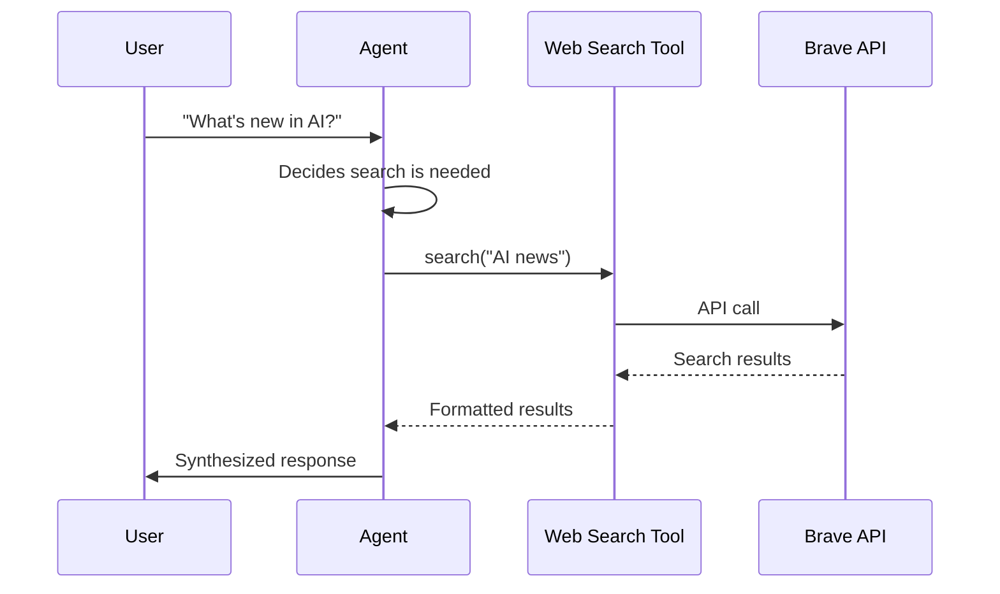

# Add Tools (MCP)

## Give your agents superpowers

Tools let agents interact with the real world - search the web, access files, query databases, call APIs. This guide adds web search to your formation.


## What You'll Build

By the end of this guide, your agent will:
1. Detect when you need information
2. Search the web using Brave Search
3. Synthesize results into a response

---

## Prerequisites

- A working formation (`muxi dev` succeeds)
- Brave Search API key ([get one free](https://brave.com/search/api/))

> [!TIP]
> **Test tools in isolation first.** Before adding a new MCP server to your formation, run it standalone and verify it works with direct calls. This saves debugging time.

---

[[steps]]

[[step Create the MCP Configuration]]

```bash
cd my-formation
mkdir -p mcp
```

Create `mcp/web-search.yaml`:

```yaml
schema: "1.0.0"
id: web-search
description: Brave web search
type: command
command: npx
args: ["-y", "@modelcontextprotocol/server-brave-search"]
auth:
  type: env
  BRAVE_API_KEY: "${{ secrets.BRAVE_API_KEY }}"
```

[[/step]]

[[step Add the Secret]]

```bash
muxi secrets set BRAVE_API_KEY
```

Enter your Brave API key when prompted.

[[/step]]

[[step Update Formation]]

Update your `formation.yaml`:

```yaml
schema: "1.0.0"
id: my-assistant
description: Assistant with web search

llm:
  api_keys:
    openai: "${{ secrets.OPENAI_API_KEY }}"
  models:
    - text: "openai/gpt-4o"

agents:
  - id: assistant
    role: |
      You are a helpful assistant with web search capabilities.
      Use web search when you need current information.
    mcps:
      - web-search
```

[[/step]]

[[step Test It]]

```bash
muxi dev
```

Then try:

```
You: What are the latest AI developments this week?
Assistant: [searches the web] Based on my search, here are the latest developments...
```

[[/step]]

[[/steps]]

---

## How It Works



> [!TIP]
> The agent decides when to use tools based on the request. You don't need to explicitly ask it to search.

---

## Popular Tools to Add

### File System

```yaml
# mcp/filesystem.yaml
schema: "1.0.0"
id: filesystem
type: command
command: npx
args: ["-y", "@modelcontextprotocol/server-filesystem", "/home/user/documents"]
```

### Database

[[tabs]]

[[tab PostgreSQL]]
```yaml
# mcp/database.yaml
schema: "1.0.0"
id: database
type: command
command: npx
args: ["-y", "@modelcontextprotocol/server-postgres"]
auth:
  type: env
  DATABASE_URL: "${{ secrets.DATABASE_URL }}"
```
[[/tab]]

[[tab SQLite]]
```yaml
# mcp/database.yaml
schema: "1.0.0"
id: database
type: command
command: npx
args: ["-y", "@modelcontextprotocol/server-sqlite", "--db", "./data/app.db"]
```
[[/tab]]

[[/tabs]]

### GitHub

```yaml
# mcp/github.yaml
schema: "1.0.0"
id: github
type: command
command: npx
args: ["-y", "@modelcontextprotocol/server-github"]
auth:
  type: env
  GITHUB_TOKEN: "${{ secrets.GITHUB_TOKEN }}"
```

---

## Agent-Specific Tools

Give different agents different tools in `formation.yaml`:

```yaml
agents:
  - id: researcher
    role: Research and gather information
    mcps:
      - web-search      # Can search

  - id: developer
    role: Code and database work
    mcps:
      - filesystem      # Can access files
      - database        # Can query database

  - id: writer
    role: Write content
    # No mcps - pure writing focus
```

With corresponding MCP files in `mcp/` directory.

---

## Troubleshooting

[[toggle Tool not appearing]]
1. Check the MCP file exists in `mcp/` directory
2. Check the agent has the MCP ID in its `mcps` list
3. Restart with `muxi dev`
[[/toggle]]

[[toggle API errors]]
Check your API key:
```bash
muxi secrets get BRAVE_API_KEY
```

Verify it's valid by testing directly:
```bash
curl "https://api.search.brave.com/res/v1/web/search?q=test" \
  -H "X-Subscription-Token: YOUR_KEY"
```
[[/toggle]]

[[toggle Tool timing out]]
Increase timeout in the MCP config:
```yaml
timeout_seconds: 60
```
[[/toggle]]

---

## Next Steps

- [Tools Reference](../reference/tools.md) - All configuration options
- [Add Memory](add-memory.md) - Persistent conversations
- [Multi-Agent Systems](multi-agent.md) - Specialized agent teams
