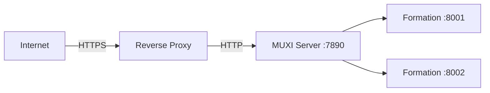

# Deploy to Production

## Move your formation from localhost to a production server


Take your local formation to production with TLS, authentication, and proper service management.

## What You'll Set Up



- **TLS termination** at the reverse proxy
- **HMAC authentication** for management
- **API key auth** for formations
- **systemd service** for auto-restart


## Prerequisites

- Formation working locally (`muxi dev` succeeds)
- Server with SSH access (cloud VM, dedicated, etc.)
- Domain name (optional but recommended)
- TLS-ready reverse proxy (Nginx/Caddy) or ability to bind HTTPS at the edge
- Open ports: 443 (public), 7890 (internal to proxy), 8001-9000 (internal formations)

---

[[steps]]

[[step Install MUXI on Production Server]]

SSH to your server:

```bash
ssh user@your-server.com
```

Install MUXI:

```bash
curl -fsSL https://muxi.org/install | sudo bash
```

Initialize:

```bash
muxi-server init
```

> [!IMPORTANT]
> Save the generated credentials! You'll need the `key_id` and `secret` for CLI access.

[[/step]]

[[step Configure the Server]]

Edit the config file:
- **System install (sudo)**: `/etc/muxi/server/config.afs`
- **User install (Homebrew, curl)**: `~/.muxi/server/config.afs`

```yaml
server:
  port: 7890
  host: 127.0.0.1    # Bind to localhost (reverse proxy handles external)

auth:
  enabled: true
  keys:
    - id: MUXI_production
      secret: sk_...   # From muxi-server init

formations:
  port_range: [8000, 9000]
  auto_restart: true
  health_check_interval: 30s

logging:
  level: info
  format: json
  output: /var/log/muxi/server.log  # System install
  # or: ~/.muxi/server/logs/server.log  # User install
```

[[/step]]

[[step Set Up Reverse Proxy]]

[[tabs]]

[[tab Nginx]]
```nginx
server {
    listen 443 ssl http2;
    server_name muxi.yourdomain.com;

    ssl_certificate /etc/letsencrypt/live/muxi.yourdomain.com/fullchain.pem;
    ssl_certificate_key /etc/letsencrypt/live/muxi.yourdomain.com/privkey.pem;

    location / {
        proxy_pass http://127.0.0.1:7890;
        proxy_http_version 1.1;
        proxy_set_header Upgrade $http_upgrade;
        proxy_set_header Connection "upgrade";
        proxy_set_header Host $host;
        proxy_set_header X-Real-IP $remote_addr;
    }
}
```

Get a certificate:
```bash
sudo certbot --nginx -d muxi.yourdomain.com
```
[[/tab]]

[[tab Caddy]]
```
# Caddy handles TLS automatically!
muxi.yourdomain.com {
    reverse_proxy localhost:7890
}
```

[[/tab]]

[[/tabs]]

[[/step]]

[[step Create systemd Service]]

Create `/etc/systemd/system/muxi-server.service`:

```ini
[Unit]
Description=MUXI Server
After=network.target

[Service]
Type=simple
User=muxi
Group=muxi
ExecStart=/usr/local/bin/muxi-server serve
Restart=always
RestartSec=5
LimitNOFILE=65535

[Install]
WantedBy=multi-user.target
```

Enable and start:

```bash
sudo useradd -r -s /bin/false muxi
sudo systemctl daemon-reload
sudo systemctl enable muxi-server
sudo systemctl start muxi-server
```

[[/step]]

[[step Configure CLI Profile]]

On your **local machine**:

```bash
muxi profile add production
```

Enter when prompted:

- URL: `https://muxi.yourdomain.com`
- Key ID: `MUXI_production`
- Secret Key: `sk_...`

[[/step]]

[[step Deploy Your Formation]]

```bash
cd my-formation
muxi deploy --profile production
```

Verify:

```bash
muxi formation list --profile production
```

[[/step]]

[[step Test]]

```bash
curl https://muxi.yourdomain.com/api/my-formation/health
```

Or chat:

```bash
muxi chat --profile production "Hello!"
```

[[/step]]

[[/steps]]


## Production Checklist

- [ ] Authentication enabled (`auth.enabled: true`)
- [ ] TLS/HTTPS configured
- [ ] Firewall configured (allow 443, block 7890 from outside)
- [ ] `systemd` service running
- [ ] Logs configured
- [ ] Monitoring set up (see [Monitoring Guide](monitoring.md))
- [ ] Backup strategy planned


## Troubleshooting

[[toggle Server won't start]]
Check logs:
```bash
sudo journalctl -u muxi-server -n 100
```

Common issues:

- Port already in use
- Config syntax error
- Missing permissions
[[/toggle]]

[[toggle 502 Bad Gateway]]
MUXI isn't running or wrong port:
```bash
curl http://127.0.0.1:7890/health
```
[[/toggle]]

[[toggle Authentication failing]]
- Verify credentials match between CLI and server config
- Check timestamp is within 5 minutes
- Regenerate if needed: `muxi-server init`
[[/toggle]]


## Next Steps

[+] [Server: Managing Formations](server/managing-formations.md) - All operations
[+] [CLI: muxi deploy](cli/deploy.md) - Command reference
[+] [Production Guide](server/production-checklist.md) - Best practices
[+] [Monitoring & Logs](monitoring.md) - Set up observability
[+] [CI/CD Integration](ci-cd.md) - Automate deployments
