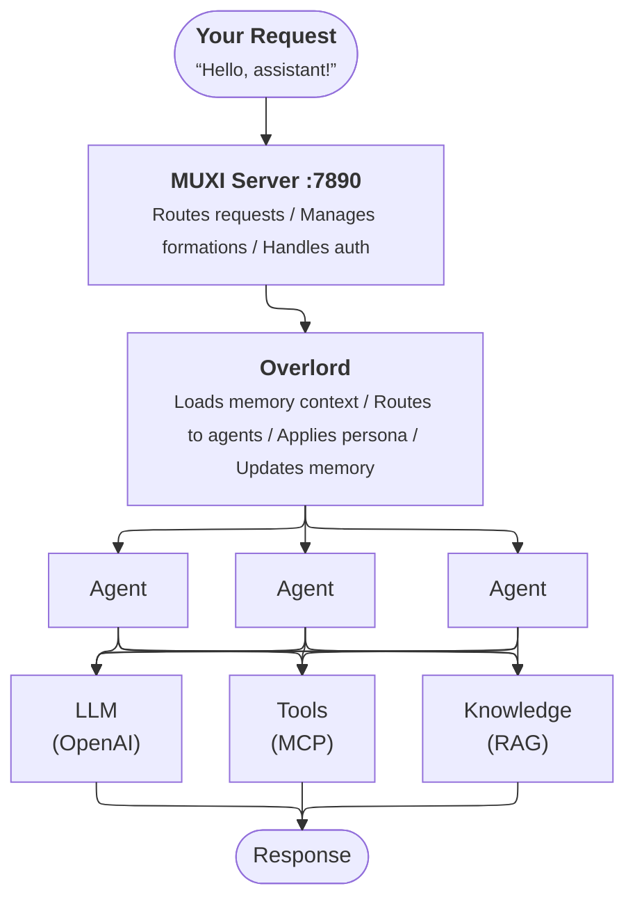

# How MUXI Works

## The 30-second mental model

You completed the quickstart. Here's what you actually built:



**Think of it as:**
- **Server** = Traffic controller (like Nginx for AI)
- **Formation** = Your complete AI system (like a Docker container)
- **Overlord** = The brain that manages memory, routes requests, and applies persona
- **Agent** = A specialized worker that uses tools and knowledge to complete tasks

---

## What happens when you send a message

[[steps]]

[[step Your app sends a request]]

```bash
curl -X POST http://localhost:8001/v1/chat \
  -d '{"message": "What can you help me with?"}'
```

The request hits your formation's API and goes to the **Overlord**.

[[/step]]

[[step The Overlord builds context]]

The Overlord loads context from three memory tiers:

- **Buffer memory** - Recent conversation messages
- **Long-term memory** - User preferences and history (if enabled)
- **Working memory** - Current session state

This context is attached to your message before any agent sees it.

[[/step]]

[[step The Overlord routes to an agent]]

The Overlord decides how to handle your request:

1. **SOP match?** → Execute the standard procedure
2. **Complex request?** → Decompose into multi-agent workflow
3. **Simple request?** → Route to the best-suited agent

```
User:  "What can you help me with?"
  ↓
Overlord: "Simple question → route to 'assistant' agent"
```

[[/step]]

[[step The agent processes with tools]]

The selected agent:

- Receives the message + context from the Overlord
- Calls MCP tools if needed (web search, databases, etc.)
- Retrieves relevant knowledge (RAG)
- Sends everything to the LLM

[[/step]]

[[step The Overlord applies persona and responds]]

The Overlord:

- Applies the configured persona (tone, style) to the response
- Streams the response back to your app
- Updates all memory tiers with the conversation

[[/step]]

[[/steps]]

> [!TIP]
> For a deep dive into every step, see [Request Lifecycle](deep-dives/request-lifecycle.md).

---

## The four things you configure

Every formation has four core building blocks. You don't need all of them - start simple and add as needed.

:::: cols=2

[[card]]

#### 1. Agents

**What they do:** Specialized workers with specific roles.

**Example:** A "researcher" agent that finds information, a "writer" agent that drafts content.

```yaml
# agents/assistant.afs
id: assistant
name: My Assistant
system_message: You are a helpful assistant.
```

[Learn more →](concepts/agents-and-orchestration.md)

[[/card]]

[[card]]

#### 2. Tools (MCP)

**What they do:** Give agents capabilities beyond text generation.

**Example:** Web search, database queries, file operations, API calls.

```yaml
# mcp/web-search.afs
id: web-search
server: "@anthropic/web-search"
```

[Learn more →](concepts/tools-and-mcp.md)

[[/card]]

[[card]]

#### 3. Memory

**What it does:** Remembers conversations across sessions.

**Example:** User preferences, conversation history, learned context.

```yaml
# formation.afs
memory:
  persistent:
    enabled: true
```

[Learn more →](concepts/memory-system.md)

[[/card]]

[[card]]

#### 4. Knowledge (RAG)

**What it does:** Gives agents access to your documents.

**Example:** Product docs, FAQs, internal wikis.

```yaml
# agents/support.afs
knowledge:
  sources:
    - path: ./docs
```

[Learn more →](concepts/knowledge-and-rag.md)

[[/card]]

::::

---

## Formation file structure

When you ran `muxi new formation`, you got this structure:

```
my-assistant/
├── formation.afs      # Main configuration (LLM, memory, defaults)
├── agents/            # Agent definitions (auto-discovered)
│   └── assistant.afs  # Your agent
├── mcp/               # Tool configurations (optional)
├── knowledge/         # Documents for RAG (optional)
├── sops/              # Standard procedures (optional)
├── triggers/          # Webhook templates (optional)
└── secrets.example    # Required API keys template
```

### The key files

[[tabs]]

[[tab formation.afs]]

The main configuration file. Sets defaults for the entire formation.

```yaml
schema: "1.0.0"
id: my-assistant

llm:
  models:
    - text: "openai/gpt-4o"

memory:
  persistent:
    enabled: true
```

[[/tab]]

[[tab agents/*.afs]]

Each agent is a separate file. They're auto-discovered from the `agents/` directory.

```yaml
schema: "1.0.0"
id: assistant
name: Helpful Assistant
description: General-purpose assistant

system_message: |
  You are a helpful assistant. Be concise and friendly.

# Optional: agent-specific tools
mcp_servers:
  - web-search

# Optional: agent-specific knowledge
knowledge:
  sources:
    - path: ./docs/faq.md
```

[[/tab]]

[[tab mcp/*.afs]]

Tool servers that agents can use. Each file defines one MCP server.

```yaml
schema: "1.0.0"
id: web-search
server: "@anthropic/web-search"

# Some tools need API keys
env:
  API_KEY: ${{ secrets.SEARCH_API_KEY }}
```

[[/tab]]

[[/tabs]]

---

## Single agent vs. multi-agent

### Single agent (what you built)

Simple formations have one agent that handles everything:

```
User → Overlord → assistant → LLM → Response
```

Good for: chatbots, simple assistants, focused tools.

### Multi-agent (when you're ready)

Complex formations have specialized agents that collaborate:

```
User → Overlord ─┬→ researcher → find information
                 ├→ analyst    → analyze data
                 └→ writer     → draft response
```

The Overlord routes requests to the right agent or coordinates multiple agents for complex tasks.

Good for: customer support systems, research assistants, content pipelines.

[Build Multi-Agent Teams →](guides/build-multi-agent-systems.md)

---

## Development vs. production

| | `muxi dev` | `muxi deploy` |
|---|---|---|
| **Where it runs** | Your machine | MUXI Server |
| **Port** | 8001 (direct) | 7890 (proxied) |
| **Hot reload** | Yes | No |
| **Use for** | Development | Production |

### Local development

```bash
muxi dev
# Formation running at http://localhost:8001
```

### Production deployment

```bash
muxi deploy
# Formation deployed to server at http://server:7890/api/my-assistant/
```

[Deploy to Production →](guides/deploy-to-production.md)

---

## Next steps

Now that you understand how MUXI works, choose your path:

:::: cols=2

(guides/add-mcp-tools.md)[[card]]
#### Add Tools
Give your agent web search, file access, databases, and more via MCP.
[[/card]]

(guides/add-memory.md)[[card]]
#### Add Memory
Make conversations persist across sessions.
[[/card]]

(guides/add-knowledge.md)[[card]]
#### Add Knowledge
Let your agent reference your documents (RAG).
[[/card]]

(guides/build-multi-agent-systems.md)[[card]]
#### Build Multi-Agent Teams
Create specialized agents that work together.
[[/card]]

::::

---

## Go deeper

[+] [Architecture](concepts/architecture.md) - Complete system architecture
[+] [Formation Schema](concepts/formation-schema.md) - Full YAML specification
[+] [The Overlord](concepts/overlord.md) - How orchestration works
[+] [Request Lifecycle](deep-dives/request-lifecycle.md) - Every step of a request
