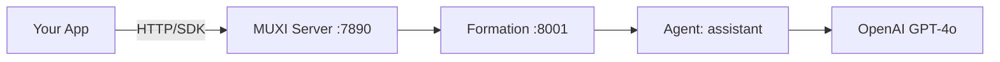

# Quickstart

## Get your first formation running in 5 minutes

<!-- TODO: Add video walkthrough -->
<!-- [Video placeholder: Complete quickstart walkthrough] -->

This guide takes you from zero to a running AI agent you can chat with.

> [!NOTE]
> **Prerequisites:** macOS, Linux, or Windows with terminal access and an OpenAI API key.

### Get started in 5 minutes

[[steps]]

[[step Install MUXI]]

[[tabs]]

[[tab macOS]]
```bash
brew install muxi-ai/tap/muxi
```
[[/tab]]

[[tab Linux]]
```bash
curl -fsSL https://muxi.org/install | sudo bash
```
[[/tab]]

[[tab Windows]]
```powershell
powershell -c "irm https://muxi.org/install | iex"
```
[[/tab]]

[[/tabs]]

Verify installation:

```bash
muxi --version
```

[[/step]]

[[step Start the Server]]

```bash
muxi-server init    # First time only - generates credentials
muxi-server start
```

The server runs on port 7890. Leave this terminal open.

> [!TIP]
> Save the credentials shown after `init` - you'll need them for remote deployments.

[[/step]]

[[step Create a Formation]]

Open a **new terminal**:

```bash
muxi new formation my-assistant
cd my-assistant
```

This creates:

```
my-assistant/
├── formation.afs      # Main configuration
├── agents/            # Agent definitions
├── secrets.example    # Required secrets template
└── .gitignore
```

[[/step]]

[[step Configure Secrets]]

```bash
muxi secrets setup
```

Enter your OpenAI API key when prompted:

```
Setting up secrets for my-assistant...

Required secrets:
  OPENAI_API_KEY (from llm.api_keys)

Enter OPENAI_API_KEY: sk-...

✓ Secrets encrypted and saved
```

[[/step]]

[[step Run Locally]]

```bash
muxi dev
```

Output:

```
✓ Formation 'my-assistant' running
✓ API: http://localhost:8001
✓ Web: http://localhost:8001/chat
```

[[/step]]

[[step Test It]]

[[tabs]]

[[tab curl]]
```bash
curl -X POST http://localhost:8001/v1/chat \
  -H "Content-Type: application/json" \
  -d '{"message": "Hello!"}'
```
[[/tab]]

[[tab Browser]]
Open `http://localhost:8001/chat` in your browser for an interactive chat UI.
[[/tab]]

[[tab Python]]
```python
from muxi import Formation

formation = Formation(url="http://localhost:8001")
response = formation.chat("Hello!")
print(response.text)
```
[[/tab]]

[[/tabs]]

[[/step]]

[[/steps]]

---

## Start from Registry

Pull a pre-built formation instead of creating from scratch:

```bash
muxi pull @muxi/starter-assistant
cd starter-assistant
muxi secrets setup
muxi dev
```

> [!TIP]
> Browse [registry.muxi.org](https://registry.muxi.org) to discover community formations.

---

## What You Built



You now have:
- A **MUXI Server** managing formations
- A **Formation** with one agent
- An **API** ready for integration

---

## Next Steps

:::: cols=2

(guides/deploy.md)[[card]]
#### Deploy to Production
Move beyond localhost to a real server.
[[/card]]

(guides/add-tools.md)[[card]]
#### Add Tools
Give your agent web search, file access, and more.
[[/card]]

(guides/add-memory.md)[[card]]
#### Add Memory
Make conversations persist across sessions.
[[/card]]

(formations/README.md)[[card]]
#### Formation Reference
Complete YAML configuration guide.
[[/card]]

::::
