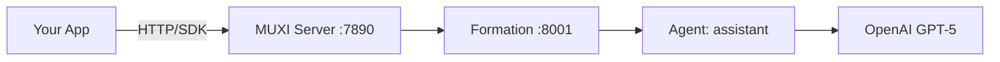

# Quickstart

## Go from zero to a running AI agent in 5 minutes

<!-- TODO: Replace with actual video embed
<div class="video-placeholder">
  <p>🎬 Video: Complete quickstart walkthrough</p>
</div>
-->

This quickstart gets you from zero to a working AI agent in 5 minutes. You'll install MUXI, create a formation, and test it.

> [!NOTE]
> **Prerequisites:**
> - Terminal access (macOS, Linux, or Windows)
> - OpenAI API key ([get one here](https://platform.openai.com/api-keys))
> - 5 minutes

## Get started in 5 minutes

[[steps]]

[[step Install MUXI]]

[[tabs]]

[[tab macOS]]
```bash
brew install muxi-ai/tap/muxi
```

**Expected output:**

```
==> Downloading https://github.com/muxi-ai/muxi/releases/...
==> Installing muxi
🍺  /opt/homebrew/bin/muxi
```
[[/tab]]

[[tab Linux]]
```bash
curl -fsSL https://muxi.org/install | sudo bash
```

**Expected output:**

```
[INFO] Downloading MUXI...
[INFO] Installing to /usr/local/bin
[INFO] MUXI installed successfully
```
[[/tab]]

[[tab Windows]]
```powershell
powershell -c "irm https://muxi.org/install | iex"
```

**Expected output:**

```
Downloading MUXI...
Installing to C:\Program Files\muxi
MUXI installed successfully
```
[[/tab]]

[[/tabs]]

Verify installation:

```bash
muxi --version
```

**Expected:** `muxi version 1.0.0` (or higher)

> [!TIP]
> **Troubleshooting:**
> - Command not found? Restart your terminal
> - macOS: `brew update && brew install muxi-ai/tap/muxi`
> - Linux: Check PATH includes `/usr/local/bin`

[[/step]]

[[step Start the Server]]

**First time only** - generate credentials:

```bash
muxi-server init
```

**Expected output:**

```
Generated credentials:
  Key ID:     muxi_key_abc123...
  Secret:     muxi_secret_xyz789...

⚠️  Save these credentials securely!

Config saved to: ~/.muxi/server/config.yaml
```

> [!WARNING]
> **Save these credentials!** You'll need them to deploy formations remotely.

Now start the server:

```bash
muxi-server start
```

**Expected output:**

```
[INFO] muxi remote starting...
[INFO] Listening on :7890
[INFO] Server ready
```

**Leave this terminal open** - the server must stay running.

> [!TIP]
> **Troubleshooting:**
> - Port already in use? `muxi-server --port 7891`
> - Check logs: `muxi-server logs`

[[/step]]

[[step Create a Formation]]

Open a **new terminal**:

```bash
muxi new formation my-assistant
cd my-assistant
```

This creates:

```
my-assistant/
├── formation.afs      # Main configuration
├── agents/            # Agent definitions
├── secrets            # Required secrets template
└── .gitignore
```

[[/step]]

[[step Configure Secrets]]

```bash
muxi secrets setup
```

Enter your OpenAI API key when prompted:

```
Setting up secrets for my-assistant...

Required secrets:
  OPENAI_API_KEY (from llm.api_keys)

Enter OPENAI_API_KEY: sk-...

✓ Secrets encrypted and saved
```

[[/step]]

[[step Run Locally]]

With the server running (from Step 2), start your formation:

```bash
muxi up
```

**Expected output:**

```
✓ Started my-assistant
✓ Formation running on port 8001

  Draft URL: http://localhost:7890/draft/my-assistant

  To stop:   muxi down
```

> [!TIP]
> Think of `muxi up` / `muxi down` like `docker compose up` / `docker compose down` - quick start/stop for local development.

[[/step]]

[[step Test It]]

[[tabs]]

[[tab Python]]
```bash
pip install muxi
```

```python
from muxi import FormationClient

client = FormationClient(
    server_url="http://localhost:7890",
    formation_id="my-assistant",
    mode="draft",  # Uses /draft/ prefix for local dev
)

for event in client.chat_stream({"message": "Hello!"}):
    if event.get("type") == "text":
        print(event.get("text"), end="")
```
[[/tab]]

[[tab TypeScript]]
```bash
npm install @muxi-ai/muxi-typescript
```

```typescript
import { FormationClient } from "@muxi-ai/muxi-typescript";

const client = new FormationClient({
  serverUrl: "http://localhost:7890",
  formationId: "my-assistant",
  mode: "draft",
});

for await (const event of client.chatStream(
  { message: "Hello!" },
  "user_123"
)) {
  if (typeof event.token === "string") process.stdout.write(event.token);
}
```
[[/tab]]

[[tab Go]]
```bash
go get github.com/muxi-ai/muxi-go
```

```go
import muxi "github.com/muxi-ai/muxi-go"

client := muxi.NewFormationClient(&muxi.FormationConfig{
    ServerURL:   "http://localhost:7890",
    FormationID: "my-assistant",
    Mode:        "draft",
})

stream, _ := client.ChatStream(ctx, &muxi.ChatRequest{Message: "Hello!"})
for chunk := range stream {
    if token, ok := chunk.Raw["token"].(string); ok {
        fmt.Print(token)
    }
}
```
[[/tab]]

[[tab Ruby]]
```bash
gem install muxi
```

```ruby
require 'json'
require 'muxi'

client = Muxi::FormationClient.new(
  server_url: 'http://localhost:7890',
  formation_id: 'my-assistant',
  mode: 'draft',
  client_key: 'fmc_...'
)

client.chat_stream({ message: 'Hello!' }, user_id: 'user_123') do |event|
  next unless event['event'] == 'message'
  data = JSON.parse(event['data'])
  print data['token'] if data['token'].is_a?(String)
end
```
[[/tab]]

[[tab Java]]
```gradle
implementation("org.muxi:muxi-java:0.20260212.0")
```

```java
FormationClient client = new FormationClient(
    "http://localhost:7890",
    "my-assistant",
    "fmc_...",
    null,
    30,
    "draft"
);

JsonObject request = new JsonObject();
request.addProperty("message", "Hello!");
client.chatStream(request, "user_123", event -> {
    if ("message".equals(event.event())) {
        JsonObject data = JsonParser.parseString(event.data()).getAsJsonObject();
        if (data.has("token")) System.out.print(data.get("token").getAsString());
    }
});
```
[[/tab]]

[[tab Kotlin]]
```kotlin
implementation("org.muxi:muxi-kotlin:0.20260212.0")
```

```kotlin
val client = FormationClient(FormationConfig(
    serverUrl = "http://localhost:7890",
    formationId = "my-assistant",
    mode = "draft",
    clientKey = "fmc_..."
))

client.chatStream(
    mapOf("message" to "Hello!"),
    userId = "user_123"
).collect { event ->
    if (event.event == "message") {
        val token = Json.parseToJsonElement(event.data)
            .jsonObject["token"]?.jsonPrimitive?.contentOrNull
        if (token != null) print(token)
    }
}
```
[[/tab]]

[[tab Swift]]
```swift
// Package.swift
.package(url: "https://github.com/muxi-ai/muxi-swift.git", from: "0.1.0")
```

```swift
let client = try FormationClient(config: FormationConfig(
    formationId: "my-assistant",
    serverUrl: "http://localhost:7890",
    clientKey: "fmc_...",
    mode: "draft"
))

for try await event in await client.chatStream(
    ["message": "Hello!"],
    userId: "user_123"
) {
    guard event.event == "message",
          let data = event.data.data(using: .utf8),
          let payload = try JSONSerialization.jsonObject(with: data) as? [String: Any],
          let token = payload["token"] as? String else { continue }
    print(token, terminator: "")
}
```
[[/tab]]

[[tab C#]]
```bash
dotnet add package Muxi
```

```csharp
using System.Text.Json;

var client = new FormationClient(new FormationConfig
{
    ServerUrl = "http://localhost:7890",
    FormationId = "my-assistant",
    Mode = "draft",
    ClientKey = "fmc_..."
});

await foreach (var evt in client.ChatStreamAsync(
    new Dictionary<string, object> { ["message"] = "Hello!" },
    userId: "user_123"))
{
    if (evt.Event != "message") continue;
    using var document = JsonDocument.Parse(evt.Data);
    if (document.RootElement.TryGetProperty("token", out var token) &&
        token.ValueKind == JsonValueKind.String)
        Console.Write(token.GetString());
}
```
[[/tab]]

[[tab PHP]]
```bash
composer require muxi/muxi-php
```

```php
$client = new FormationClient([
    'serverUrl' => 'http://localhost:7890',
    'formationId' => 'my-assistant',
    'mode' => 'draft',
    'clientKey' => 'fmc_...',
]);

$client->chatStream(
    ['message' => 'Hello!'],
    'user_123',
    function (array $event): void {
        if ($event['event'] !== 'message') return;
        $data = json_decode($event['data'], true);
        if (is_string($data['token'] ?? null)) echo $data['token'];
    }
);
```
[[/tab]]

[[tab Dart]]
```bash
dart pub add muxi
```

```dart
final client = FormationClient(FormationConfig(
  serverUrl: 'http://localhost:7890',
  formationId: 'my-assistant',
  mode: 'draft',
  clientKey: 'fmc_...',
));

await for (final event in client.chatStream(
  {'message': 'Hello!'},
  userId: 'user_123',
)) {
  if (event.event != 'message') continue;
  final data = jsonDecode(event.data);
  if (data['token'] is String) stdout.write(data['token']);
}
```
[[/tab]]

[[tab Rust]]
```bash
cargo add muxi-rust
```

```rust
let mut config = FormationConfig::new(
    "http://localhost:7890",
    "my-assistant",
    "fmc_...",
    "",
);
config.mode = "draft".to_string();
let client = FormationClient::new(config)?;

let stream = client.chat_stream(json!({"message": "Hello!"}), Some("user_123"));
futures::pin_mut!(stream);
while let Some(event) = stream.next().await {
    let event = event?;
    if event.event == "message" {
        let data: serde_json::Value = serde_json::from_str(&event.data)?;
        if let Some(token) = data["token"].as_str() { print!("{}", token); }
    }
}
```
[[/tab]]

[[tab C++]]
```cpp
#include <muxi/muxi.hpp>

muxi::FormationConfig config;
config.server_url = "http://localhost:7890";
config.formation_id = "my-assistant";
config.mode = "draft";
config.client_key = "fmc_...";
muxi::FormationClient client(config);

client.chat_stream({{"message", "Hello!"}}, "user_123", [](const auto& event) {
    if (event.event != "message") return;
    auto data = nlohmann::json::parse(event.data);
    if (data.contains("token") && data["token"].is_string())
        std::cout << data["token"].get<std::string>();
});
```
[[/tab]]

[[tab curl]]
```bash
curl -X POST http://localhost:7890/draft/my-assistant/v1/chat \
  -H "Content-Type: application/json" \
  -d '{"message": "Hello!"}'
```
[[/tab]]

[[/tabs]]

> [!TIP]
> **Local dev → Production:** Use `mode="draft"` with `muxi up`, then remove it after `muxi deploy` to use the live `/api/` endpoint.

[[/step]]

[[/steps]]


## Start from Registry

Pull a pre-built formation instead of creating from scratch:

```bash
muxi pull @muxi/hello-muxi
cd starter-assistant
muxi secrets setup
muxi up
```

> [!TIP]
> Browse [registry.muxi.org](https://registry.muxi.org) to discover community formations.


## What You Built


```mermaid
graph LR
    A[Your App] -->|HTTP/SDK| B[MUXI Server :7890]
    B --> C[Formation :8001]
    C --> D[Agent: assistant]
    D --> E[OpenAI GPT-5]
```

You now have:

- A **MUXI Server** managing formations
- A **Formation** with one agent
- An **API** ready for integration

> [!TIP]
> **Want to understand how this all works?** See [How MUXI Works](how-it-works.md) for the full architecture and request flow.


## Common First Issues

[[toggle Port already in use]]
```bash
# Find what's using the port
lsof -i :7890

# Use a different port
muxi-server --port 7891
```
[[/toggle]]

[[toggle Command not found after install]]
Restart your terminal, or check your PATH:
```bash
# macOS/Linux
echo $PATH | grep -E "(homebrew|local/bin)"

# Add to PATH if needed
export PATH="$PATH:/usr/local/bin"
```
[[/toggle]]

[[toggle Server won't start]]
```bash
# Check if already running
ps aux | grep muxi-server

# View logs
muxi-server logs
```
[[/toggle]]

[[toggle API key errors]]
```bash
# Verify secret is set
muxi secrets get OPENAI_API_KEY

# Re-run setup
muxi secrets setup
```
[[/toggle]]

For more issues, see the [Troubleshooting Guide](guides/troubleshooting.md).


## Next Steps

:::: cols=2

(guides/deploy-to-production.md)[[card]]
#### Deploy to Production
Move beyond localhost to a real server.
[[/card]]

(guides/add-mcp-tools.md)[[card]]
#### Add Tools
Give your agent web search, file access, and more.
[[/card]]

(guides/add-memory.md)[[card]]
#### Add Memory
Make conversations persist across sessions.
[[/card]]

(reference/README.md)[[card]]
#### Formation Reference
Complete YAML configuration guide.
[[/card]]

::::
