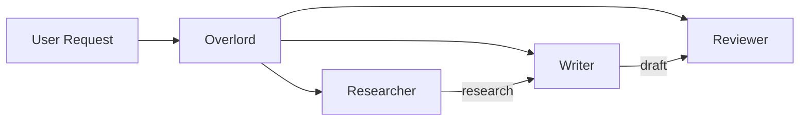

# Agents

## Define AI personas with specific roles and capabilities

Agents are the workers in your formation. Each has a role, personality, and set of tools. MUXI automatically routes requests to the right agent.

> [!TIP]
> **New to agents?** Read [Agent Concepts →](../concepts/agents-and-orchestration.md) first for an overview of how agents work in MUXI.
>
> **API Reference:** [GET /v1/agents](api/formation#tag/Agents/GET/agents) | [GET /v1/agents/{id}](api/formation#tag/Agents/GET/agents/{agent_id})


## Your First Agent

Create `agents/assistant.afs`:

```yaml
schema: "1.0.0"
id: assistant
name: Assistant
description: Helpful assistant

system_message: You are a helpful assistant who answers questions clearly.
```

That's it. One agent, ready to chat.

---

## Agent Configuration

### Full Example

```yaml
# agents/researcher.afs
schema: "1.0.0"
id: researcher
name: Research Specialist
description: Gathers accurate information from multiple sources

system_message: |
  You research topics thoroughly and provide accurate,
  well-sourced information. Always cite your sources.

knowledge:
  enabled: true
  sources:
    - path: knowledge/docs/
      description: Internal documentation

llm_models:
  - text: "openai/gpt-4o"
    settings:
      temperature: 0.7
```

### Configuration Fields

| Field | Type | Required | Description |
|-------|------|----------|-------------|
| `schema` | string | Yes | Schema version ("1.0.0") |
| `id` | string | Yes | Unique identifier (used in routing) |
| `name` | string | Yes | Display name |
| `description` | string | Yes | What the agent does |
| `system_message` | string | No | System prompt defining behavior |
| `knowledge` | object | No | RAG sources for this agent |
| `llm_models` | list | No | Override formation LLM settings |

---

## Multi-Agent Formations

The real power comes from multiple specialized agents:

```yaml
# agents/researcher.afs
schema: "1.0.0"
id: researcher
name: Researcher
description: Gathers accurate information

system_message: |
  You are a research specialist.
  Your job is to gather accurate information...
```

```yaml
# agents/writer.afs
schema: "1.0.0"
id: writer
name: Writer
description: Creates content

system_message: |
  You are a content writer.
  Your job is to create clear, engaging content...
```

```yaml
# agents/reviewer.afs
schema: "1.0.0"
id: reviewer
name: Reviewer
description: Reviews content quality

system_message: |
  You are an editor.
  Your job is to review content for accuracy, and to...
```



> [!TIP]
> MUXI's **Overlord** automatically routes requests to the best agent based on the task. You can also specify agents explicitly.

---

## Agent Routing

### Automatic Routing

MUXI analyzes requests and picks the right agent:

```
User:  "Find information about AI trends"
→ Routes to: researcher (has web-search)

User:  "Write a blog post about our product"
→ Routes to: writer (writing role)
```

### Explicit Routing

Override automatic routing when needed:

[[tabs]]

[[tab CLI]]
```bash
muxi chat --agent researcher "Find info about AI trends"
```
[[/tab]]

[[tab curl]]
```bash
curl -X POST http://localhost:8001/v1/chat \
  -d '{"message": "...", "agent": "researcher"}'
```
[[/tab]]

[[tab Python]]
```python
response = formation.chat(
    "Find info about AI trends",
    agent="researcher"
)
```
[[/tab]]

[[tab TypeScript]]
```typescript
const response = await formation.chat('Find info about AI trends', {
  agent: 'researcher'
});
```
[[/tab]]

[[tab Go]]
```go
response, _ := formation.ChatWithOptions("Find info about AI trends", muxi.ChatOptions{
    Agent: "researcher",
})
```
[[/tab]]

[[/tabs]]

---

## Agent-Specific Tools

MCP servers are defined in `mcp/*.afs` files. All agents in a formation have access to formation-level MCP servers. For agent-specific tools, define them in the agent file:

```yaml
# agents/researcher.afs
schema: "1.0.0"
id: researcher
name: Researcher
description: Research specialist

system_message: |
  You are a research specialist.
  Your job is to gather accurate information...

# Agent-specific MCP server
mcp_servers:
  - id: web-search
    description: Brave web search
    type: command
    command: npx
    args: ["-y", "@modelcontextprotocol/server-brave-search"]
    auth:
      type: env
      BRAVE_API_KEY: "${{ secrets.BRAVE_API_KEY }}"
```

```yaml
# agents/developer.afs
schema: "1.0.0"
id: developer
name: Developer
description: Code assistant

system_message: |
  You are a software developer.
  Your job is to write, review, and debug code...

mcp_servers:
  - id: filesystem
    description: File access
    type: command
    command: npx
    args: ["-y", "@modelcontextprotocol/server-filesystem", "./src"]
  - id: database
    description: PostgreSQL access
    type: command
    command: npx
    args: ["-y", "@modelcontextprotocol/server-postgres"]
    auth:
      type: env
      DATABASE_URL: "${{ secrets.DATABASE_URL }}"
```

```yaml
# agents/writer.afs
schema: "1.0.0"
id: writer
name: Writer
description: Content writer

system_message: |
  You are a content writer.
  Your job is to create compelling written content...
# No mcp_servers - focuses purely on writing
```

---

## Agent-Specific Knowledge

Different agents can access different knowledge bases:

```yaml
# agents/support.afs
schema: "1.0.0"
id: support
name: Support Agent
description: Customer support specialist

system_message: Customer support specialist with FAQ access.

knowledge:
  enabled: true
  sources:
    - path: knowledge/faq/
      description: Customer FAQs
    - path: knowledge/troubleshooting/
      description: Troubleshooting guides
```

```yaml
# agents/sales.afs
schema: "1.0.0"
id: sales
name: Sales Agent
description: Sales advisor

system_message: |
  You are a sales advisor.
  Your job is to help customers find the right products...

knowledge:
  enabled: true
  sources:
    - path: knowledge/pricing/
      description: Pricing and plans
    - path: knowledge/features/
      description: Product features
```

---

## Separate Agent Files

Agents are auto-discovered from `agents/*.afs` files:

```bash
muxi new agent researcher
```

Creates `agents/researcher.afs`:

```yaml
# agents/researcher.afs
schema: "1.0.0"
id: researcher
name: Research Specialist
description: Expert at gathering information

system_message: |
  You are an expert researcher who:
  - Gathers accurate information from multiple sources
  - Cites all sources properly
  - Provides balanced, objective analysis
  - Admits uncertainty when appropriate
```

In your formation, just leave agents empty - they're auto-discovered:

```yaml
# formation.afs
agents: []  # Auto-discovered from agents/ directory
```

---

## Best Practices

> [!IMPORTANT]
> **Clear roles matter.** Well-defined, non-overlapping roles lead to better routing and results.

1. **Be specific** - "Customer support for Acme SaaS products" beats "helpful assistant"
2. **Match tools to roles** - Researchers get search, developers get filesystem
3. **One specialty per agent** - Let each agent focus on what they do best
4. **Use separate files** - Keep complex agent definitions organized

---

## Next Steps

[+] [Tools (MCP)](tools.md) - Give agents capabilities
[+] [Knowledge](knowledge.md) - Add domain expertise
[+] [Multi-Agent Guide](../guides/build-multi-agent-systems.md) - Build agent teams
[+] [Examples](examples.md) - Complete agent examples
