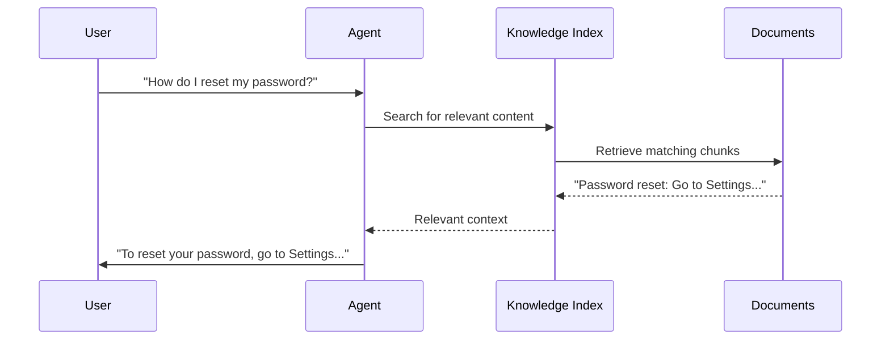

# Knowledge

## Let agents answer from your documents

Knowledge sources let agents answer questions using your documents - PDFs, markdown, spreadsheets, and more. MUXI handles embedding, indexing, and retrieval automatically.


## Quick Setup

[[steps]]

[[step Create knowledge directory]]

```bash
mkdir -p knowledge/docs
```
[[/step]]

[[step Add your documents]]

```
knowledge/
└── docs/
    ├── getting-started.md
    ├── api-reference.md
    └── faq.pdf
```
[[/step]]

[[step Configure the agent]]

```yaml
# agents/assistant.afs
schema: "1.0.0"
id: assistant
name: Assistant
description: Helpful assistant with knowledge access

system_message: You are a helpful assistant.

knowledge:
  enabled: true
  sources:
    - path: knowledge/docs/
      description: Product documentation
```
[[/step]]

[[step Test it]]

```bash
muxi dev
# Ask: "How do I get started?"
```
[[/step]]

[[/steps]]

## Why Knowledge Sources?

Knowledge sources give agents **domain expertise**. Instead of relying only on training data, agents can answer questions using your specific documents - return policies, product manuals, internal procedures, etc.

## How It Works



MUXI:
1. **Indexes** your documents at startup (creates embeddings once)
2. **Caches** embeddings - only recreates if files change
3. **Searches** for relevant chunks when asked (RAG)
4. **Includes** context in agent prompts

> **Performance note:** Embeddings are created once on initialization and cached. They're only regenerated when the underlying files change - not on every startup.

## Configuration

### Basic

```yaml
agents:
  - id: assistant
    knowledge:
      enabled: true
      sources:
        - path: knowledge/docs/
          description: Product documentation
```

### Full Options

```yaml
agents:
  - id: assistant
    knowledge:
      enabled: true
      embed_batch_size: 50          # Embeddings per batch
      max_files_per_source: 10      # Files to include
      sources:
        - path: knowledge/manuals/
          description: Product manuals
          recursive: true            # Include subdirectories
          allowed_extensions:        # Filter file types
            - ".md"
            - ".txt"
            - ".pdf"
          file_limit: 20             # Override max files
          max_file_size: 5242880     # 5MB limit
```

### Source Fields

| Field | Default | Description |
|-------|---------|-------------|
| `path` | - | Path relative to formation |
| `description` | - | What this source contains |
| `recursive` | false | Include subdirectories |
| `allowed_extensions` | all | File types to include |
| `file_limit` | 5 | Max files from this source |
| `max_file_size` | 1MB | Skip files larger than this |

## Supported Formats

### Text
- `.txt` - Plain text
- `.md` - Markdown

### Documents
- `.pdf` - PDF documents
- `.docx` - Word documents
- `.pptx` - PowerPoint presentations
- `.xlsx` - Excel spreadsheets

### Web & Data
- `.html` - Web pages
- `.csv` - CSV data
- `.json` - JSON data

### Images (with OCR)
- `.jpg`, `.png`, `.gif` - Text extraction

## Agent-Specific Knowledge

Give different agents different expertise:

```yaml
# agents/support.afs
schema: "1.0.0"
id: support
name: Support Agent
description: Customer support specialist

system_message: Customer support specialist.

knowledge:
  enabled: true
  sources:
    - path: knowledge/faq/
      description: Customer FAQs
    - path: knowledge/troubleshooting/
      description: Troubleshooting guides
```

```yaml
# agents/sales.afs
schema: "1.0.0"
id: sales
name: Sales Agent
description: Sales advisor

system_message: Sales advisor.

knowledge:
  enabled: true
  sources:
    - path: knowledge/pricing/
      description: Pricing and plans
    - path: knowledge/features/
      description: Product features
```

```yaml
# agents/technical.afs
schema: "1.0.0"
id: technical
name: Technical Expert
description: Technical expert

system_message: Technical expert.

knowledge:
  enabled: true
  sources:
    - path: knowledge/api/
      description: API documentation
    - path: knowledge/architecture/
      description: System architecture
```

## File Organization

```
my-formation/
└── knowledge/
    ├── general/
    │   ├── company-info.md
    │   └── contact.md
    ├── support/
    │   ├── faq.md
    │   └── troubleshooting.md
    ├── sales/
    │   ├── pricing.md
    │   └── features.md
    └── technical/
        ├── api-reference.md
        └── architecture.pdf
```

> [!TIP]
> Organize by topic or audience. Each agent can reference the directories relevant to their role.

## Caching

MUXI caches embeddings to avoid re-indexing:

```
~/.muxi/{formation_id}/cache/knowledge/{hash}.cache
```

- **Automatic invalidation** - Cache updates when files change
- **Lazy loading** - First query triggers indexing
- **Incremental updates** - Only re-embeds changed files

Force reindex:

```bash
muxi dev --reindex
```

## Performance Tips

1. **Limit file count** - Use `max_files_per_source`
2. **Set size limits** - Skip large files that slow indexing
3. **Filter extensions** - Only include relevant file types
4. **Organize by topic** - Smaller, focused directories
5. **Use descriptions** - Help the agent understand each source

## Troubleshooting

[[toggle Knowledge not loading]]
Check paths are relative to formation:

```yaml
# Good
path: knowledge/docs/

# Bad - absolute path
path: /home/user/knowledge/docs/
```
[[/toggle]]

[[toggle Search not finding content]]
Verify files exist:

```bash
ls -la knowledge/docs/
```

Check file sizes aren't exceeding limits.
[[/toggle]]

[[toggle High memory usage]]
Reduce file limits:

```yaml
knowledge:
  max_files_per_source: 5
  sources:
    - path: knowledge/
      max_file_size: 1048576  # 1MB
```
[[/toggle]]

## Next Steps

[+] [Add Knowledge Guide](guides/add-knowledge.md) - Step-by-step tutorial
[+] [Memory](memory.md) - Conversation memory
[+] [Agents](agents.md) - Agent configuration
