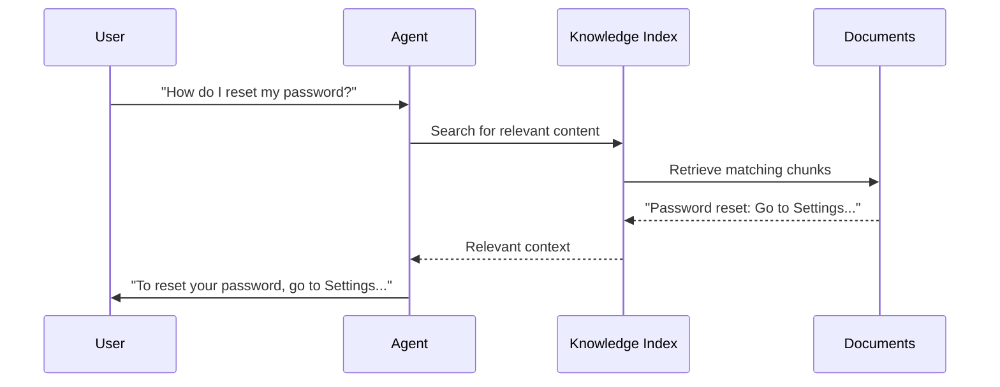

# Knowledge

## Let agents answer from your documents

Knowledge sources let agents answer questions using your documents - PDFs, markdown, spreadsheets, and more. MUXI handles embedding, indexing, and retrieval automatically.


## Quick Setup

[[steps]]

[[step Create knowledge directory]]

```bash
mkdir -p knowledge/docs
```
[[/step]]

[[step Add your documents]]

```
knowledge/
└── docs/
    ├── getting-started.md
    ├── api-reference.md
    └── faq.pdf
```
[[/step]]

[[step Configure the agent]]

```yaml
# agents/assistant.afs
schema: "1.0.0"
id: assistant
name: Assistant
description: Helpful assistant with knowledge access

system_message: You are a helpful assistant.

knowledge:
  enabled: true
  sources:
    - path: knowledge/docs/
      description: Product documentation
```
[[/step]]

[[step Test it]]

```bash
muxi up
# Ask: "How do I get started?"
```
[[/step]]

[[/steps]]

## Why Knowledge Sources?

Knowledge sources give agents **domain expertise**. Instead of relying only on training data, agents can answer questions using your specific documents - return policies, product manuals, internal procedures, etc.

## How It Works


```mermaid
sequenceDiagram
    participant U as User
    participant A as Agent
    participant K as Knowledge Index
    participant D as Documents

    U->>A: "How do I reset my password?"
    A->>K: Search for relevant content
    K->>D: Retrieve matching chunks
    D-->>K: "Password reset: Go to Settings..."
    K-->>A: Relevant context
    A->>U: "To reset your password, go to Settings..."
```

MUXI:
1. **Indexes** your documents at startup (creates embeddings once)
2. **Caches** embeddings - only recreates if files change
3. **Searches** for relevant chunks when asked (RAG)
4. **Includes** context in agent prompts

> **Performance note:** Embeddings are created once on initialization and cached. They're only regenerated when the underlying files change - not on every startup.

## Configuration

### Basic

```yaml
agents:
  - id: assistant
    knowledge:
      enabled: true
      sources:
        - path: knowledge/docs/
          description: Product documentation
```

### Full Options

```yaml
agents:
  - id: assistant
    knowledge:
      enabled: true
      embed_batch_size: 50          # Embeddings per batch
      max_files_per_source: 10      # Files to include
      sources:
        - path: knowledge/manuals/
          description: Product manuals
          recursive: true            # Include subdirectories
          allowed_extensions:        # Filter file types
            - ".md"
            - ".txt"
            - ".pdf"
          file_limit: 20             # Override max files
          max_file_size: 5242880     # 5MB limit
```

### Source Fields

| Field | Default | Description |
|-------|---------|-------------|
| `path` | - | Path relative to formation (local source) |
| `url` | - | Remote source location (see below); mutually exclusive with `path` |
| `description` | - | What this source contains |
| `recursive` | false | Include subdirectories |
| `allowed_extensions` | all | File types to include |
| `file_limit` | 5 | Max files from this source |
| `max_file_size` | 1MB | Skip files larger than this |

Each source declares **either** `path` **or** `url` - not both.

### Remote Sources

A source can point at a remote location with `url:` instead of a local `path:`:

```yaml
knowledge:
  enabled: true
  sources:
    - url: https://docs.example.com/handbook.pdf
      description: Company handbook
    - url: s3://my-bucket/knowledge/
      description: Product manuals synced from S3
```

Supported URL schemes:

`http`, `https`, `s3`, `gs`, `az`, `rsync`, `rsync+ssh`, `ftp`, `sftp`, `file`

#### Per-protocol auth

| Scheme | `auth` block |
|--------|--------------|
| `http(s)` | `basic` / `bearer`, plus optional `headers` |
| `s3` | `aws` (omit keys to use boto3's default credential chain) |
| `gs` | `gcp` with `credentials_json`, else Application Default Credentials |
| `az` | `azure` with `connection_string` **or** `account_name` + `account_key` |
| `rsync+ssh` / `sftp` | `ssh_key` or `basic`; host-key checking is strict (opt out per source with `accept_new_host_keys: true`) |
| `ftp` | `basic` or URL userinfo |

Optional SDKs ship as extras (`muxi-runtime[gcs]`, `[azure]`, `[sftp]`); a
missing extra produces a config-time error naming it.

#### Archive extraction

A remote source that points at an archive can be unpacked into the mirror:

```yaml
sources:
  - url: https://example.com/handbook.zip
    description: Handbook
    extract: true
    extract_pattern: "*.md"        # keep only matching members
    max_extracted_files: 1000      # decompression-bomb guard
    max_extracted_size: 524288000  # 500MB, counted on the decompressed stream
```

Supported archives: `.zip`, `.tar`, `.tar.gz`/`.tgz`, `.tar.bz2`, `.tar.xz`.
Extraction is path-traversal-safe, rejects symlink/hardlink/device members, and
only updates the mirror after the whole archive extracts successfully (a corrupt
archive degrades to the previously synced content).

#### Scheduled re-sync

```yaml
sources:
  - url: s3://my-bucket/knowledge/
    description: Manuals
    schedule: "@daily"             # cron, or @hourly/@daily/@weekly; @startup = startup-only
    retry:
      max_attempts: 3
      initial_delay: 5
      max_delay: 300
      exponential_base: 2
```

Scheduled sources re-sync periodically through the shared scheduler; only
changed/deleted files are re-embedded. Overlapping syncs are skipped, failures
retry with exponential backoff and then fall back to the next cron fire, always
serving stale content in the meantime. With no running scheduler, schedules
degrade to startup-only sync with a warning.

Trigger a re-sync on demand:

```http
POST /v1/agents/{agent_id}/knowledge/sync
```

(AdminKey; optional `{"source_id": ...}` body.)

### Persistent Knowledge Trees (`agent_tree`)

Local (`path`) sources can build a persistent per-agent knowledge tree and
control when it regenerates:

```yaml
knowledge:
  enabled: true
  sources:
    - path: knowledge/docs/
      description: Product documentation
      retrieval: hybrid
      agent_tree:
        regenerate: on-source-change
```

| `regenerate` value | Behavior |
|--------------------|----------|
| `manual` | Rebuild only when you ask (`muxi knowledge rebuild`) |
| `on-source-change` | Rebuild when the source files change |
| `on-formation-load` | Rebuild every time the formation loads |

> `agent_tree` applies to local sources only. Sync a remote source locally first
> if you need a persistent tree. It also requires an explicit `retrieval:
> tree`, `tree-vector`, or `hybrid`; `vector` does not consult the tree.

## Retrieval Modes (Reasoning RAG)

Beyond classic vector chunking, large documents can be indexed as a hierarchical
tree that an LLM navigates at query time. A per-file gate decides automatically:
files above `knowledge.reasoning_threshold` tokens (default `40000`, `0`
disables) are tree-indexed; everything else uses the vector pipeline. A per-source
`retrieval:` override forces the mode.

| `retrieval` | How it works |
|-------------|--------------|
| `vector` | Classic embedding chunk search (default for small files) |
| `tree` | **Method A** - one LLM call selects nodes from the compressed tree; zero embeddings |
| `tree-vector` | **Method B** - per-node chunk embeddings scored with the PageIndex formula; zero LLM calls per query |
| `hybrid` | Method A and B run in parallel, results merge, and a sufficiency evaluator decides whether to fetch more |

```yaml
knowledge:
  enabled: true
  reasoning_threshold: 40000
  tree:
    model: premium                 # llm.aliases name or provider/model; defaults to the agent text model
    terminator_model: fast         # sufficiency evaluator for hybrid mode
    max_depth: 3                   # default
    max_pages_per_node: 10         # default
    max_tokens_per_node: 20000     # default
    max_document_tokens: 500000    # default; larger files fall back to vector
    max_sufficiency_rounds: 3      # default hybrid loop bound
    max_fetched_nodes_pct: 50      # default hybrid loop bound
  sources:
    - path: knowledge/handbook/
      description: Large handbook
      retrieval: hybrid
```

All retrieval modes fall back to `vector` on failure - a tree build or navigation
error never fails a turn. Tree and vector sources coexist in one agent's
knowledge base; tree results carry a `node_path` breadcrumb. Formations without
these keys behave byte-identically to the previous vector path.

## Supported Formats

### Text
- `.txt` - Plain text
- `.md` - Markdown

### Documents
- `.pdf` - PDF documents
- `.docx` - Word documents
- `.pptx` - PowerPoint presentations
- `.xlsx` - Excel spreadsheets

### Web & Data
- `.html` - Web pages
- `.csv` - CSV data
- `.json` - JSON data

### Images (with OCR)
- `.jpg`, `.png`, `.gif` - Text extraction

## Agent-Specific Knowledge

Give different agents different expertise:

```yaml
# agents/support.afs
schema: "1.0.0"
id: support
name: Support Agent
description: Customer support specialist

system_message: Customer support specialist.

knowledge:
  enabled: true
  sources:
    - path: knowledge/faq/
      description: Customer FAQs
    - path: knowledge/troubleshooting/
      description: Troubleshooting guides
```

```yaml
# agents/sales.afs
schema: "1.0.0"
id: sales
name: Sales Agent
description: Sales advisor

system_message: Sales advisor.

knowledge:
  enabled: true
  sources:
    - path: knowledge/pricing/
      description: Pricing and plans
    - path: knowledge/features/
      description: Product features
```

```yaml
# agents/technical.afs
schema: "1.0.0"
id: technical
name: Technical Expert
description: Technical expert

system_message: Technical expert.

knowledge:
  enabled: true
  sources:
    - path: knowledge/api/
      description: API documentation
    - path: knowledge/architecture/
      description: System architecture
```

## File Organization

```
my-formation/
└── knowledge/
    ├── general/
    │   ├── company-info.md
    │   └── contact.md
    ├── support/
    │   ├── faq.md
    │   └── troubleshooting.md
    ├── sales/
    │   ├── pricing.md
    │   └── features.md
    └── technical/
        ├── api-reference.md
        └── architecture.pdf
```

> [!TIP]
> Organize by topic or audience. Each agent can reference the directories relevant to their role.

## Caching

MUXI caches embeddings to avoid re-indexing:

```
~/.muxi/{formation_id}/cache/knowledge/{hash}.cache
```

- **Automatic invalidation** - Cache updates when files change
- **Lazy loading** - First query triggers indexing
- **Incremental updates** - Only re-embeds changed files

Force reindex during local development:

```bash
muxi knowledge rebuild
```

Force-rebuild the persistent per-agent knowledge trees on a running formation:

```bash
muxi knowledge rebuild
```

This calls the runtime's `POST /v1/knowledge/rebuild` endpoint (admin).

## Performance Tips

1. **Limit file count** - Use `max_files_per_source`
2. **Set size limits** - Skip large files that slow indexing
3. **Filter extensions** - Only include relevant file types
4. **Organize by topic** - Smaller, focused directories
5. **Use descriptions** - Help the agent understand each source

## Troubleshooting

[[toggle Knowledge not loading]]
Check paths are relative to formation:

```yaml
# Good
path: knowledge/docs/

# Bad - absolute path
path: /home/user/knowledge/docs/
```
[[/toggle]]

[[toggle Search not finding content]]
Verify files exist:

```bash
ls -la knowledge/docs/
```

Check file sizes aren't exceeding limits.
[[/toggle]]

[[toggle High memory usage]]
Reduce file limits:

```yaml
knowledge:
  max_files_per_source: 5
  sources:
    - path: knowledge/
      max_file_size: 1048576  # 1MB
```
[[/toggle]]

## Next Steps

[+] [Add Knowledge Guide](../guides/add-knowledge.md) - Step-by-step tutorial
[+] [Memory](../concepts/memory-system.md) - Conversation memory
[+] [Agents](../concepts/agents-and-orchestration.md) - Agent configuration
