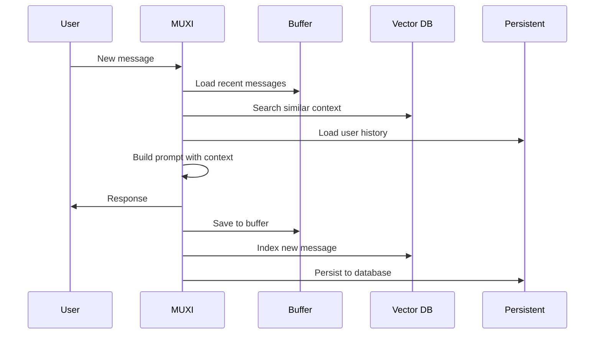

# Memory

## Give agents memory that persists

MUXI's three-tier memory system lets agents remember context within conversations and across sessions.


## Memory Architecture

```
┌─────────────────────────────────────┐
│         Buffer Memory               │  ← Recent messages (fast)
│         ~50 messages                │
└─────────────────────────────────────┘
                ↓
┌─────────────────────────────────────┐
│         Vector Search               │  ← Semantic similarity
│         Find related context        │
└─────────────────────────────────────┘
                ↓
┌─────────────────────────────────────┐
│       Persistent Memory             │  ← Long-term storage
│       SQLite / PostgreSQL           │
└─────────────────────────────────────┘
```

---

## Quick Setup

### Conversation Memory (Default)

```yaml
memory:
  buffer:
    size: 50              # Keep 50 recent messages
```

### With Semantic Search

```yaml
memory:
  buffer:
    size: 50
    vector_search: true   # Find related past messages
```

### With Persistence

```yaml
memory:
  buffer:
    size: 50
    vector_search: true
  persistent:
    enabled: true
    provider: sqlite      # Survives restarts
```

---

## Buffer Memory

Stores recent conversation messages in memory:

```yaml
memory:
  buffer:
    size: 50              # Messages before summarization
    multiplier: 10        # Effective capacity: 500 messages
```

| Field | Default | Description |
|-------|---------|-------------|
| `size` | 50 | Messages to keep in full |
| `multiplier` | 10 | Summarized message capacity |
| `vector_search` | false | Enable semantic search |

> [!TIP]
> When the buffer fills, older messages are automatically summarized to preserve context while saving space.

---

## Vector Search

Find semantically related past conversations:

```yaml
memory:
  buffer:
    vector_search: true
    embedding_model: openai/text-embedding-3-small
```

When enabled, MUXI:
1. Embeds each message as a vector
2. Searches for similar past interactions
3. Includes relevant context in prompts

This helps agents recall related information even from distant conversations.

---

## Persistent Memory

Save conversations across sessions:

[[tabs]]

[[tab SQLite (Simple)]]
```yaml
memory:
  persistent:
    enabled: true
    provider: sqlite
    # Stores in ~/.muxi/{formation_id}/memory.db
```

Best for: Single-user, local development
[[/tab]]

[[tab PostgreSQL (Production)]]
```yaml
memory:
  persistent:
    enabled: true
    provider: postgresql
    connection_string: ${{ secrets.POSTGRES_URI }}
```

Best for: Multi-user, production deployments
[[/tab]]

[[/tabs]]

---

## Multi-User Memory

Isolate memory per user:

```yaml
memory:
  persistent:
    enabled: true
    provider: postgresql
    connection_string: ${{ secrets.POSTGRES_URI }}
    user_isolation: true
```

Pass user ID in requests:

[[tabs]]

[[tab curl]]
```bash
curl -X POST http://localhost:8001/v1/chat \
  -H "X-Muxi-User-Id: user_123" \
  -d '{"message": "Remember I prefer Python"}'
```
[[/tab]]

[[tab Python]]
```python
response = formation.chat(
    "Remember I prefer Python",
    user_id="user_123"
)
```
[[/tab]]

[[tab TypeScript]]
```typescript
const response = await formation.chat('Remember I prefer Python', {
  userId: 'user_123'
});
```
[[/tab]]

[[tab Go]]
```go
response, _ := formation.ChatWithOptions("Remember I prefer Python", muxi.ChatOptions{
    UserID: "user_123",
})
```
[[/tab]]

[[/tabs]]

Each user's memory is completely isolated.

---

## Complete Configuration

```yaml
memory:
  # Buffer memory
  buffer:
    size: 50
    multiplier: 10
    vector_search: true
    embedding_model: openai/text-embedding-3-small
  
  # Working memory (tool outputs, intermediate state)
  working:
    max_memory_mb: 10
    fifo_interval_min: 5
  
  # Persistent storage
  persistent:
    enabled: true
    provider: postgresql
    connection_string: ${{ secrets.POSTGRES_URI }}
    user_isolation: true
```

---

## Disable Memory

For stateless interactions (no context between messages):

```yaml
memory:
  buffer:
    size: 0
  persistent:
    enabled: false
```

---

## How It Works



---

## Next Steps

[+] [Add Memory Guide](../guides/add-memory.md) - Step-by-step tutorial
[+] [Multi-User Support](../deep-dives/multi-user.md) - User isolation details
[+] [Knowledge](knowledge.md) - Add document-based RAG
