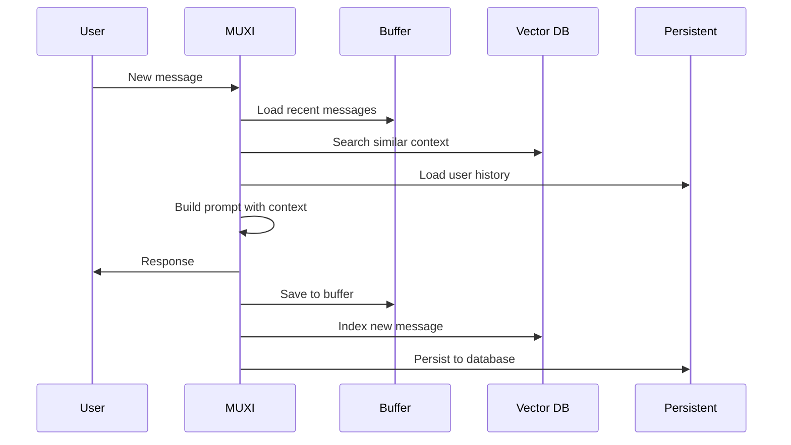

# Memory

## Give agents memory that persists

MUXI's three-tier memory system lets agents remember context within conversations and across sessions.

> [!TIP]
> **New to memory?** Read [Memory Concepts →](../concepts/memory-system.md) first to understand how the three-tier architecture works.
>
> **API Reference:** [`GET /v1/memory`](/docs/api/formation#tag/Memory/GET/memory) | [`DELETE /v1/memory/buffer`](/docs/api/formation#tag/Memory/DELETE/memory/buffer)


## Memory Architecture

```plain
┌─────────────────────────────────────┐
│         Buffer Memory               │  ← Recent messages (fast)
│         ~50 messages                │
└─────────────────────────────────────┘
                ↓
┌─────────────────────────────────────┐
│         Vector Search               │  ← Semantic similarity
│         Find related context        │
└─────────────────────────────────────┘
                ↓
┌─────────────────────────────────────┐
│       Persistent Memory             │  ← Long-term storage
│       SQLite / PostgreSQL           │
└─────────────────────────────────────┘
```

## Quick Setup

### Conversation Memory (Default)

```yaml
memory:
  buffer:
    size: 50              # Keep 50 recent messages
```

### With Semantic Search

```yaml
memory:
  buffer:
    size: 50
    vector_search: true   # Find related past messages
```

### With Persistence

Persistent memory is enabled by default (SQLite). For PostgreSQL:

```yaml
memory:
  buffer:
    size: 50
    vector_search: true
  persistent:
    connection_string: ${{ secrets.POSTGRES_URI }}
```

## Buffer Memory

Stores recent conversation messages in memory:

```yaml
memory:
  buffer:
    size: 50              # Messages before summarization
    multiplier: 10        # Effective capacity: 500 messages
```

| Field | Default | Description |
|-------|---------|-------------|
| `size` | 50 | Messages to keep in full |
| `multiplier` | 10 | Summarized message capacity |
| `vector_search` | false | Enable semantic search |

> [!TIP]
> When the buffer fills, older messages are automatically summarized to preserve context while saving space.

## Vector Search

Find semantically related past conversations:

```yaml
memory:
  buffer:
    vector_search: true
    embedding_model: openai/text-embedding-3-small
```

When enabled, MUXI:
1. Embeds each message as a vector
2. Searches for similar past interactions
3. Includes relevant context in prompts

This helps agents recall related information even from distant conversations.

### Embedding Models

You can use API-based or local embedding models:

```yaml
# API-based (requires API key)
embedding_model: openai/text-embedding-3-small    # 1536 dimensions

# Local (no API key required, downloaded automatically)
embedding_model: local/all-MiniLM-L6-v2           # 384 dimensions
embedding_model: local/all-mpnet-base-v2           # 768 dimensions
```

The embedding dimension is detected automatically. MUXI creates dimension-specific storage tables (`memories_384`, `memories_1536`, etc.), so different formations can share the same database even with different embedding models.

> [!TIP]
> Local models are great for development and air-gapped environments. No API key needed -- the model downloads on first use via `sentence-transformers`.

## Persistent Memory

Persistent memory is **enabled by default** with SQLite. A `memory.db` file is created automatically in the formation directory -- no configuration needed.

[[tabs]]

[[tab Default (SQLite, automatic)]]
```yaml
# No persistent config needed -- SQLite enabled by default
memory:
  buffer:
    size: 50
```

Best for: Single-user, local development. Works out of the box.
[[/tab]]

[[tab SQLite (Explicit)]]
```yaml
memory:
  persistent:
    connection_string: "sqlite:///data/memory.db"
```

Best for: Custom SQLite path or explicit configuration.
[[/tab]]

[[tab PostgreSQL (Production)]]
```yaml
memory:
  persistent:
    connection_string: ${{ secrets.POSTGRES_URI }}
```

Best for: Multi-user, production deployments.
[[/tab]]

[[tab Disabled]]
```yaml
memory:
  persistent: false
```

Explicitly disable persistent memory.
[[/tab]]

[[/tabs]]

## Multi-User Memory

Isolate memory per user:

```yaml
memory:
  persistent:
    connection_string: ${{ secrets.POSTGRES_URI }}
```

Pass user ID in requests:

[[tabs]]

[[tab curl]]
```bash
curl -X POST http://localhost:8001/v1/chat \
  -H "X-Muxi-User-Id: user_123" \
  -d '{"message": "Remember I prefer Python"}'
```
[[/tab]]

[[tab Python]]
```python
response = formation.chat(
    "Remember I prefer Python",
    user_id="user_123"
)
```
[[/tab]]

[[tab TypeScript]]
```typescript
const response = await formation.chat('Remember I prefer Python', {
  userId: 'user_123'
});
```
[[/tab]]

[[tab Go]]
```go
response, _ := formation.ChatWithOptions("Remember I prefer Python", muxi.ChatOptions{
    UserID: "user_123",
})
```
[[/tab]]

[[/tabs]]

Each user's memory is completely isolated.

## Complete Configuration

```yaml
memory:
  # Buffer memory
  buffer:
    size: 50
    multiplier: 10
    vector_search: true
    embedding_model: openai/text-embedding-3-small

  # Working memory (tool outputs, intermediate state)
  working:
    max_memory_mb: 10
    fifo_interval_min: 5

  # Persistent storage
  persistent:
    connection_string: ${{ secrets.POSTGRES_URI }}
```

## Disable Memory

For stateless interactions (no context between messages):

```yaml
memory:
  buffer:
    size: 0
  persistent:
    enabled: false
```

## How It Works


```mermaid
sequenceDiagram
    participant U as User
    participant M as MUXI
    participant B as Buffer
    participant V as Vector DB
    participant P as Persistent

    U->>M: New message
    M->>B: Load recent messages
    M->>V: Search similar context
    M->>P: Load user history
    M->>M: Build prompt with context
    M->>U: Response
    M->>B: Save to buffer
    M->>V: Index new message
    M->>P: Persist to database
```

## Next Steps

[+] [Add Memory Guide](../guides/add-memory.md) - Step-by-step tutorial
[+] [Multi-User Support](../deep-dives/multi-user.md) - User isolation details
[+] [Knowledge](knowledge.md) - Add document-based RAG
