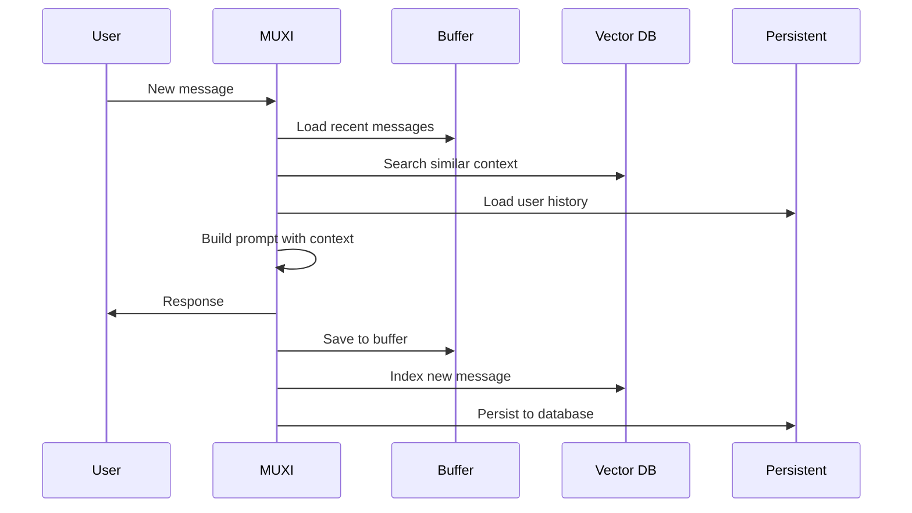

# Memory

## Give agents memory that persists

MUXI's three-tier memory system lets agents remember context within conversations and across sessions.

> [!TIP]
> **New to memory?** Read [Memory Concepts →](../concepts/memory-system.md) first to understand how the three-tier architecture works.
>
> **API Reference:** [`GET /v1/memory`](/docs/api/formation#tag/Memory/GET/memory) | [`DELETE /v1/memory/buffer`](/docs/api/formation#tag/Memory/DELETE/memory/buffer)


## Memory Architecture

```plain
┌─────────────────────────────────────┐
│         Buffer Memory               │  ← Recent messages (fast)
│         ~50 messages                │
└─────────────────────────────────────┘
                ↓
┌─────────────────────────────────────┐
│         Vector Search               │  ← Semantic similarity
│         Find related context        │
└─────────────────────────────────────┘
                ↓
┌─────────────────────────────────────┐
│       Persistent Memory             │  ← Long-term storage
│       SQLite / PostgreSQL           │
└─────────────────────────────────────┘
```

## Quick Setup

### Conversation Memory (Default)

```yaml
memory:
  buffer:
    size: 50              # Keep 50 recent messages
```

### With Semantic Search

```yaml
memory:
  buffer:
    size: 50
    vector_search: true   # Find related past messages
```

### With Persistence

Persistent memory is enabled by default (SQLite). For PostgreSQL:

```yaml
memory:
  buffer:
    size: 50
    vector_search: true
  persistent:
    connection_string: ${{ secrets.POSTGRES_URI }}
```

## Buffer Memory

Stores recent conversation messages in memory:

```yaml
memory:
  buffer:
    size: 50              # Messages before summarization
    multiplier: 10        # Effective capacity: 500 messages
```

| Field | Default | Description |
|-------|---------|-------------|
| `size` | 50 | Messages to keep in full |
| `multiplier` | 10 | Summarized message capacity |
| `vector_search` | false | Enable semantic search |

> [!TIP]
> When the buffer fills, older messages are automatically summarized to preserve context while saving space.

## Vector Search

Find semantically related past conversations:

```yaml
memory:
  buffer:
    vector_search: true
    embedding_model: openai/text-embedding-3-small
```

When enabled, MUXI:
1. Embeds each message as a vector
2. Searches for similar past interactions
3. Includes relevant context in prompts

This helps agents recall related information even from distant conversations.

### Embedding Models

You can use API-based or local embedding models:

```yaml
# API-based (requires API key)
embedding_model: openai/text-embedding-3-small    # 1536 dimensions

# Local (no API key required, pre-downloaded by `muxi-server init`)
embedding_model: local/nomic-ai/nomic-embed-text-v1.5            # 768 dimensions (default)
embedding_model: local/nomic-ai/nomic-embed-text-v2-moe          # 768 dimensions, multilingual
embedding_model: local/sentence-transformers/all-mpnet-base-v2   # 768 dimensions
embedding_model: local/sentence-transformers/all-MiniLM-L6-v2    # 384 dimensions
```

The default local model is `local/nomic-ai/nomic-embed-text-v1.5` (768-dim, 8k context, Apache-2.0). The id after `local/` is the full HuggingFace repo id (`<org>/<model>`); any HuggingFace embedding repo works. The embedding dimension is detected automatically. MUXI pre-creates dimension-specific storage tables (`memories_384`, `memories_768`, `memories_1024`, `memories_1536`, `memories_3072`), so different formations can share the same database even with different embedding models.

You can pin a specific HuggingFace revision by appending `:<revision>` to the slug:

```yaml
embedding_model: local/nomic-ai/nomic-embed-text-v1.5:e04b7e4c5ea3e3d7e41e13d4c02fa5e29e0e3a0a
```

> [!TIP]
> Local models are great for development and air-gapped environments. No API key needed -- the default model is pre-downloaded by `muxi-server init` into a shared cache (`$MUXI_CACHE_DIR` or `<data_dir>/cache`) and bind-mounted into formations at `/opt/hf-cache`, so deploys don't stall on a multi-hundred-MB fetch.

> [!NOTE]
> On macOS the CoreML execution provider is **off by default** for local ONNX
> embedding models (partition negotiation cost more than it saved). Set
> `ONELLM_COREML_DISABLED=false` to opt back in.

> [!IMPORTANT]
> Short-name aliases like `local/all-MiniLM-L6-v2` and `local/all-mpnet-base-v2` were removed. Use the full HuggingFace repo id (`local/sentence-transformers/all-MiniLM-L6-v2`) or migrate to the new default.

## Persistent Memory

Persistent memory is **enabled by default** with SQLite. A `memory.db` file is created automatically in the formation directory -- no configuration needed.

[[tabs]]

[[tab Default (SQLite, automatic)]]
```yaml
# No persistent config needed -- SQLite enabled by default
memory:
  buffer:
    size: 50
```

Best for: Single-user, local development. Works out of the box.
[[/tab]]

[[tab SQLite (Explicit)]]
```yaml
memory:
  persistent:
    connection_string: "sqlite:///data/memory.db"
```

Best for: Custom SQLite path or explicit configuration.
[[/tab]]

[[tab PostgreSQL (Production)]]
```yaml
memory:
  persistent:
    connection_string: ${{ secrets.POSTGRES_URI }}
```

Best for: Multi-user, production deployments.
[[/tab]]

[[tab Disabled]]
```yaml
memory:
  persistent: false
```

Explicitly disable persistent memory.
[[/tab]]

[[/tabs]]

## Multi-User Memory

Isolate memory per user:

```yaml
memory:
  persistent:
    connection_string: ${{ secrets.POSTGRES_URI }}
```

Pass user ID in requests:

[[tabs]]

[[tab curl]]
```bash
curl -X POST http://localhost:8001/v1/chat \
  -H "X-Muxi-User-Id: user_123" \
  -d '{"message": "Remember I prefer Python"}'
```
[[/tab]]

[[tab Python]]
```python
response = formation.chat(
    "Remember I prefer Python",
    user_id="user_123"
)
```
[[/tab]]

[[tab TypeScript]]
```typescript
const response = await formation.chat('Remember I prefer Python', {
  userId: 'user_123'
});
```
[[/tab]]

[[tab Go]]
```go
response, _ := formation.ChatWithOptions("Remember I prefer Python", muxi.ChatOptions{
    UserID: "user_123",
})
```
[[/tab]]

[[/tabs]]

Each user's memory is completely isolated.

## Memory Scopes

Memory is no longer single-scope. A memory is **written to exactly one scope**
and **read up the chain** - a user's query sees their own memories, their
groups' shared memories, and formation-wide memories, merged by relevance with
more-specific scopes outranking broader ones.

| Scope | Written by | Read by |
|-------|-----------|---------|
| `user` | conversation extraction (always) and explicit writes | that user |
| `group` | grant-gated shared writes | members of the group |
| `formation` | grant-gated shared writes | everyone |

Writing `group` or `formation` scope requires a `memory.write` grant in the
caller's [group YAML](../concepts/access-control.md#shared-memory-grants) (403
without one). Set `scope_id` to the group ID for group writes; formation writes
derive their scope ID from the active formation. `GET /v1/memories` can narrow
the fan-out with the comma-separated `scopes` query parameter, for example
`?scopes=user` or `?scopes=user,group`.

```json
{
  "content": "The support team owns production triage.",
  "scope": "group",
  "scope_id": "support"
}
```

## Ingestion API

Push content into memory from pipelines and integrations, not just chat:

| Endpoint | Purpose |
|----------|---------|
| `POST /v1/memories` | Ingest one item (`source`, `source_id`, `timestamp`, `metadata`, scope fields) |
| `POST /v1/memories/batch` | Batch ingest with per-item accepted/duplicate/invalid status |
| `GET /v1/memories/ingestion/{processing_id}` | Async status with per-stage outcomes and cost |

Ingestion is **idempotent by construction**: `(source, source_id)` rides a unique
index, so a replayed POST returns the original event id (`duplicate: true`) and
never creates copies. A cheap local classifier triages items and per-source noise
filtering (`memory.ingestion.sources.<source>.filter`) runs before extraction;
filtered items are recorded as replayable events.

Ingestion behaviour is tuned through the `memory.ingestion` block (inert when
absent):

```yaml
memory:
  ingestion:
    sources:
      zendesk:
        filter: strict         # strict | lenient | off; strict is default
        tier: 2                # pin a source's processing tier
    tiers:
      enabled: true
      ambiguity_margin: 0.05
      t3_signal_score: 5
      models:
        t2: openai/gpt-4o-mini
        t3: openai/gpt-4o      # optional frontier model for high-signal items
      budget:
        t2_items_per_job: 100  # capped items are demoted, not dropped
        t3_items_per_job: 10
    entity_resolution:
      enabled: true
      auto_merge_threshold: 0.85
      flag_threshold: 0.5
      entity_types: [person]
      max_entities: 200
    synthesis:
      enabled: true
      hot: { enabled: true, interval_seconds: 300 }
      warm: { enabled: true, interval_seconds: 3600 }
      cold: { enabled: true, interval_seconds: 86400 }
      cold_cold: { enabled: true, interval_seconds: 604800 }
      patterns:
        enabled: true
        min_events: 20
        top_k: 3
```

Items escalate through tiers (Tier 0 regex signals → Tier 1 verbatim →
Tier 2 LLM extraction → Tier 3 frontier model) based on deterministic
heuristics; `metadata.priority: high` forces Tier 3. Entity resolution merges
probable identity matches over the knowledge graph. Each synthesis cadence is
individually disableable and interval-configurable.

### Distillery

On-prem distilleries can push pre-processed memory through a signed channel:

```yaml
memory:
  distillery:
    enabled: true
    default_trust_level: provisional   # provisional | verified
    default_max_batch_size: 10000
    default_max_events_per_day: 1000000
    signature_max_age_seconds: 300
```

The feature also requires persistent memory with `memory.events.enabled`.
Manage the Ed25519 trust registry through the admin API:

| Endpoint | Purpose |
|----------|---------|
| `POST /v1/memory/distilleries` | Register a public key, trust level, and write scope |
| `GET /v1/memory/distilleries` | List registrations |
| `DELETE /v1/memory/distilleries/{distillery_id}` | Revoke a registration |
| `POST /v1/memories/distilled` | Submit a signed batch |
| `GET /v1/memories/distilled/{processing_id}` | Poll projection/embedding status |

A registration scope can restrict `user_ids` (`all`, `pattern:<glob>`, or an
explicit list), `event_types`, `max_events_per_day`, and `max_batch_size`.
Submissions carry `X-Distillery-ID`, `X-Distillery-Signature`, and
`X-Distillery-Timestamp`. Authentication is fail-closed Ed25519 over the raw
body bound to id and timestamp. Unknown or invalid credentials return the same
401, revoked registrations return 410, and quota exhaustion returns 429.

```json
{
  "batch_id": "distill-20260713-001",
  "embedding_mode": "none",
  "events": [
    {
      "event_type": "fact.extracted",
      "event_version": 1,
      "user_id": "user_123",
      "source_id": "ticket-9482:fact-1",
      "occurred_at": "2026-07-13T12:00:00Z",
      "payload": {
        "memory": "The user prefers email notifications.",
        "collection": "preferences"
      }
    }
  ]
}
```

Accepted event types are `fact.extracted`, `log.entry`, and
`interaction.turn`. To ship vectors, use `embedding_mode: "pre_computed"`,
provide a provider-prefixed `embedding_model`, and map payload field names to
float arrays in each event's `embedding_vectors`.

## Event Substrate

Every memory write is recorded as an immutable event; the stores are rebuildable
projections.

| Endpoint | Purpose |
|----------|---------|
| `GET /v1/memories/provenance?entity=X` | "Why do you think X?" - entity, facts, and causation chains back to the source turn (`?event_id=` traces one event) |
| `POST /v1/memory/rebuild` | Wipe-and-rebuild projections (background job by default; backs `muxi memory rebuild --user <id>`) |
| `POST /v1/memory/backfill` | Synthesize `source='legacy'` events for pre-event-log rows |
| `POST /v1/memory/forget` | GDPR flow: soft-delete a source's events and start a projection rebuild |
| `GET /v1/memory/forget/{job_id}` | Poll the default background rebuild |

Use `background: false` in the forget request body or `?sync=true` to wait for
the rebuild. Legacy backfill processes bounded resumable passes and reports
`synthesized` plus `complete` for each projection.

```yaml
memory:
  events:
    event_first: false      # Phase C cutover groundwork, default OFF
    retention:
      max_events_per_user: 100000   # alert-only
  decay:
    enabled: true
    default_half_life_days: 180
    volatile_default_ttl_hours: 24
    half_lives: {}          # per-relationship-type overrides
  projections:
    batch_size: 500
    lag_alert_threshold_seconds: 60
```

## Knowledge Graph & Captain's Log

Built alongside (not replacing) flat-fact extraction:

- **Knowledge graph** (`kg_entities` / `kg_relationships`): real-time + hourly
  deep extraction, contradiction detection with supersession (retain-never-
  delete), and graph context injected into chat.
- **Captain's Log**: periodic per-user digests with full source lineage, exposed
  via the `/history` client endpoint. A session-end digest fires when a session
  idles past `memory.captains_log.session_idle_minutes` (default `30`, `0`/`false`
  disables), so short sessions persist without waiting for the daily tick.
- **Lessons loop**: digest-extracted lessons with dedup, confidence decay, a
  `record_lesson` built-in tool, and top-N injection into agent prompts.
- **Recall**: the `recall_history` built-in tool answers time-anchored questions
  ("what did we discuss last Tuesday?") over the user's own log entries.

```yaml
memory:
  captains_log:
    session_idle_minutes: 30
```

## Lifecycle & Maintenance

All four blocks fail-fast validate at load and are inert when unconfigured:

```yaml
memory:
  compaction:
    flush_enabled: true
    flush_threshold: 0.80     # pre-compaction flush of at-risk buffer items
  pruning:
    mode: cache-ttl           # trim stale context after the prompt-cache window
    strategy: soft_trim       # soft_trim | hard_clear
    cache_ttl_seconds: 300
    keep_last_n_tool_results: 3
    soft_trim_max_chars: 4000
  index:
    enabled: true
    entity_count_threshold: 10   # regenerate after this entity-count change
    max_tokens: 300
    artifact_cap: 20
    regenerate_on: [artifact_save, entity_count_threshold, lint, log_entry]
  lint:
    enabled: true
    schedule: weekly              # daily | weekly | positive seconds
    conflict_resolution_days: 7   # on demand: POST /v1/memory/lint
    stale_artifact_days: 90
    superseded_retention_days: 30
    orphan_cleanup: true
```

## Complete Configuration

```yaml
memory:
  # Buffer memory
  buffer:
    size: 50
    multiplier: 10
    vector_search: true
    embedding_model: openai/text-embedding-3-small

  # Working memory (tool outputs, intermediate state)
  working:
    max_memory_mb: 10
    fifo_interval_min: 5

  # Persistent storage
  persistent:
    connection_string: ${{ secrets.POSTGRES_URI }}
```

## Disable Memory

For stateless interactions (no context between messages):

```yaml
memory:
  buffer:
    size: 0
  persistent:
    enabled: false
```

## How It Works


```mermaid
sequenceDiagram
    participant U as User
    participant M as MUXI
    participant B as Buffer
    participant V as Vector DB
    participant P as Persistent

    U->>M: New message
    M->>B: Load recent messages
    M->>V: Search similar context
    M->>P: Load user history
    M->>M: Build prompt with context
    M->>U: Response
    M->>B: Save to buffer
    M->>V: Index new message
    M->>P: Persist to database
```

## Next Steps

[+] [Add Memory Guide](../guides/add-memory.md) - Step-by-step tutorial
[+] [Multi-User Support](../deep-dives/multi-user.md) - User isolation details
[+] [Knowledge](knowledge.md) - Add document-based RAG
