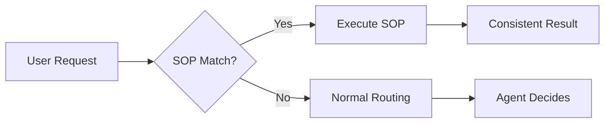

# SOPs (Standard Operating Procedures)

## Define repeatable workflows

SOPs ensure agents handle specific tasks the same way every time. When a request matches an SOP, the agent follows that procedure exactly.


## How It Works



SOPs have **highest routing priority**. When matched:

- Skip complexity analysis
- Skip agent selection
- Execute procedure immediately

---

## Create an SOP

[[steps]]

[[step Create the file]]

```bash
muxi new sop customer-onboarding
```

Creates `sops/customer-onboarding.md`:

```markdown
---
name: Customer Onboarding
tags: [customer, onboarding, new user]
triggers:
  keywords: [new customer, onboard customer, setup customer]
---

# Customer Onboarding Procedure

1. Collect customer information:
   - Company name
   - Primary contact email
   - Use case description

2. Create account in system

3. Send welcome email with:
   - Login credentials
   - Getting started guide link
   - Support contact information

4. Schedule kickoff call within 48 hours

5. Document everything in CRM
```
[[/step]]

[[step Deploy and test]]

```bash
muxi dev
```

Then try:

```
You: I need to onboard a new customer
Agent: I'll follow the customer onboarding procedure...
       [Executes each step in order]
```
[[/step]]

[[/steps]]

---

## SOP Structure

### Frontmatter

```yaml
---
name: Customer Onboarding           # Display name
tags: [customer, onboarding]        # For semantic matching
triggers:
  keywords: [onboard, new customer] # Exact phrase triggers
---
```

### Body

Write as numbered steps:

```markdown
# Procedure Name

1. First step with details
2. Second step with substeps:
   - Substep A
   - Substep B
3. Third step

## Expected Output

Describe what the result should look like.

## Notes

Any special considerations.
```

---

## Matching Logic

SOPs match in order:

1. **Keywords** - Exact phrase match (case-insensitive)
2. **Tags** - Semantic similarity to request
3. **Content** - Full-text semantic search (threshold: 0.7)

```yaml
triggers:
  keywords: [generate report, create report]  # Exact match
tags: [report, analysis, summary]              # Semantic match
```

---

## Example SOPs

### Bug Triage

```markdown
---
name: Bug Triage
tags: [bug, issue, priority, triage]
triggers:
  keywords: [triage bug, prioritize issue, bug priority]
---

# Bug Triage Procedure

1. Analyze the bug report:
   - Reproduction steps
   - Expected vs actual behavior
   - Error messages or logs

2. Assess impact:
   - Number of users affected
   - Severity of impact (data loss, UX issue, cosmetic)
   - Workaround availability

3. Assign priority:
   - **P0**: Critical, blocks all users, no workaround
   - **P1**: High, major feature broken, fix this sprint
   - **P2**: Medium, minor feature issue, fix next sprint
   - **P3**: Low, cosmetic or edge case, backlog

4. Create tracking issue with:
   - Clear summary
   - Priority label
   - Assigned team
   - Link to original report
```

### Weekly Summary

```markdown
---
name: Weekly Summary
tags: [weekly, summary, report, status]
triggers:
  keywords: [weekly summary, week in review, weekly report]
---

# Weekly Summary Procedure

1. Gather data from the past week:
   - Completed tasks and deliverables
   - Key metrics and changes
   - Notable events or decisions

2. Identify highlights:
   - Major accomplishments
   - Challenges overcome
   - Lessons learned

3. Note current blockers and risks:
   - Active issues
   - Dependencies
   - Resource constraints

4. Outline next week's priorities:
   - Top 3 goals
   - Key milestones
   - Meetings or deadlines

5. Format as executive summary:
   - 1 paragraph overview
   - Bullet points for details
   - Clear action items
```

### Incident Response

```markdown
---
name: Incident Response
tags: [incident, outage, emergency, response]
triggers:
  keywords: [incident, outage, system down, emergency]
---

# Incident Response Procedure

1. **Acknowledge** (within 5 minutes):
   - Confirm incident received
   - Assign incident commander
   - Start incident channel

2. **Assess** (within 15 minutes):
   - Identify affected systems
   - Determine user impact
   - Set severity level

3. **Communicate** (ongoing):
   - Post status to status page
   - Notify affected teams
   - Update every 30 minutes

4. **Mitigate**:
   - Implement immediate fixes
   - Roll back if necessary
   - Verify resolution

5. **Post-mortem** (within 48 hours):
   - Document timeline
   - Identify root cause
   - Define action items
```

---

## SOP Priority

SOPs bypass normal routing:

```
Request
   ↓
┌─────────────────────┐
│ 1. Check SOP match  │ ← Highest priority
└─────────────────────┘
   ↓ (no match)
┌─────────────────────┐
│ 2. Check agent spec │
└─────────────────────┘
   ↓ (no agent)
┌─────────────────────┐
│ 3. Analyze & route  │
└─────────────────────┘
```

> [!TIP]
> Use SOPs for your most important, repeatable workflows. They guarantee consistency.

---

## Testing SOPs

Verify your SOP triggers correctly:

```bash
muxi dev
```

Then test with trigger phrases:

```
You: onboard a new customer
# Should trigger customer-onboarding SOP

You: help me triage this bug
# Should trigger bug-triage SOP
```

---

## Best Practices

1. **Clear trigger phrases** - Use common, natural language
2. **Numbered steps** - Easy to follow and verify
3. **Specific outputs** - Define what "done" looks like
4. **Test thoroughly** - Ensure proper matching

---

## Next Steps

[+] [Write SOPs Guide](../guides/create-sops.md) - Step-by-step tutorial
[+] [Triggers](triggers.md) - Webhook automation
[+] [Orchestration](../deep-dives/how-orchestration-works.md) - How routing works
