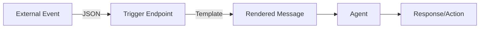

# Triggers

## Connect your agents to the world

Triggers let external systems invoke your agents via webhooks. GitHub issues, Slack messages, monitoring alerts - any JSON payload can become a conversation.

> [!TIP]
> **New to triggers?** Read [Triggers Concept →](../concepts/triggers.md) to understand the template system.
>
> **API Reference:** [GET /v1/triggers](api/formation#tag/Triggers/GET/triggers) | [POST /v1/triggers/{id}/invoke](api/formation#tag/Triggers/POST/triggers/{trigger_id}/invoke)


## How It Works



1. External system sends JSON to trigger endpoint
2. MUXI renders a template with the data
3. Agent processes as a regular conversation
4. Response returned (sync) or request ID (async)

---

## Create a Trigger

[[steps]]

[[step Create template]]

```bash
muxi new trigger github-issue
```

Creates `triggers/github-issue.md`:

```markdown
---
name: GitHub Issue Handler
tags: [github, issue]
---

New issue from ${{ data.repository }}:

**Issue #${{ data.issue.number }}**: ${{ data.issue.title }}
**Author**: ${{ data.issue.author }}

Analyze this issue and suggest:
1. Priority level
2. Potential causes
3. Recommended next steps
```
[[/step]]

[[step Deploy formation]]

```bash
muxi deploy
```
[[/step]]

[[step Call the trigger]]

```bash
curl -X POST http://localhost:8001/v1/triggers/github-issue \
  -H "X-Muxi-Client-Key: fmc_..." \
  -H "Content-Type: application/json" \
  -d '{
    "data": {
      "repository": "acme/webapp",
      "issue": {
        "number": 42,
        "title": "Login button not working",
        "author": "alice"
      }
    }
  }'
```
[[/step]]

[[/steps]]

---

## Template Syntax

Use `${{ data.* }}` for variable substitution:

### Simple Values

```markdown
Repository: ${{ data.repository }}
Author: ${{ data.author }}
```

### Nested Objects

```markdown
Issue #${{ data.issue.number }}: ${{ data.issue.title }}
Labels: ${{ data.issue.labels }}
```

### Multi-Level

```markdown
User: ${{ data.user.profile.name }}
Email: ${{ data.user.contact.email }}
```

---

## Request Format

```json
{
  "data": {
    // Your event data - available as ${{ data.* }}
  },
  "session_id": "optional-session-id",
  "use_async": true
}
```

| Field | Required | Default | Description |
|-------|----------|---------|-------------|
| `data` | Yes | - | Event data for template |
| `session_id` | No | new | Session to use |
| `use_async` | No | true | Return immediately |

---

## Response Types

### Async (Default)

Returns immediately with request ID:

```json
{
  "request_id": "req_abc123",
  "status": "processing"
}
```

Poll for result:

```bash
curl http://localhost:8001/v1/requests/req_abc123
```

### Sync

Wait for completion:

```json
{
  "data": {...},
  "use_async": false
}
```

Returns full response when done.

---

## Example Templates

### Deployment Notification

```markdown
---
name: Deployment Alert
tags: [deployment, devops]
---

Deployment to ${{ data.environment }}:

**Service**: ${{ data.service }}
**Version**: ${{ data.version }}
**Status**: ${{ data.status }}
**Deployer**: ${{ data.user }}

Monitor for issues and report any anomalies.
```

### Slack Message

```markdown
---
name: Slack Handler
tags: [slack, message]
---

Message from ${{ data.user }} in #${{ data.channel }}:

${{ data.text }}

Respond appropriately to help the user.
```

### Monitoring Alert

```markdown
---
name: Alert Response
tags: [alert, monitoring]
---

ALERT from ${{ data.source }}:

**Severity**: ${{ data.severity }}
**Service**: ${{ data.service }}
**Message**: ${{ data.message }}

Investigate and provide:
1. Probable cause
2. Impact assessment
3. Remediation steps
```

---

## Webhook Integration

### GitHub Setup

1. Go to repo Settings → Webhooks
2. Add webhook:
   - **URL**: `https://your-server/v1/triggers/github-issue`
   - **Content type**: `application/json`
   - **Events**: Issues, Pull requests

### Middleware Pattern

Transform webhooks before MUXI:

```javascript
// Express middleware
app.post('/github-webhook', (req, res) => {
  // Transform GitHub's format to your template's expected format
  const payload = {
    data: {
      repository: req.body.repository.full_name,
      issue: {
        number: req.body.issue.number,
        title: req.body.issue.title,
        author: req.body.issue.user.login,
        body: req.body.issue.body
      }
    }
  };

  fetch('http://muxi:8001/v1/triggers/github-issue', {
    method: 'POST',
    headers: {
      'X-Muxi-Client-Key': process.env.MUXI_KEY,
      'Content-Type': 'application/json'
    },
    body: JSON.stringify(payload)
  });

  res.status(200).send('OK');
});
```

---

## List Available Triggers

```bash
curl http://localhost:8001/v1/triggers \
  -H "X-Muxi-Client-Key: fmc_..."
```

```json
{
  "triggers": ["github-issue", "slack-message", "deployment"],
  "count": 3
}
```

---

## Authentication

Triggers use the same auth as chat:

- `X-Muxi-Client-Key` header (required)
- `X-Muxi-User-Id` header (optional)

---

## Next Steps

[+] [Create Triggers Guide](../guides/triggers.md) - Step-by-step tutorial
[+] [SOPs](sops.md) - Standard operating procedures
[+] [Async Operations](../deep-dives/async.md) - Background processing
