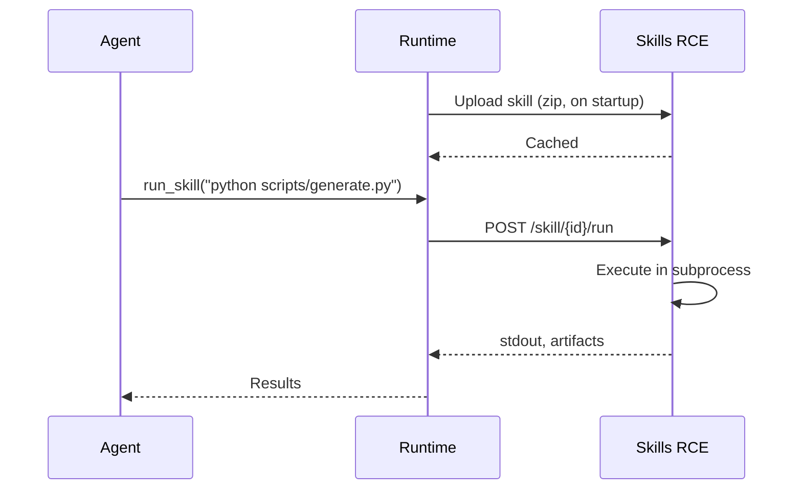

# Skills RCE

## Run skill scripts in sandboxed containers

Skills RCE is the code execution service that runs skill scripts. When an agent activates a skill with executable scripts, the runtime sends the code to Skills RCE for sandboxed execution.

> [!TIP]
> **Server-managed formations get Skills RCE automatically.** The MUXI Server includes a built-in RCE instance -- no formation configuration required. Only configure `rce:` in your formation if you need a custom or external instance.


## How It Works



1. **Startup**: Runtime zips skill directories and uploads them to RCE (hash-based, skips unchanged skills)
2. **Execution**: Agent calls `run_skill`, runtime sends the command to RCE
3. **Response**: RCE returns stdout, stderr, exit code, and any generated files as base64 artifacts


## Two Ways to Use RCE

### Built-in (server-managed)

When running formations via MUXI Server, Skills RCE is included. Formations use it automatically with no configuration needed.

### Custom instance

Run your own RCE service and point your formation at it:

```yaml
# formation.afs
rce:
  url: "http://localhost:7891"
  token: "${{ secrets.RCE_TOKEN }}"
```

This is useful when you need:
- A specific set of packages or runtimes
- Dedicated resources for heavy workloads
- Network isolation or custom security policies


## Running Your Own Instance

### Docker

```bash
docker run -d -p 7891:7891 \
  -e RCE_AUTH_TOKEN=my-secret \
  ghcr.io/muxi-ai/skills-rce:latest
```

### SIF (Linux)

Download the `.sif` file from the [Releases](https://github.com/muxi-ai/skills-rce/releases) page:

```bash
apptainer run skills-rce.sif
```

### From source

```bash
cd src && go build -o skills-rce ./cmd/rce
RCE_AUTH_TOKEN=my-secret ./skills-rce
```


## Configuration

All via environment variables:

| Variable | Default | Description |
|----------|---------|-------------|
| `RCE_PORT` | `7891` | Listen port |
| `RCE_CACHE_DIR` | `/cache/skills` | Skill cache directory |
| `RCE_DEFAULT_TIMEOUT` | `30` | Default job timeout (seconds) |
| `RCE_MAX_TIMEOUT` | `300` | Maximum allowed timeout |
| `RCE_AUTH_TOKEN` | (none) | Bearer token for authenticated endpoints |


## Authentication

Set `RCE_AUTH_TOKEN` to require a bearer token on all endpoints except `/health` and `/status`:

```bash
docker run -d -p 7891:7891 -e RCE_AUTH_TOKEN=my-secret ghcr.io/muxi-ai/skills-rce:latest
```

When configured, all requests must include `Authorization: Bearer <token>`.


## Available Runtimes

The Docker image bundles runtimes commonly used by agent skills:

| Runtime | Version | Languages |
|---------|---------|-----------|
| Python | 3.11 | python |
| Bun | latest | javascript, typescript |
| Node.js | 20 | (npx, npm) |
| Go | 1.26 | go |
| Bash | 5.1 | bash |
| Perl | 5.34 | perl |

### Python packages

**Data & analysis:** numpy, pandas, scipy, scikit-learn, statsmodels, sympy

**Visualization:** matplotlib, seaborn, plotly, bokeh, altair

**Documents:** reportlab, fpdf2, python-docx, openpyxl, python-pptx, xlsxwriter

**Images:** pillow, pytesseract, pdf2image, qrcode

**HTTP:** requests, httpx

**General:** pyyaml, jinja2, tabulate, orjson

### JS/TS packages

lodash, axios, cheerio, sharp, csv-parse, date-fns, zod, marked, uuid, yaml

### System tools

curl, wget, git, ffmpeg, imagemagick, poppler-utils, tesseract-ocr

> [!TIP]
> Call `GET /status` on any RCE instance to see the exact versions of all installed runtimes and packages.


## API

| Method | Endpoint | Auth | Description |
|--------|----------|------|-------------|
| GET | `/health` | No | Liveness check |
| GET | `/status` | No | Full capabilities (runtimes, packages, cached skills) |
| POST | `/run` | Yes | Execute ad-hoc code |
| POST | `/skill/{id}` | Yes | Upload/cache a skill directory |
| GET | `/skill/{id}` | Yes | Check cache status |
| DELETE | `/skill/{id}` | Yes | Remove cached skill |
| POST | `/skill/{id}/run` | Yes | Execute command against cached skill |

See the full [OpenAPI spec](https://github.com/muxi-ai/skills-rce/blob/main/openapi.yaml) for request/response schemas.


## Security

- Each job runs in an isolated subprocess with resource limits
- Cached skill directories are read-only during execution
- Working directories cleaned up after each job
- Output truncated at 100KB
- Zip uploads validated against path traversal attacks
- No host filesystem access beyond mounted volumes


## Troubleshooting

[[toggle RCE not reachable]]
Check the service is running:

```bash
curl http://localhost:7891/health
```

Verify the URL in your formation config matches the actual RCE address.
[[/toggle]]

[[toggle Script fails but works locally]]
The RCE environment may not have the same packages. Check what's available:

```bash
curl http://localhost:7891/status | jq '.packages'
```
[[/toggle]]

[[toggle Skills not cached on startup]]
Check runtime logs for "uploaded to RCE cache" messages. The runtime uploads skills at startup -- if the RCE service isn't reachable at that point, uploads happen inline on first `run_skill` call.
[[/toggle]]


## Next Steps

[+] [Skills Concepts](../concepts/skills.md) - How skills work
[+] [Skills Reference](../reference/skills.md) - SKILL.md syntax and config
[+] [Add Skills Guide](../guides/add-skills.md) - Step-by-step tutorial
[+] [GitHub: skills-rce](https://github.com/muxi-ai/skills-rce) - Source and releases
