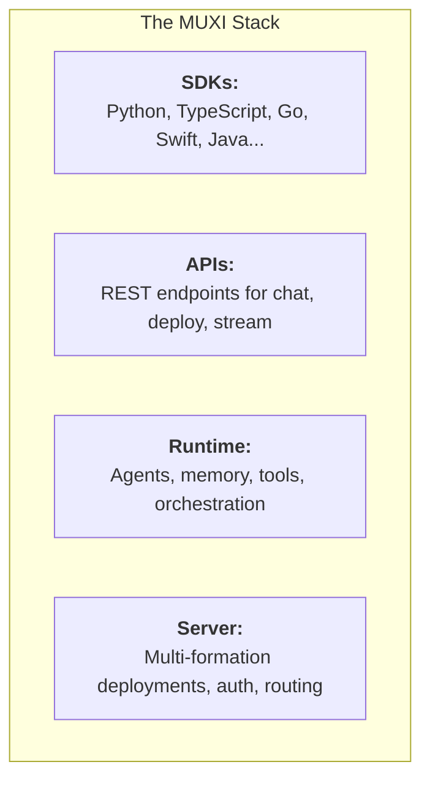

# What is MUXI?

## The AI Application Server

No one builds their own Nginx to deploy a website. No one should reinvent infrastructure to build AI.

<!-- TODO: Replace with actual video embed
<div class="video-placeholder">
  <p>🎬 Video: From zero to a multi-agent AI system in under 5 minutes</p>
</div>
-->

MUXI is **production-ready infrastructure for AI agents**. Not a framework. Not a wrapper. A server.

Think of it this way:
- Websites have **web servers** (Nginx, Apache)
- APIs have **application servers** (Express, FastAPI)
- Agents now have **MUXI**



### How it runs

Like a web application:

| Layer | Web World | MUXI |
|-------|-----------|------|
| **Server** | Nginx | MUXI Server |
| **Runtime** | Node / Python | MUXI Runtime |
| **Application** | Your code | Formation |

### How you ship it

Like Docker:

| Concept | Docker | MUXI |
|---------|--------|------|
| **Engine** | Docker Engine | Server + Runtime |
| **Definition** | Dockerfile | Formation |
| **Registry** | Docker Hub | MUXI Registry |
| **CLI** | `docker` | `muxi` |

**The key insight:** You build applications ON TOP of MUXI using SDKs. Your frontend, mobile app, or backend talks to MUXI via API. MUXI handles orchestration, memory, multi-tenancy, and observability.

**That's what makes it infrastructure, not a framework.**


## The Problem

Building a demo agent is easy:

```python
response = openai.chat("Hello, world!")
```

Building a **production** agent system requires:

- Multi-agent orchestration and coordination
- Memory management (short-term, long-term, semantic)
- Tool integration (APIs, databases, file systems)
- Multi-tenant isolation and security
- Observability and debugging
- Deployment, scaling, and lifecycle management

**Most teams spend 3-6 months building this infrastructure before shipping a single feature.**

The question: Is agent infrastructure your core IP, or is it plumbing blocking your actual product?

## The Solution

MUXI treats agents as **native infrastructure primitives**. Declare them in YAML, deploy with one command, manage like containers.

### Declare your system in YAML

```yaml
# formation.afs - A complete AI system definition
schema: "1.0.0"
id: customer-support

llm:
  models:
    - text: openai/gpt-4o

agents:
  - id: triage
    role: "Route customer inquiries"
  - id: technical
    role: "Handle technical issues"
  - id: billing
    role: "Handle billing questions"

memory:
  persistent:
    enabled: true

mcp:
  servers:
    - id: zendesk
    - id: stripe
```

### Deploy with one command

```bash
muxi deploy
# That's it. You're live.
```

### Build on top

```python
from muxi import MuxiClient

client = MuxiClient("http://server:7890/api")
response = client.chat("customer-support", "I need a refund", user_id="user_123")
```

## Key Capabilities

:::: cols=2

[[card]]

#### LLM-Agnostic

Use OpenAI, Anthropic, Google, Azure, AWS Bedrock, or local models (Ollama, llama.cpp). Swap providers in seconds. Mix models per agent. Automatic failover when providers fail.

[Learn more →](concepts/llm-providers.md)

[[/card]]

[[card]]

#### Multi-Tenant by Design

Each user stores their own credentials – OAuth tokens, API keys, connection strings. Complete session isolation. One formation serves thousands of users with personalized experiences.

[Learn more →](concepts/multi-tenancy.md)

[[/card]]

[[card]]

#### Intelligent Orchestration

The Overlord automatically breaks down complex requests into subtasks. No predefined workflows – agents analyze complexity, identify dependencies, and execute in optimal order.

[Learn more →](concepts/agents-and-orchestration.md)

[[/card]]

[[card]]

#### Agent Collaboration (A2A)

Agents within your formation work together seamlessly. Delegate tasks across formations. Collaborate with external agents from other organizations via A2A protocol.

[Learn more →](concepts/agents-and-orchestration.md)

[[/card]]

[[card]]

#### 1,000+ MCP Tools

Access GitHub, Slack, Stripe, databases, file systems, and more through Model Context Protocol. Unlike typical implementations, MUXI indexes tool schemas once – not dumped into every context window.

[Learn more →](concepts/tools-and-mcp.md)

[[/card]]

[[card]]

#### Three-Tier Memory

Buffer memory for immediate context. Persistent memory across sessions. Vector memory for semantic retrieval. User synopsis caching reduces token usage by 80%+.

[Learn more →](concepts/memory-system.md)

[[/card]]

[[card]]

#### Knowledge & RAG

Pre-load agents with domain knowledge from files and URLs. PDFs, markdown, Office docs, images – agents retrieve relevant context without fine-tuning. Update knowledge by updating files.

[Learn more →](concepts/knowledge-and-rag.md)

[[/card]]

[[card]]

#### Real-Time Streaming

Stream responses as agents think, not after completion. SSE and WebSocket support. Token-by-token delivery for chat interfaces. Progress updates for multi-step operations.

[Learn more →](deep-dives/real-time-streaming.md)

[[/card]]

::::


## Built for Efficiency

MUXI isn't a prototype tool – it's production infrastructure with the numbers to prove it.

| Metric | Value |
|--------|-------|
| Time to first agent | 5 Minutes |
| Response time | <100ms time to first token |
| Test coverage | 80%+ test coverage across core components |
| Observability Events | 349 typed events |
| LLM  supported | 21+ providers, 300+ models |
| LLM cost saving | 50-80% via semantic caching |


## Declare Once, Deploy Everywhere

MUXI created the [Agent Formation Schema](https://agentformation.org) – an open spec for declarative AI systems. Agents, knowledge, tools, and settings defined in portable `.afs` files.

**Like a Dockerfile for containers, but for agents.**

Formations are:
- **Portable** – Run anywhere MUXI runs
- **Versionable** – Git-friendly YAML files
- **Shareable** – Push to the registry, pull anywhere


## The Formation Registry

Discover and share formations through the [MUXI Registry](https://registry.muxi.org). Like Docker Hub, but for AI agents.

```bash
# Pull a pre-built formation
muxi pull @acme/customer-support

# Publish your own
muxi publish my-agent:1.0.0
```

Browse community formations, install with one command, customize for your needs.


## Open Source & Self-Hosted

MUXI is **open-source** and **self-hostable**. Your data stays on your infrastructure. No vendor lock-in. No per-seat pricing. No usage limits. **Free forever. Revenue from optional support services.**

- Full source code on [GitHub](https://github.com/muxi-ai)
- Single binary installation
- Works on Linux, macOS, Windows, Docker
- Enterprise features available


## How It Compares

**MUXI makes frameworks obsolete for 90% of use cases.**

| | MUXI | Frameworks (LangChain, CrewAI) | Cloud AI (Bedrock, Vertex) |
|---|---|---|---|
| **What it is** | Infrastructure | Library | Managed service |
| **Deployment** | `muxi deploy` | You build it | Vendor-managed |
| **Multi-tenancy** | Built-in | You build it | Limited |
| **Self-hosted** | Yes | N/A | No |
| **LLM choice** | Any provider | Any provider | Vendor models |
| **Observability** | 349 events | You build it | Vendor tools |

### vs. AI Assistants (OpenClaw, ChatGPT)

Different layer entirely. OpenClaw is a personal AI assistant (single-user product). MUXI is infrastructure to build products like OpenClaw – with multi-tenancy, proper memory, and SDKs for integration.

**MUXI is infrastructure, not a framework.** Frameworks help you write agent logic. MUXI runs agents in production.


## Who Is MUXI For?

### Platform Builders

Building a SaaS with AI features? MUXI handles orchestration, memory, and multi-tenancy so you can focus on your product.

### Internal Tool Builders

Deploying AI assistants for your team? MUXI gives you SOPs, observability, and enterprise-grade infrastructure out of the box.

### Developers Tired of Framework Hell

Spent months on LangChain orchestration code? MUXI replaces it with YAML configuration and a single deploy command.

## Next Steps

:::: cols=2

(quickstart.md)[[card]]
#### Quickstart
Get your first agent running in 5 minutes.
[[/card]]

(how-it-works.md)[[card]]
#### How It Works
Understand the architecture and request flow.
[[/card]]

(examples/README.md)[[card]]
#### Examples
See real formations for common use cases.
[[/card]]

(installation/README.md)[[card]]
#### Installation
Install on macOS, Linux, Windows, or Docker.
[[/card]]

::::
