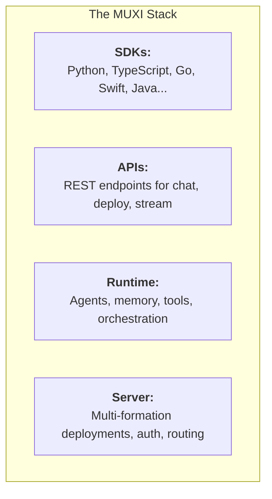

# What is MUXI?

## The AI Application Server

No one builds their own Nginx to deploy a website. No one should reinvent infrastructure to build AI.

<!-- TODO: Replace with actual video embed
<div class="video-placeholder">
  <p>🎬 Video: From zero to a multi-agent AI system in under 5 minutes</p>
</div>
-->

MUXI is **production-ready infrastructure for AI agents**. Not a framework. Not a wrapper. A server.

Think of it this way:
- Websites have **web servers** (Nginx, Apache)
- APIs have **application servers** (Express, FastAPI)
- Agents now have **MUXI**


```mermaid
flowchart TB
    subgraph "The MUXI Stack"
        A["<b>SDKs:</b><br>Python, TypeScript, Go, Swift, Java..."]
        B["<b>APIs:</b><br>REST endpoints for chat, deploy, stream"]
        C["<b>Runtime:</b><br>Agents, memory, tools, orchestration"]
        D["<b>Server:</b><br>Multi-formation deployments, auth, routing"]
    end
```

### How it runs

Like a web application:

| Layer | Web World | MUXI |
|-------|-----------|------|
| **Server** | Nginx | MUXI Server |
| **Runtime** | Node / Python | MUXI Runtime |
| **Application** | Your code | Formation |

### How you ship it

Like Docker:

| Concept | Docker | MUXI |
|---------|--------|------|
| **Engine** | Docker Engine | Server + Runtime |
| **Definition** | Dockerfile | Formation |
| **Registry** | Docker Hub | MUXI Registry |
| **CLI** | `docker` | `muxi` |

**The key insight:** You build applications ON TOP of MUXI using SDKs. Your frontend, mobile app, or backend talks to MUXI via API. MUXI handles orchestration, memory, multi-tenancy, and observability.

**That's what makes it infrastructure, not a framework.**


## The Problem

Building a demo agent is easy:

```python
response = openai.chat("Hello, world!")
```

Building a **production** agent system requires:

- Multi-agent orchestration and coordination
- Memory management (short-term, long-term, semantic)
- Tool integration (APIs, databases, file systems)
- Multi-tenant isolation and security
- Observability and debugging
- Deployment, scaling, and lifecycle management

**Most teams spend 3-6 months building this infrastructure before shipping a single feature.**

The question: Is agent infrastructure your core IP, or is it plumbing blocking your actual product?

## The Solution

MUXI treats agents as **native infrastructure primitives**. Declare them in YAML, deploy with one command, manage like containers.

### Declare your system in YAML

```yaml
# formation.afs - A complete AI system definition
schema: "1.0.0"
id: customer-support

llm:
  models:
    - text: openai/gpt-4o

agents:
  - id: triage
    role: "Route customer inquiries"
  - id: technical
    role: "Handle technical issues"
  - id: billing
    role: "Handle billing questions"

memory:
  persistent:
    enabled: true

mcp:
  servers:
    - id: zendesk
    - id: stripe
```

### Deploy with one command

```bash
muxi deploy
# That's it. You're live.
```

### Build on top

```python
from muxi import FormationClient

formation = FormationClient(
    server_url="http://server:7890",
    formation_id="customer-support",
    client_key="<your-client-key>",
)
response = formation.chat(
    {"message": "I need a refund"},
    user_id="user_123",
)
```

## Key Capabilities

:::: cols=2

[[card]]

#### LLM-Agnostic

Use OpenAI, Anthropic, Google, Azure, AWS Bedrock, or local models (Ollama, llama.cpp). Swap providers in seconds. Mix models per agent. Automatic failover when providers fail.

[Learn more →](concepts/llm-providers.md)

[[/card]]

[[card]]

#### Multi-Tenant RBAC

Sessions, memory, artifacts, and encrypted credentials stay isolated per user. Group-based RBAC controls access to agents, MCP servers, and individual tools through inheritance and fail-closed membership resolution.

[Learn more →](concepts/access-control.md)

[[/card]]

[[card]]

#### Intelligent Orchestration

The Overlord automatically breaks down complex requests into subtasks. No predefined workflows – agents analyze complexity, identify dependencies, and execute in optimal order.

[Learn more →](concepts/agents-and-orchestration.md)

[[/card]]

[[card]]

#### Agent Collaboration (A2A)

Agents within your formation work together seamlessly. Delegate tasks across formations. Collaborate with external agents from other organizations via A2A protocol.

[Learn more →](concepts/agents-and-orchestration.md)

[[/card]]

[[card]]

#### MCP Without the Bloat

Connect MCP tool catalogs without injecting every schema into every prompt. MUXI indexes definitions once, selects relevant tools at runtime, and filters the surface through layered allow/deny rules.

[Learn more →](concepts/tools-and-mcp.md)

[[/card]]

[[card]]

#### Memory Platform

Layered context, user/group/formation scopes, immutable events, provenance, rebuilds, selective forgetting, decay, knowledge graphs, Captain's Logs, and signed on-premises distillation.

[Learn more →](concepts/memory-system.md)

[[/card]]

[[card]]

#### Reasoning RAG & Remote Knowledge

Navigate hierarchical document trees with tree, vector, or hybrid retrieval. Synchronize local and remote knowledge from HTTP, cloud storage, rsync, FTP, and SFTP sources.

[Learn more →](concepts/knowledge-and-rag.md)

[[/card]]

[[card]]

#### Real-Time Streaming

Stream text, progress, planning, tool activity, and typed UI widgets over SSE. Non-streaming responses use the same response envelope and text fallback.

[Learn more →](reference/response-ui-widgets.md)

[[/card]]

[[card]]

#### Formation Self-Tuning

Turn operational evidence into reviewable revisions of `MUXI.md`, backed by experiments and watched metrics. Inspect, apply, or dismiss every suggested behavioral change.

[Learn more →](concepts/self-tuning.md)

[[/card]]

[[card]]

#### Proactive Formations

Let formations initiate useful contact through heartbeats, active hours, per-user channels, soul documents, notification routing, and built-in slash commands.

[Learn more →](concepts/proactiveness.md)

[[/card]]

[[card]]

#### Coding-Agent Delegation

Delegate repository work to supported headless coding agents in isolated asynchronous workspaces, with deterministic monitoring for long-running jobs.

[Learn more →](concepts/coding-delegation.md)

[[/card]]

[[card]]

#### Durable Artifacts & UI

Persist generated files as encrypted, versioned, user-scoped memory and return typed options, actions, links, and MCP resources that clients render natively.

[Learn more →](concepts/artifacts.md)

[[/card]]

::::


## Built for Production

MUXI includes the infrastructure that normally appears after a prototype fails
its first production review: group-based RBAC, per-user credentials, scoped and
auditable memory, idempotent mutations, circuit breakers, fallback models,
typed observability, PII redaction, isolated runtimes, health checks, updates,
and rollbacks.


## Declare Once, Deploy Everywhere

MUXI created the [Agent Formation Schema](https://agentformation.org) – an open spec for declarative AI systems. Agents, knowledge, tools, and settings defined in portable `.afs` files.

**Like a Dockerfile for containers, but for agents.**

Formations are:
- **Portable** – Run anywhere MUXI runs
- **Versionable** – Git-friendly YAML files
- **Shareable** – Push to the registry, pull anywhere


## The Formation Registry

Discover and share formations through the [MUXI Registry](https://registry.muxi.org). Like Docker Hub, but for AI agents.

```bash
# Pull a pre-built formation
muxi pull @acme/customer-support

# Publish the current formation
cd my-agent
muxi push
```

Browse community formations, install with one command, customize for your needs.


## Open Source & Self-Hosted

MUXI is **open-source** and **self-hostable**. Your data stays on your infrastructure. No vendor lock-in. No per-seat pricing. No usage limits. **Free forever. Revenue from optional support services.**

- Full source code on [GitHub](https://github.com/muxi-ai)
- Single binary installation
- Works on Linux, macOS, Windows, Docker
- Enterprise controls included


## How It Compares

**MUXI makes frameworks obsolete for 90% of use cases.**

| | MUXI | Frameworks (LangChain, CrewAI) | Cloud AI (Bedrock, Vertex) |
|---|---|---|---|
| **What it is** | Infrastructure | Library | Managed service |
| **Deployment** | `muxi deploy` | You build it | Vendor-managed |
| **Multi-tenancy** | Built-in | You build it | Limited |
| **Self-hosted** | Yes | N/A | No |
| **LLM choice** | Any provider | Any provider | Vendor models |
| **Observability** | Hundreds of typed events | You build it | Vendor tools |

### vs. AI Assistants (OpenClaw, ChatGPT)

Different layer entirely. OpenClaw is a personal AI assistant (single-user product). MUXI is infrastructure to build products like OpenClaw – with multi-tenancy, proper memory, and SDKs for integration.

**MUXI is infrastructure, not a framework.** Frameworks help you write agent logic. MUXI runs agents in production.


## Who Is MUXI For?

### Platform Builders

Building a SaaS with AI features? MUXI handles orchestration, memory, and multi-tenancy so you can focus on your product.

### Internal Tool Builders

Deploying AI systems across your organization? MUXI gives you group-based RBAC, scoped memory, per-user credentials, SOPs, observability, and self-tuning out of the box.

### Developers Tired of Framework Hell

Spent months on LangChain orchestration code? MUXI replaces it with YAML configuration and a single deploy command.

## Next Steps

:::: cols=2

(quickstart.md)[[card]]
#### Quickstart
Get your first agent running in 5 minutes.
[[/card]]

(how-it-works.md)[[card]]
#### How It Works
Understand the architecture and request flow.
[[/card]]

(examples/README.md)[[card]]
#### Examples
See real formations for common use cases.
[[/card]]

(installation/README.md)[[card]]
#### Installation
Install on macOS, Linux, Windows, or Docker.
[[/card]]

::::
